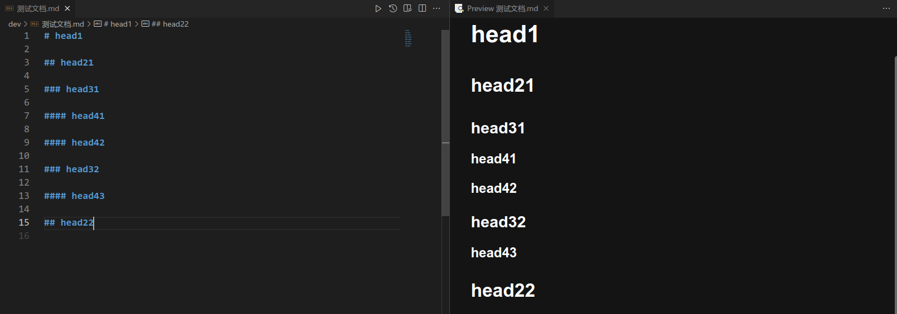
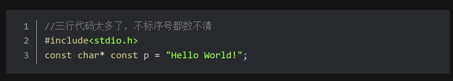

# Markdown 的最基本用法

## 1. 空行规范

各级标题、文本、代码段、列表、插入图片之间建议空一行。

我的意思是这样的：

```text
第一段

第二段，与上边的一段之间有空行
```

而不是：

```text
第一段
第二段，与上边的一段之间没有空行
```


## 2. 标题

上边这一行就是标题，虽然不是大标题而是小标题。可以输入最多六级标题（一般用不了那么多），在一行前面输入 `#` 可以创建标题，井号后边是标题文字。井号输入几个就是几级标题。井号与标题文字之间需要空一格。

上边的“标题”两字是二级标题。大标题是一级标题。

另外，标题建议从第一级开始（文档开头使用一级标题），且不要出现标题越级情况，即下一个标题最多比上一个标题多一级，当然也可能比上一个少或相等。不同的标题文字建议不要有重复。

比如使用以下代码：

```markdown
# head1

## head21

### head31

#### head41

#### head42

### head32

#### head43

## head22
```

VSCode中的效果：



上图左边为编辑的VSCode代码，右边为MPE的预览。后面同理。

Typora中的效果图：


使用typora会创建大纲：


> 另外符号`=`和`-`也会创建标题，不过只能创建两级，而且容易混淆，所以很少用，也不建议使用。

## 3. 文本

一般文本直接输入即可。建议参照之前写的空行规范加上空行。

### 3.1 简单文本样式的改变

- 加粗：前后各两个星号；
- 斜体：两边各一个星号；
- 阴影，前后加上键盘左上角的点；
- 删除：划删除线的文字，左右各两个`~`。

```markdown
演示文字
这里是 **加粗文字** 的效果
这里是 *斜体文字* 的效果
这里是 `阴影文字` 的效果
这里是 ~~删除文字~~ 的效果
```

效果：

这里是 **加粗文字** 的效果
这里是 *斜体文字* 的效果
这里是 `阴影文字` 的效果
这里是 ~~删除文字~~ 的效果


### 3.2 取消特殊符号

上边我们用了星号等符号作为格式的控制字符。但是有的时候我们希望直接表示出来这些字符，比如：

```bash
C语言的常见指针类型包括int*以及char*等。
```

直接打出来的效果：

C语言的常见指针类型包括int*以及char*等。

可以发现，两个星号成了斜体控制字符，怎么办呢？

```markdown
C语言的常见指针类型包括int\*以及char\*等。
```

效果：

C语言的常见指针类型包括int\*以及char\*等。

### 3.3 文本的引用

基本代码：

```markdown
> 被引用的文本
```

效果：

> 被引用的文本


甚至还可以嵌套，这样需要在前面加上多个`>`号：

```markdown
> 一级引用
>> 二级引用
> 其实这里还是二级引用
> 为什么这里还是
>>> 三级引用
> 一个大于号右边竟然是三级引用
> 这究竟是道德的扭曲还是人格的沦丧？
>
> 这又是什么？
```

注意，如果上一行是多层嵌套，那么下一行即使只有一个 `>` 也会变成同样层数的嵌套。因此跳出前一层需要有空行。

> 一级引用
>> 二级引用
> 其实这里还是二级引用
> 为什么这里还是
>>> 三级引用
> 一个大于号右边竟然是三级引用
> 这究竟是道德的扭曲还是人格的沦丧？
>
> 这又是什么？

## 4. 列表

Markdown可以创建多级列表。先给个示例看看：

```text
- 安徽省
  - 合肥市
    - 蜀山区

      蜀山区是合肥市西南部的一个区

      - 稻香村街道
        - 中国科学技术大学（中校区）
        - 中国科学技术大学（西校区）
  - 芜湖市
    - 镜湖区
    - 鸠江区
  - 蚌埠市
    - 禹会区
    - 淮上区
- 北京市
  - 西城区
```

效果：

- 安徽省
  - 合肥市
    - 蜀山区

      蜀山区是合肥市西南部的一个区

      - 稻香村街道
        - 中国科学技术大学（中校区）
        - 中国科学技术大学（西校区）
  - 芜湖市
    - 镜湖区
    - 鸠江区
  - 蚌埠市
    - 禹会区
    - 淮上区
- 北京市
  - 西城区

创建列表需要用一个减号和空格，后边输入列表文本。

该级列表下边可以输入解释文字，该文字需要通过空格和列表文本对齐（上文的“蜀山区是合肥市西南部的一个区”就是解释文字）；列表下边还可以有子列表，同样是减号和空格，但是减号同样要和上一级的文本对齐。

其实还可以把第一级列表的减号改成序号，同样要记得把下一级的减号与上一级的文字对齐。这样可以自动标号，不过很多时候只能应用于第一级列表。

```markdown
1. 安徽省
   - 合肥市
     - 蜀山区
     - 包河区
     - 瑶海区
     - 庐阳区
   - 芜湖市
2. 北京市
3. 重庆市
```

效果：

1. 安徽省
   - 合肥市
     - 蜀山区
     - 包河区
     - 瑶海区
     - 庐阳区
   - 芜湖市
2. 北京市
3. 重庆市

标号需要和标题配合，合理使用，使文档层次清晰。

## 5. 公式

可以用两个`$$`插入latex公式，这样插入的公式将独占一行。如果使用vscode则在中间，typora在左边，而且typora貌似不能解析矩阵。

```markdown
$$x_1,x_2=\frac{-b±\sqrt{b^2-4ac}}{2a}$$

$$\det\overrightarrow{A}=det\begin{pmatrix}
0&\beta\\
\alpha&\alpha_{1,2}^{\frac{3}{2}}
\end{pmatrix}=-\alpha\beta$$

$$\int_{0}^{\infty}{e^{-x^2}}{\rm d}x=\frac{\sqrt{\pi}}{2}$$
```

$$x_1,x_2=\frac{-b±\sqrt{b^2-4ac}}{2a}$$

$$\det\overrightarrow{A}=det\begin{pmatrix}
0&\beta\\
\alpha&\alpha_{1,2}^{\frac{3}{2}}
\end{pmatrix}=-\alpha\beta$$

$$\int_{0}^{\infty}{e^{-x^2}}{\rm d}x=\frac{\sqrt{\pi}}{2}$$

如果写在段落内，则两端只需要一个`$`符号，建议公式两边加上空格：

```markdown
当 $\Delta>0$ 时，方程的两个不同实根为 $x_1,x_2=\frac{-b±\sqrt{b^2-4ac}}{2a}$
```

效果：

当 $\Delta>0$ 时，方程的两个不同实根为 $x_1,x_2=\frac{-b±\sqrt{b^2-4ac}}{2a}$

至于 LaTeX 公式怎么写，这不是本文的内容，请自行在网上学习。

## 6. 代码块

Markdown可以比较方便地插入代码。在代码的第一行前与最后一行后都输入三个键盘左上角的点，并在开始的三个点后边写上代码所用的语言，比如c/cpp/python等，会根据所选语言进行高亮。（复制以下代码的时候，需要去掉三个点前面的斜杠，想想为什么我加上了这个斜杠）

```text
\```C
#include<stdio.h>
const char* const p = "Hello World!";
\```
```

效果，有一点点高亮：

```C
#include<stdio.h>
const char* const p = "Hello World!";
```

有的代码比较长，这时候可以给代码加上行号，其方法是在语言名字后边加上`{.line-numbers}`，就像这样：

```text
\```c{.line-numbers}
//三行代码太长了，不标序号都数不清
#include<stdio.h>
const char* const p = "Hello World!";
\```
```

效果：

```c{.line-numbers}
//三行代码太多了，不标序号都数不清
#include<stdio.h>
const char* const p = "Hello World!";
```



这个加行号的功能，貌似一些地方并不支持，但是这样做总归没有坏处。

没有任何语言可以在那个位置输入diff或text等作为语言。如果是命令行，可以使用 bash(linux) 或 cmd(Windows) 作为语言。

## 7. 链接

这里首先只讲外部链接，内部链接在更高级Markdown用法里再讲。

可以插入图片或网页链接。图片需要写出相对或绝对地址；**建议把图片编好序号放在markdown文件旁边image的文件夹内，这就是为什么我建议新建那两个文件夹。** 也可以采取其他自己喜欢且容易整理的方式。

```text

这是[有用的学习资料](https://www.bilibili.com/video/BV1GJ411x7h7)。
```

效果：


这是[有用的学习资料](https://www.bilibili.com/video/BV1GJ411x7h7)。

另外，网页链接的格式也适用于文件（猜一下这是为什么），一般仅用于链接到其他 Markdown 文件，比如下面的回到上一级文档。这里也建议使用相对地址。

提醒：将 markdown 文档发给别人时，请记得把图片啥的都带上。

> 如果你不知道啥是相对地址，请上网搜索。

## 结语

当你看完本文的时候，就可以基本上完成各种各样的实验报告了。

如果你阅读完本文的内容，可以[回到上一级文档](./README.md)；如果有需要，可以进一步阅读更高级的 Markdown 用法。
