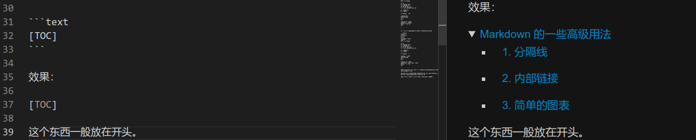
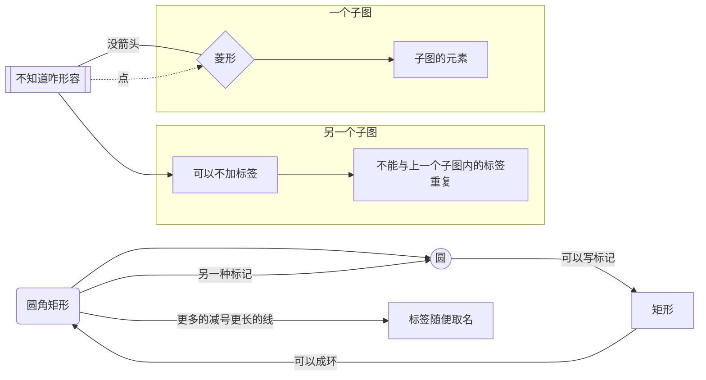
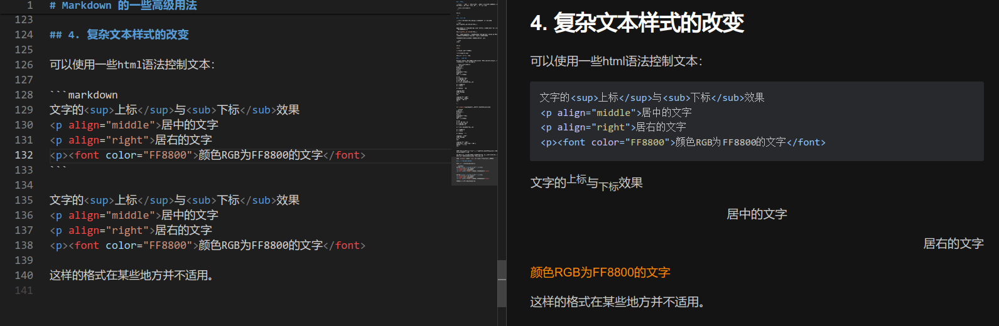
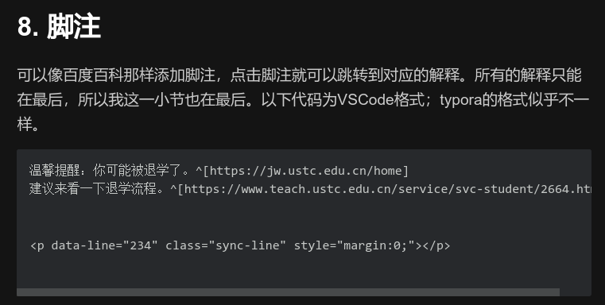
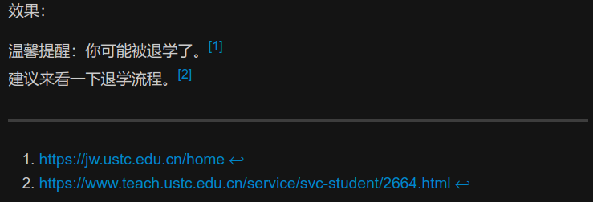

# Markdown 的一些高级用法

## 1. 任务列表

```markdown
- [ ] 数据结构
- [x] 数学分析
```

效果：

- [ ] 数据结构
- [x] 数学分析

至于叉表示对号这事，我也不知道谁想出来的。

另外，这似乎是vscode的MPE的一个bug，就是如果文档特别长，且在比较靠后的位置使用任务列表，则其并不能正确生成预览。因此如果有必要，请使用typora等替代品。

## 2. 分隔线

使用三个 `-` 或者 `*` 表示，且这一行除了空格只能有这些符号。由于可能会被识别为二级标题，所以建议这一行开头加上空格。

```text{.line-numbers}
 ---
```

效果：

 ---

## 3. 内部链接

使用内部链接，可以在点击之后到达本文档的某一个标题，比如

```text
这里是[到任务列表的链接](#1-任务列表)
```

需要注意的是，中间的减号是因为我的标题带有空格。如果没有标题空格就不用加这个符号。效果：

这里是[到任务列表的链接](#1-任务列表)

点击一下就回到了分隔线标题的地方。不过如果你用的是 VSCode 的 MPE，貌似文档太长的时候会有 bug，但是 typora 我还没发现。

另外还可以直接创建全文的标题列表，这个更简单：

```text
[TOC]
```

效果：

[TOC]

在 VSCode 里大概长这样：



这个东西一般放在开头。

## 4. 简单的图表

Markdown 的提供多种图表功能，这里只讲解一种常用的，叫 mermaid 画图。举例（请去掉开头结尾的斜杠）：

```text{.line-numbers}
\```mermaid
graph LR
A(圆角矩形)
B((圆))
C[矩形]
D[[不知道咋形容]]
E{菱形}
AA[标签随便取名]

A-->B
B-->|可以写标记|C
C-->|可以成环|A
A--另一种标记--->B
A--->|更多的减号更长的线|AA

D---|没箭头|E
D-.->|点|E

D-->可以不加标号

subgraph 子图
F[子图的元素]
E-->F
end

subgraph 另一个子图
G[不能与上一个重名]
可以不加标号-->G
end

\```
```

其中`graph LR`指从左到右，也可以改为RL或TD（上下）等。



这种图表，对描述程序流程、图论画图、数字电路的有限状态机（其实这门课也有）等都很方便实用。

但是这个东西也有缺点，比如每个节点内不能换行、线上的注释不能换行，甚至文字插入标点（甚至还包括全角标点）都不行。

除了 `mermaid` ，还有 `flow` 等实用的作图工具，请自行探索。

## 5. 复杂文本样式的改变

可以使用一些html语法控制文本：

```text
文字的<sup>上标</sup>与<sub>下标</sub>效果
<p align="middle">居中的文字
<p align="right">居右的文字
<p><font color="FF8800">颜色RGB为FF8800的文字</font>
```

文字的<sup>上标</sup>与<sub>下标</sub>效果
<p align="middle">居中的文字
<p align="right">居右的文字
<p><font color="FF8800">颜色RGB为FF8800的文字</font>

这样的格式在某些地方并不适用，但是在 VSCode 里是没问题的。



## 6. 插入简单表格

[这个网站](https://tableconvert.com/excel-to-markdown)可以转换表格。不过只能转换简单的格式。

```markdown
| id | name    | age | gender |
|----|---------|-----|--------|
| 1  | Roberta | 39  | M      |
| 2  | Oliver  | 25  | M      |
| 3  | Shayna  | 18  | F      |
| 4  | Fechin  | 18  | M      |
```

效果：

| id | name    | age | gender |
|----|---------|-----|--------|
| 1  | Roberta | 39  | M      |
| 2  | Oliver  | 25  | M      |
| 3  | Shayna  | 18  | F      |
| 4  | Fechin  | 18  | M      |

复杂的表格可以使用html：

```html
<p>
<div>
<table>
    <tr>
        <td rowspan="2">合并单元格</br>用这个"/br"换行</br>"rowspan"向下合并</td>
        <td>1行2列</td>
    </tr>
    <tr>
        <td>2行2列</td>
    </tr>
</table>
</div>
</p>
```

这东西typora渲染不了。效果：

<p>
<div>
<table>
    <tr>
        <td rowspan="2">合并单元格</br>用这个"/br"换行</br>"rowspan"向下合并</td>
        <td>1行2列</td>
    </tr>
    <tr>
        <td>2行2列</td>
    </tr>
</table>
</div>
</p>


## 7. 截长图

有时候，你希望对方阅读一篇 `.md`文 档，但是对方在用手机。此时直接把文档发给对方是不合适的，因为很少有手机软件能直接阅读 Markdown 的。如果发PDF，那么一般生成的PDF一行字数太多。如果能生成一行大约有20-30个字的图片则会很实用。

具体操作：鼠标右键浏览器打开（Open in browser），然后按下Ctrl键和加号键放大，直到每行大约有20-30字，然后使用浏览器捕获整页（不同浏览器不同，比如edge浏览器使用：右上角三个点、网页捕获、捕获整页）

另一种方法是上传到git上并把这个文件的git地址发过去。

这样可以便于使用手机阅读文档及代码。

## 8. 脚注

可以像百度百科那样添加脚注，点击脚注就可以跳转到对应的解释。所有的解释只能在最后，所以我这一小节也在最后。以下代码为VSCode格式；typora的格式似乎不一样。

```text
温馨提醒：你可能被退学了。^[https://jw.ustc.edu.cn/home]
建议来看一下退学流程。^[https://www.teach.ustc.edu.cn/service/svc-student/2664.html]
```

不知道为啥 VSCode 上边那一段多了一行，其实只需要复制前边两行。



效果：

温馨提醒：你可能被退学了。^[https://jw.ustc.edu.cn/home]
建议来看一下退学流程。^[https://www.teach.ustc.edu.cn/service/svc-student/2664.html]


