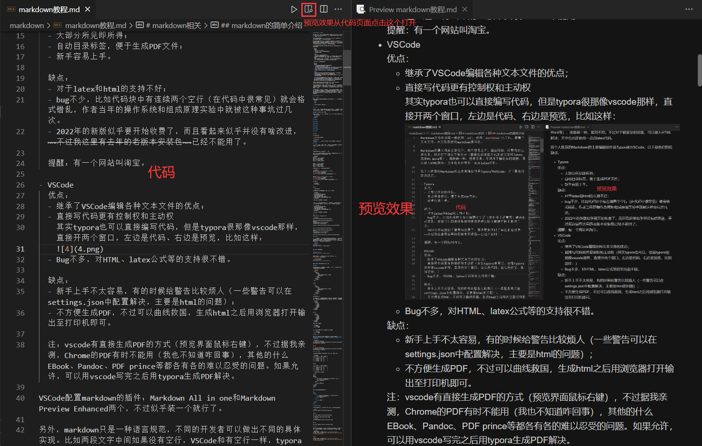
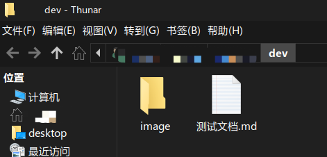
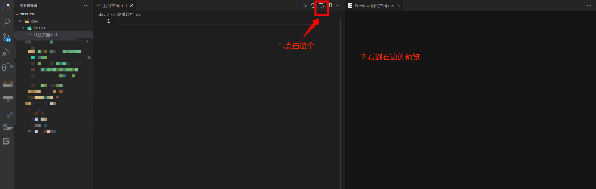

# markdown 简单用法

本文介绍Markdown的简单用法，原文为X助教于202206所写。

有的时候看一个人写的文档，如果遇到卡壳的地方就挺难受的。如果有卡壳的地方欢迎邮箱联系我（邮箱在[仓库主页文档](../../README.md)里），我邮件回复比较快，建议不要加我的QQ号。

本次重写文档，主要进行的是重点和细枝末节的分离，以及做更多的补充。

如果阅读完毕，请点击[回到上一级文档](../README.md)。

## markdown的简单介绍

Markdown是近几年兴起一种新型排版语言**规范**，在计算机相关行业十分流行。计算机相关专业的人，大二掌握基本的markdown用法，对于今后学习有很多便利性。

> 注意“规范”一词。规范或者说标准，是一套比较虚的东西，并不是什么具体实现。
>
> 举个例子，“面包”也是一种规范。从搜索引擎可以得到：国家标准GB/T 20981-2021《面包质量通则》规定了面包的术语和定义、产品分类、技术要求、试验方法、检验规则、标签、包装、运输及贮存。（助教没有去看这个国标文档，只是拿这个做例子）
>
> 有这个规范之后，消费者看到简单的烘焙品就认为这是面包；从面包加工工厂来看，需要依赖于这个标准才能生产面包，然后可以向消费者宣称这是面包；从监管部门来看，对产品进行检测，满足以上标准的可以称为面包。
>
> 至于面包是怎样生产的、是手工还是机械制造，这样的制造上的不同；亦或是面包上边加了坚果、果酱、附赠了礼物等的产品的不同，这属于面包标准以外的其他实现，和标准无关。不同厂家生产面包不一样，不过他们都要满足以上标准。
>
> 同样的，对于实现 Markdown 功能的编辑器或各种软件，都遵循相关 Markdown 标准，至于是C语言写的还是C++写的或是其他语言写的、用了什么算法等等，这也是标准以外的东西。他们因为满足这个标准而宣称我们是支持 Markdown 的软件，标准以外的东西有自己的实现。

Markdown文件的后缀一般使用 `.md` ，如果你觉得这不好听，使用 `.markdown` 也可以，都属于文本文件。本文就是使用 markdown 编写的。

Markdown 的优点主要在于：

- 相比latex：
  - 新手容易上手
  - 语法简单
  - 调整格式容易
- 相比doc系列的格式：
  - 编写内容的时候不怎么需要考虑排版问题，不用分心，可以高效编辑
  - 文档简单整洁，条理清晰，结构完整（高考语文乱入）
  - 文件体积比较小（其实现在不怎么在乎这点存储空间）
  - 作为文本文件，其还有普适性、稳定性等优点，无需考虑兼容等问题（指：小心你用2022年的软件写完之后发给别人，人家装的是2003然后打不开。Markdown至少能用记事本打开看个大概），且便于解析（有很多开源工具，比如说设计一个网站要预览markdown估计比较容易，但是打开doc怕不是要做不少工作）
  - 修改插入的图片不需要修改markdown文件。
  - 使用开源工具，不用担心版权问题（虽然doc格式也有 libreoffice 这种软件，但是大部分人写doc用的都是商业软件）。
- 写实验报告等文档，无论是一教的还是西区的，插入代码或公式都比较美观、优雅、紧凑，插入图片、流程图等很容易。编写整齐美观的实验报告是~~卷王~~中科大学生的必备素质。

缺点在于：

- 语法不够充分（需要复杂排版方式的建议左转latex，或者MS Word等）
- 排版就一种，爱用不用，受限制比较大；不过对于稍复杂的排版，可以嵌入HTML解决；文中也允许使用一点点latex代码。

我个人推荐的 Markdown 的主要编辑软件是 Typora 和 VSCode；如上文所说，它们满足 Markdown 规范且在规范之外有不同的实现。至于如何下载安装请自行百度。我个人推荐使用 VSCode 编写。以下是他们的优缺点。

### Typora

优点：

- 大部分所见即所得；
- 自动目录标签，便于生成PDF文件；
- 新手容易上手。
  
缺点：

- 对于latex和html的支持不好，且latex公式多的文档卡顿严重；
- bug不少，比如代码块中有连续两个空行（在代码中很常见）就会格式错乱，作者当年的操作系统和组成原理实验中就被这种事坑过几次。
- 生成的 PDF 中， latex 公式貌似（我没研究过，不确定）是作为图片的（vscode的是文字），总之是不可复制，而且放大就变糊，总之很不爽
- 2022年的新版似乎要开始收费了，而且看起来似乎并没有啥改进，~~不过我这里有去年的老版本安装包~~已经不能用了。
- 对于不规范的markdown代码并不会给警告。（注：markdown不是程序，胡写也能出来个预览效果，没有错误，只有警告。）

个人评价：我现在安装了但是很少用。如果你使用 Vlab（后续文档会介绍这是啥），Vlab自带 typora 软件。
  
提醒：有一个网站叫淘宝。

### VSCode

优点：

- 继承了VSCode编辑各种文本文件的优点；
- 直接写代码更有控制权和主动权。

  其实typora也可以直接编写代码，但是typora很那像vscode那样，直接开两个窗口，左边是代码、右边是预览，比如这样：

  

  typora只能同时看代码和预览中的一个。

- Bug不多，对HTML、latex公式等的支持很不错。
- 开源软件和插件，不易引起版权纠纷。
  
缺点：

- 新手上手不太容易，有的时候给警告比较烦人（一些警告是无可避免的，可以在settings.json中配置解决，主要是html的问题。我稍后会介绍。其他情况下应该尽量减少警告。）；
- 导入图片后打开预览，如果对图片做出更改，那么预览不能同步，需要关闭预览后重新打开预览。
- 不方便生成PDF，不过可以曲线救国，右键用浏览器打开输出至打印机即可。
- 也有一些bug，主要出现在文档太长的情况下。我原来写的文档就因为太长而具有很多bug，我重构的文档比较短，减少了bug的出现。
  
注：vscode有直接生成PDF的方式（预览界面鼠标右键），不过据我亲测，Chrome的PDF有时不能用（我也不知道咋回事），其他的什么EBook、Pandoc、PDF prince等都各有各的难以忍受的问题。如果允许，可以用vscode写完之后用typora生成PDF解决。

VSCode配置markdown的插件：Markdown All in one和Markdown Preview Enhanced两个，不过似乎装一个就行了。如果安装一个则建议安装Markdown Preview Enhanced（一般简称MPE），这个用的人更多、看起来 bug 更少。

如果你希望能报出一些警告，可以安装 markdownlint 插件。报警告的意义是找出可能写错的地方（不常见）并尝试写的更规范。

## Markdown的初步练习

Markdown 作为语言规范，不同的开发者可以做出不同的具体实现。比如两段文字中间如果没有空行，VSCode 的 MPE 和有空行一样，typora 会比有空行缩短一些行间距， Github 和 Gitee 的渲染则会忽略换行，连起来成为一段。

接下来我介绍使用 Typora 和 VSCode 的简单 markdown 操作（以 VSCode 为主），至于高级操作建议自行学习。首先我们先新建一个文件夹用来做第一次练习，在里面新建一个文本文档，把名字改成 `测试文档.md` ；然后在这个文件夹里再新建一个文件夹，命名改为 `image` ，接下来跟着我的文档操作。

> 其实新建这两个文件夹不是必要的，但是最好这么做，一会我告诉你为啥。以下以vscode为主，typora为辅，这是为了便于观察代码是什么样的，以及代码和渲染的对应关系。

也就是有如下的目录：

您可以使用 VSCode 打开该文件夹，或是用 typora 点开这个md文档。我个人推荐使用 VSCode 并安装MPE插件（见上文）。使用 VSCode 打开文件夹后打开测试文档，点击右上角的“MPE:打开侧边预览”，就可以看到左边的空白文档和右边的空白预览。

然后阅读[markdown的基本使用](1.markdown_basic.md)；更复杂的格式可以看[markdown的高级使用](2.markdown_advanced.md)，但是后边的格式不太常用。

我鼓励读者使用面向CV的编程方式进行体验。

## Markdown官方教程

我在网上找到了[官方教程](https://markdown.com.cn/)，还有其[英文版教程](https://www.markdownguide.org/)，不过这些内容并没有像我这样使用 VSCode 演示，所以我不是特别推荐。

## 阅读完毕后回到上一级文档

如果你阅读完本文的内容，可以[回到上一级文档](../README.md)。
