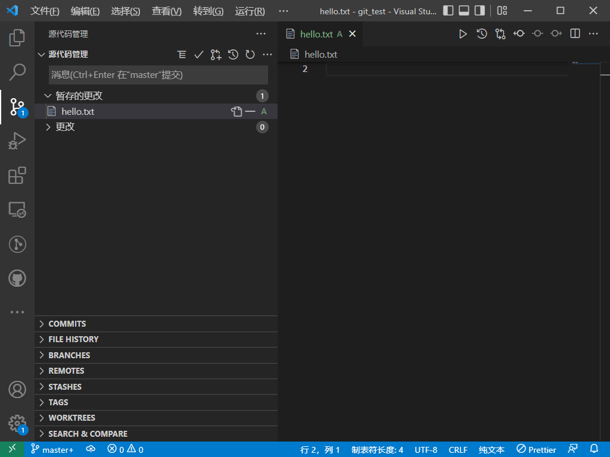
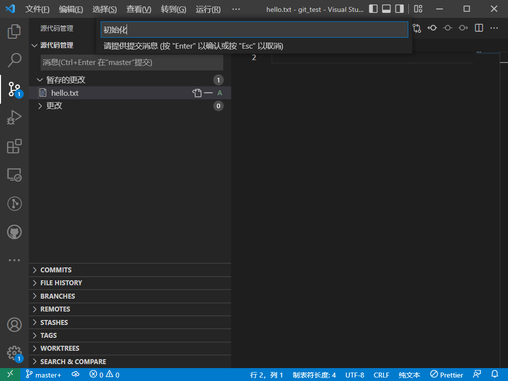

# 本地 Git 的使用

## 1. 名词解释

不准确，但都是人话

- 仓库（repository）
  是一个被 git 管理的文件夹。
  “删库跑路”的“库”就可能指这个仓库（也有可能指数据库等）

- 提交（commit）
  使用git记录这个时间点下仓库的内容。

  比如：2023年1月1日0:00，记录这个时候的代码版本。

- 提交消息（message）
  就是一次提交的注释，一般写这次提交前干了什么。

  比如：对2023年1月1日0:00的代码，其提交消息是：修改了某bug，更新了某新功能。

## 2. 二进制文件的替代

初学者了解即可。

Git 对版本的管理，如果文件是文本文件，则是按照行管理的。如果是二进制文件，则是每次提交的时候，如果文件发生变动则会把文件整个保存，因此占用空间很大，而且不能像文本文件那样按行比对各版本的不同，从而文件比对效果不好。因此，对于部分需求，如果同学们平时使用二进制文件，如果想要使用 Git 完成较好的版本管理，可以尝试使用有相似功能的文本文件替代。

常见的文本文件替代方案：

- MS Word/PPT/WPS文字/演示文件，也就是doc和ppt：可以使用 markdown latex 或 html 进行部分功能的替代。（Markdown的用法可以往上翻看我的[另一篇文档](../1.markdown_use_guide/README.md)）
- MS Excel/WPS表格，也就是xls文件：如果对表格格式（宽度、字体、颜色等）要求低、只要求保存数据信息，可以使用csv文件进行替代。
- 不过真要用二进制文件的时候，也别强求非得用文本替代，比如应用于markdown的图片也是常常出现在git仓库里的。不过一般这类文件不常更改。另外，编译的最终文件有时也会出现在git仓库里。PDF也常常出现。

需要注意的是，如果你的 git 仓库东西太多，那么在使用网络 git 平台的时候可能会因为太大而不被接受。除了减少大的二进制文件，还可以用 gitignore 以进行合适的管理（本文档后边会讲）

## 初始的配置

一般网上教程都会告诉你首先配置个人信息：

```bash
git config --global user.name 用户名
git config --global user.email 你的邮箱
```

确实是这么做的，不过他们没有讲为什么这么做，以及这么做的一些注意事项。

首先，git 的配置是有级别的，有system、global、local三个级别。system对整个操作系统有效，global对当前用户有效（一般操作系统支持多个用户，虽然各位读者的电脑大概率只有一个常用用户给自己一个人用。配置global只对你当前使用的用户有效。如果用其他用户登录则不会使用原来用户的配置两个用户的配置可以并存，当使用的时候根据当前登录用户决定），local只对当前仓库（换言之，文件夹）有效。强龙不压地头蛇，当存在配置冲突的时候，当前有效的取决于最低的级别。（比如当前用户配置的global是张三，某个仓库的local是李四，则在当前仓库使用李四，在仓库以外使用张三。）

一般我们配置这两个选项选择global，因为电脑上可能存在其他用户所以不使用system，而我们不希望每次新建仓库都重新配置，所以不使用local；现在请使用以上命令完成配置。

用户名可以输入中文，邮箱……想必没有哪个邮箱地址是中文的。

邮箱是标识 git 用户的标志，就像身份证号一样。不同电脑上配置的用户，以及网络 git 平台的账号，当邮箱相同时，认为是同一个人的操作。因此请务必记住此时你配置的邮箱。相对而言，用户名没啥重要的。

## 仓库的初始化

1 找一个文件夹，不管是空的还是有文件，使用 VSCode 打开这个文件夹：


可以像我一样在这里新建一个文件并输入以上内容。注意文件结尾要有换行。

2 点击左边那个树杈，初始化存储库：


这时候你的仓库的文件夹下已经生成了一个隐藏文件夹： `.git` ，一般我们不用管它也不要动它。需要说明的是，如果某一天这个仓库不想被 git 管理，那么删除这个 `.git` 文件夹就好。

## 进行版本管理

画一个简单的示意图：


其中虚线表示这不是本节所讲的内容。需要注意的是，更改包括文件内容更改、文件新建和删除。

3 回到资源管理器那里（左边那一列的第一个），上边的U表示这个文件没有纳入版本管理：


4 我们可以编辑这个文件。回到那个树杈（源代码管理）上，发现：


“更改”表示这是实际**发生更改的文件**。U表示没有纳入版本管理。

5 点击U左边的加号，出现一个栏目叫**暂存的更改**，这就表示这个文件在实际更改之后又被我们加入了暂存区。



不过这不代表这玩意已经 `commit` 过了，只是说这玩意即将被 `commit` ，如果提交则是这文件第一次被提交。提醒：提交的时候只提交在暂存区的文件而不是实际发生更改的文件。

6 提交有两种方式。

一种左侧的“源代码管理”和“暂存的更改”中间的地方输入消息后点击提交，提交消息（commit message）可以是中文。


如果没有这个蓝色“提交”按钮，则可以用 ctrl+Enter 替代。

另一种是点击源代码管理右边的对号，在顶上弹出的窗口输入提交信息，按 Enter 完成提交。



7 如果一切正常，那就算是纳入版本管理了。这时候，“暂存的更改”为空，“更改”可能不是空的。（我们这个例子里“更改”也是空的。我们这里讲的比较简单，每次把修改的所有文件都添加暂存并提交，暂不考虑有文件不提交的情况。）


如果源代码管理下的蓝色框里一直在转圈，那是因为没有输入提交消息，需要重启后输入消息再来。

当然也可能你会看到这样的弹出一个 COMMIT_EDITMSG 界面：


这一般是因为你在提交的时候**没有输入提交消息**（可以通过读取上面的绿色文字得到，要学会自己读取英文报错提示），关闭这个页面重新提交即可。

8 我们回去接着编辑这个文件，这次我们新增两行。编辑之后保存：


9 这里在修改的地方左边就有绿色竖条提示。把鼠标一到第一行会给出版本提示，已到第二行提示“Uncommitted changes”；保存后左边出现一个M字。如果我们新建一个文件（从外边拖进来也行）：


10 这里的 `hello.txt` 的棕色M表示文件有了变更，`file2.txt` 的绿色U跟之前的U一样。

11 现在转到版本管理，把两个更改都加到暂存的更改去：


12 按照上面说过的方法，提交后可以回去试一试，鼠标挪上去能够显示不同的提交信息。现在接着更改这个 `hello.txt` ，需要注意的是这次不是新增新的行，而且改变已有的行：


这时候会发现左边变蓝了，而不是像新增那样变绿。

13 改完之后提交，然后转到源代码管理把下边的COMMITS拉上来，可以看到历史提交记录。选一个展开，就可以看到这次提交修改的文件。点击其中的某一项，可以看到这次提交所做的修改（前后文件对比），如下图所示：


其中左边是原来的、右边是提交之后的。

可以看见这里的文件修改对比是按行比对的，能够快速帮我们定位到两个文件的区别。

> Git 对文本文件的管理，只存在删除行或新增行，不存在“修改了某一行”。实际上修改某一行之后，git会提示你在原文件中删除了该行、在新文件对应位置新增了该行。

学到这里你已经学会了使用 VSCode 和 git 进行版本管理了。你可以用前文所学的内容管理你的课程大作业或者是课程笔记，这很好用。

如果你这里没有 COMMITS 这一栏，那大概是我之前所说的两个插件没安装好。如果已经安装了，可以试试重启 VSCode 看看。

 ---

继续阅读[网络Git使用](2.git_online.md)或[回到上一级文档](README.md)，也可以看看下面介绍的命令行对应。

## 使用 gitignore

其实也不是必须的，但是很常用。Gitignore 是一个配置文件，其目的是指定仓库目录内某些内容**不**被git记录。这样可以降低体积、提升效率，并在使用线上仓库的时候隐藏某些文件。

通常需要不被git记录的内容有：

- 编译中间文件，因为很容易生成，主要是 .o 或cmake生成的各种临时文件等。一方面这些东西容易生成，而且占用空间；另一方面也可能与不同的电脑体系结构有关，保存了之后给其他人也可能并不合适。
- 编译结果的可执行文件，有的时候需要被git记录，也有的时候不需要。
- 对自己的代码进行功能测试的一些相关文件（比如测试数据或输出结果等）
- 适用于本人的配置文件，不希望传到网络 git 平台
- 给自己看的一些草稿或是私密文件，不希望传到网络 git 平台
- 可能大概就是这些，我想不出来了

14 随便建一个文件，随便取名，是用来忽略的。再随便建一个文件夹，文件夹内再建一个文件，也是用来忽略的，随便起名。这都是用来学习 gitignore 的使用所用的。可以保存，但是注意不要提交。如下图所示：


15 现在我们在git根目录下新建一个文件，名字叫 `.gitignore` ，注意没有别的乱七八糟后缀名。里面写上如下内容：


如果你使用了 VSCode 的 vscode-icons 插件，那么这个文件左边的图标将变成像我上边那样的 git 的图标。这个插件我也是比较推荐的，可以看出来文件类型，还可以对这些比较特殊的文件名加以标识避免写错。

~~在这个文件内，写入文件夹的相对路径（前边不用加斜杠或者点之类的）表示一个文件夹，前边加上一个斜杠的相对路径表示一个文件。这是常见的用法；其他的高级用法建议百度。~~（2022/11/11更新：貌似不需要斜杠，文件夹或文件都同等对待，前边都不需要 `./` ，直接写相对路径即可）被 `.gitignore` 指定的文件或文件夹将不被git管理。

> 提醒：
>
> 1. 空文件夹也不会被管理。有的时候为了使得该文件夹被管理，会在文件夹里添加 .gitkeep 文件（内容一般为空），这样该文件夹就不是空文件夹了。
> 2. 可以在 gitignore 里写目前不存在的文件（文件夹），如果未来出现这些文件（文件夹），则其自动不会被覆盖。
> 3. 如果以后有新的需要被忽略的文件，也可以以后再向 gitignore 追加项目。
> 4. 如果文件A首先被提交，然后再向 .gitignore 里添加文件A的路径，此时 gitignore 的这一项是无效的。这个可以在网上搜索解决办法，该办法比较复杂。

16 现在可以看到，资源管理器中刚刚两个新建的文件右边是U；当我们对`.gitignore`按下保存（`Ctrl+S`）的那一刻，那两个文件带上那个文件夹，瞬间暗淡了下去：


当然，右边绿色的U也没了。如果没有变暗则说明写的不对。

现在全部添加暂存区且提交，会发现左边的“更改”已经没有这些被 ignore 的文件了。以后这些文件东西也不会被纳入管理。以后即便修改这些被 ignore 的文件，其也不会被 git 管理。

 ---

## 以上操作的命令行对应

VSCode 的图形界面能够让我们直观地入门，但是实际使用的时候，添加暂存区和提交一般是命令行操作。而且 VSCode 的插件也只是帮你生成命令行来塞给 git；一些复杂的情况也需要用命令行解决。这里来介绍一下上面操作的命令行。如果暂时记不住也没关系，能用 vscode 也行。

首先要打开一个终端，Windows下可以使用cmd，打开cmd的方式请自行搜索。Powershell也可。Linux打开终端的方式就不再赘述。然后使用cd等命令切换终端当前路径到你的仓库的路径。

### 仓库初始化

```bash
git init
```

可能会报几个警告，提示改分支的名字啥的，不用管它。

### 添加文件到暂存区

添加某个文件就直接写出文件相对路径就行。一般我们选择添加全部文件，那么输入：Windows

```bash
git add .
```

后边的点表示当前目录，也就是当前目录下所有已修改文件添加到暂存区。

### 提交修改

```bash
git commit -m "提交消息"
```

提交消息可以是中文的。如果输出提示提交为空，那么则是因为没做上一步。

### 查看某一条指令有没有执行成功

如果你并不知道某条指令是否成功，请尝试：Windows下输入 `echo %errorlevel%` 或 linux下输入 `echo $?` 以查看上一条指令的返回值。如果输出是0则执行成功，否则执行失败。只能查看上一条指令是否成功。
