# 网络 Git 的使用

## 什么是 GitHub ？和 git 有什么联系？

Github 是一个在线仓库管理网站。目前我们能够接触到的在线仓库管理网站主要有 Github、Gitee 和 Gitlug 三家。

```text
以下定义USTCLUG：中国科学技术大学 Linux 用户协会（Linux User Group）
```

三个平台的比较：

|   | GitHub      | Gitee             | Gitlug            |
|------------|-------------|-------------------|-------------------|
| 运营方        | 微软公司        | 深圳市奥思网络     | USTCLUG           |
| 运营稳定情况     | 稳定          | 稳定                | 有时停机维护 |
| 网络稳定情况     | 不稳定         | 稳定                | 一般稳定  |
| 操作界面       | 只有英文        | 中、英               | 仿照 GitHub              |
| 新手操作友好程度   | 较好          | 好                 | 一般                |
| 免费仓库容量限制 | 1G          | 500M              | 貌似没限制     |
| 免费仓库人数限制 | 3人          | 5人                | 貌似没限制     |
| 超出免费限制方法  | 氪金          | 氪金                | 没听说过超出的           |
| 主要盈利方法       | 中小企业服务 | 中小企业服务       | 用爱发电              |
| 主要受众       | 全世界         | 国内                | 校内                |
| 有用的开源项目    | 世界最多        | 不多 | 很少                |
| 登录方式    | Github账号、微软账号等        | Github、QQ、微信等 | 统一身份认证 |

### 各种Git平台的的共性

1. 线上线下仓库的关联
   我们可以注册一个账号，用这个账号建立一个线上仓库，或者加入别人建立的已有的仓库，然后与线下仓库关联。这样我们可以线下编辑，然后把更改推送到线上仓库。
2. 多人共同编辑仓库
   每个人的线下仓库都与一个线上仓库相关联，然后就可以多人共同编辑，而不用搞的一堆群文件到处乱传一堆副本。这尤其适合小团队协作。**这也是我们是用git的重要原因。**
3. 查阅资料，浏览他人仓库
   即使没有账号，或者没有编辑权限，也可以在上面查找别人的开源项目，下载下来使用。GitHub 上有很多有用开源仓库。受制于网络现状，GitHub 网络连接不稳定（可以使用 fastgithub 解决，后文会介绍），gitee 有一些来自于 GitHub 的同步。

它们与 git 的联系：使用 git 可以方便地实现线下和线上的关联、管理。

### 如何选择使用哪个平台

作者个人推荐：

1. 单人或小组作业如果都是校内的则使用 gitlug，否则使用 gitee
2. 如果希望被更多的人更广泛地看到，请使用 GitHub
3. 很多人的代码仅在 GitHub 上发布，选什么就不用说了。

单个仓库超过 500M 的情况很少，但是合作人数超过 3 个人倒是比较常见，因此个人和小组作业可以优先考虑 gitee （如果全是校内的可以 gitlug）；我感觉对初学者来说，操作最友好的是 gitee，熟悉 gitee 之后再用 GitHub 就会好很多。本文档将以 gitee 为例讲解线上平台的使用。

### 在线仓库的特征

在线仓库一般在根目录有一个文件叫 `README.md` ，当用户打开这个仓库的网址时，网页会自动显示这个文件的内容。仓库内的子文件夹也可以有这样的文件。这个文件的内容一般可能包括：

- 仓库名字、目的、开发者
- 开源软件使用方法
- 致谢
- 构造仓库的想法、思路等
- 版本更新信息，如日期、修复的bug或更新的功能等。

一些仓库会有 `readme.txt` ，作用类似。

如果是开源仓库，那么一般还要有一个 `license` 文件，作用是写清楚这个仓库的知识产权及相关权利问题。一般人没有那么懂法律知识，但是我们可以抄。网上有常用的模板，全世界都在用的，可以直接抄，比如MIT License等。

Gitee 仓库如果有 license 则容易过审，就个人体验而言，加了 license （不管里边写了啥，甚至空文件都可以）后能秒过。

开源软件的一个好处是，对于比较热门的开源软件，如果有使用者发现了 bug ，那么可能会去找它的代码并帮忙找出 bug ，因此错误应该比较少。一般开源软件代码会放在 github 上；如果你不是仓库管理者，那显然不能直接修改仓库。且发现了其中一个错误，那么：

- 你可以提出 issue 向仓库管理者反馈。
- 如果有能力，可以自己修复bug，那么可以使用 pull request 功能把自己修改好的代码提交上去。如果管理者同意，那么对方将使用你提交的代码。

## 使用 Gitee 的线上仓库

首先我们需要考虑两种情况。

1. 还没有建立线上仓库，线下仓库已存在或未存在。
   一般情况下，开始一个新的项目就是这种情况。
2. 已经建立了线上仓库。
   这种情况一般是当项目开始了一段时间之后。可能是需要更换开发平台（比如换了电脑或者换了操作系统），或者多人合作且仓库不是你建的。

我认为还是要区分这两种情况的，可惜网上的教程大多都没区分。

### 情况1 还没有建立线上仓库

首先你得有个账号。可以使用 QQ 登录 gitee 并注册账号，**记得注册账号的时候邮箱填之前配置git的时候的邮箱。**

> 如果忘了，请在命令行输入：
> `git config --global user.email`

以我们之前练习线下仓库时创建的仓库为例。

21 登录后点此选择新建仓库：


> 如果是 GitHub，类似于 gitee，选择右上角加号和 new repository
> 如果是 gitlug，请在登录后选择：new project -> create blank project
>
> 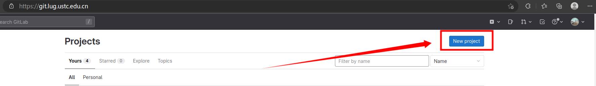

22 起个名，名字可以是中文的，路径必须是英文的。Gitee会帮你从名字翻译一个路径上来，不过你可以自己改路径名。**各种初始化选项均不要勾选，也就是说底下红框的三项都不要选，否则跳转到第二种情况。** 目前，gitee 新建仓库只能是私有的，开源需要建好之后再更改；GitHub 和 Gitlug 可以在新建仓库的时候选择开源或私有。

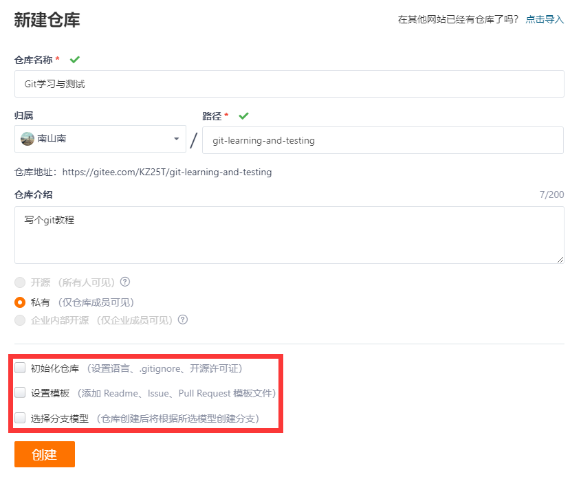

23 建好之后，gitee会很良心的给出一些命令行，并建议你接下来做什么。我是讲图形化的，不是讲命令行的，所以不用管。点击红框里右边的复制，此时得到的复制内容就是仓库网址，这是http连接方式。

> ssh方式我不讲，建议新手先把http搞好。

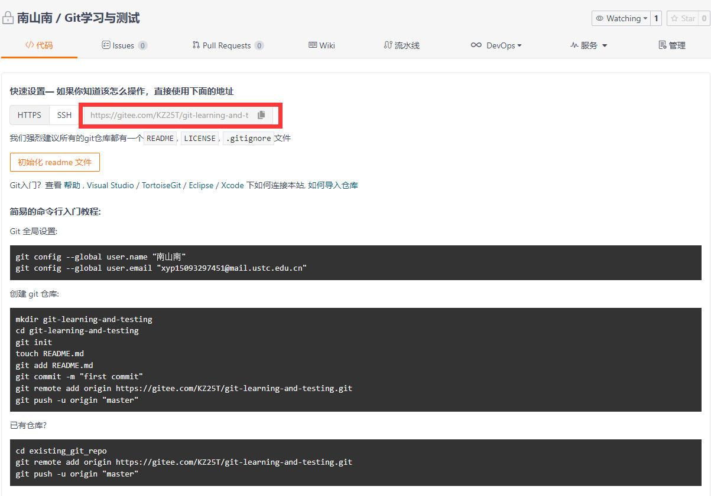

24 转到已有线下仓库的VSCode界面，如下点击添加远程存储库：

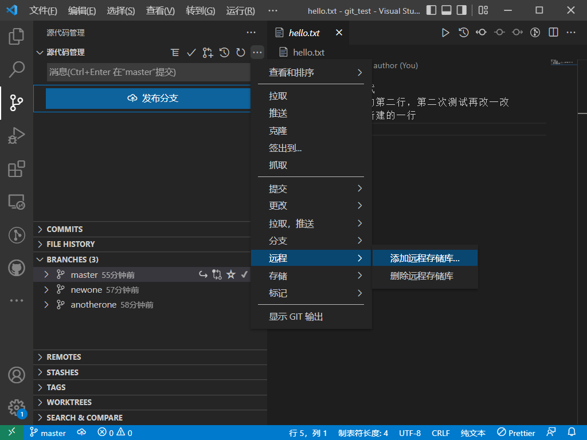

25 把刚刚的网址粘贴进去之后按回车后随便输一个名字（比如GITEE_TEST，好像不能用中文），再按回车。

如果本地之前没有用过这个账号，则 VSCode 应该会告诉你登录 gitee ，这时候不能使用QQ啥的登录，必须使用 gitee 的账号和密码。注意用户名是登录 gitee 后的网址中：`http://gitee.com/`后边的那个。

然后再回到上边vscode的源代码管理界面，点击发布分支，过几秒钟之后就会发布成功。此时刷新一下原来的gitee界面，就会看见仓库里的内容：

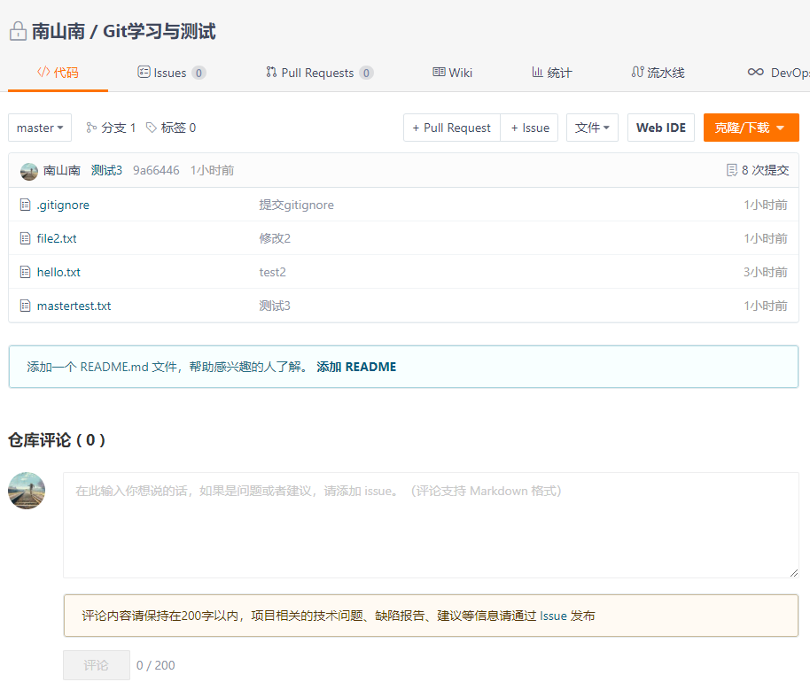

注意，被.gitignore覆盖的文件不会传上去。

### 情况2 线上仓库已建立

现在我们用刚刚创建的线上仓库做实验。虽然大家已经有线下仓库了，但是我们可以换一个地方来实验（也就是避开之前的仓库的文件夹），以此假装不存在这个线下仓库。

26 首先获得这个玩意的url，就是点下面的复制：

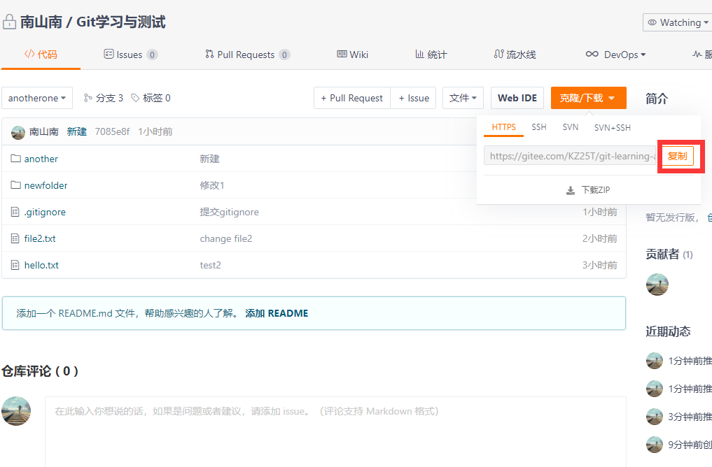

当然也可以在仓库首页复制网址。

27 然后找一个文件夹，不一定要空，因为 git 会帮你新建一个文件夹放这个仓库。打开终端调整到对应文件夹，命令行输入

```bash
git clone 上面复制的url
```

得到：

```bash
$ git clone https://gitee.com/xxx/xxx.git
正克隆到 'git-learning-and-testing'...
Username for 'https://gitee.com': xxx
Password for 'https://xxx@gitee.com': 
remote: Enumerating objects: 46, done.
remote: Counting objects: 100% (46/46), done.
remote: Compressing objects: 100% (28/28), done.
remote: Total 46 (delta 11), reused 0 (delta 0), pack-reused 0
展开对象中: 100% (46/46), 3.54 KiB | 403.00 KiB/s, 完成.
```

注意，如果不登录账号时不能访问该仓库，则 git 会要求输入账号密码。

然后对应文件夹就出来了：

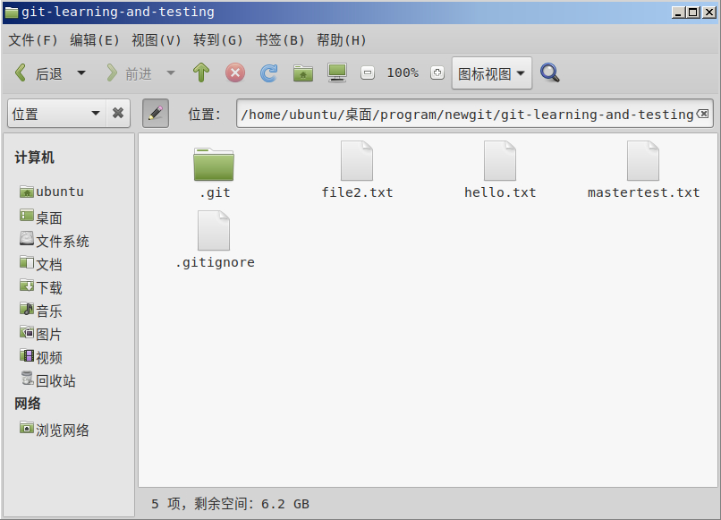

> 提醒：其实 `git clone` 不止能应用于自己的仓库，也可以用于克隆别人的仓库（前提是你可见），甚至不要求自己有账号。比如说你想学习别人的代码，则可以 clone 下来。克隆下来的仓库包括已存在的一些git的信息如历史提交记录、历史版本等，你可以在本地操作这个库，进行本地的提交。不过如果要像上面情况1后边所说的那样把内容更新到在线仓库，那么需要有仓库的一定权限。

注意，这里边的`.git`和`.gitignore`都是隐藏文件。

### 建立关联后的信息同步

28 如果线上仓库的内容发生变更，则可以通过“拉取”获取变更。

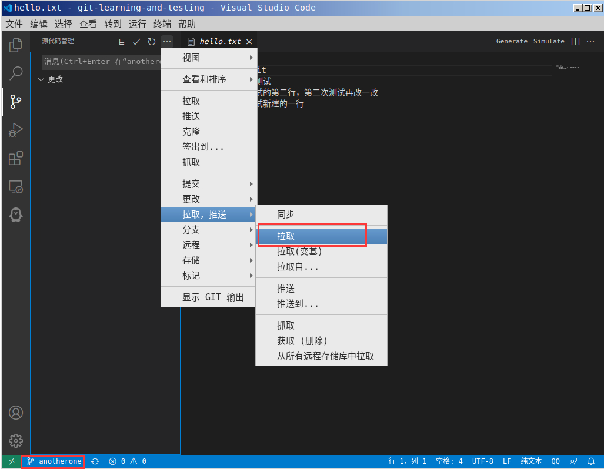

29 如果本地信息发生变更（指提交之后），可以像上图那样点击“推送”把变更更新到网上。

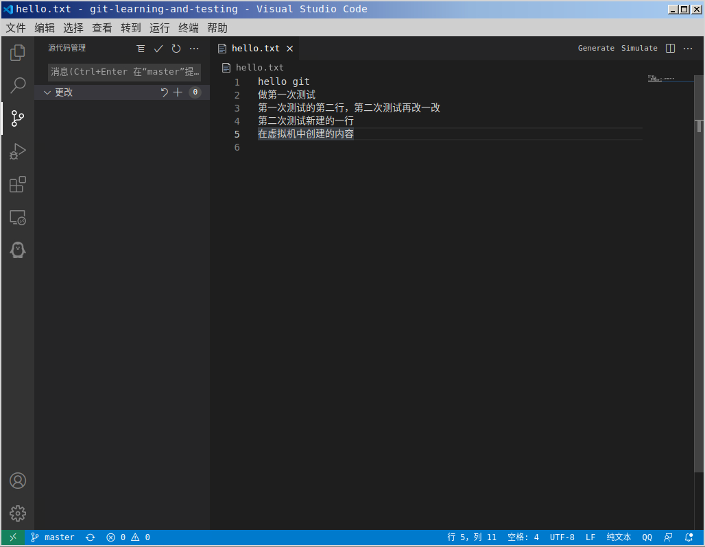

提交之后再刷新gitee就能在网上看到了。

## 多人共享仓库的使用

对于小组作业等情形，可能需要建立多人共享仓库。其中需要有一个仓库创建人，创建这个仓库之后给其他人权限，然后其他人按照上文情况2开始即可。

需要注意的是，这种情况建议每次准备编辑仓库的时候都拉取一下，看看有没有别人修改过了仓库内容。

Github 和 gitlug 邀请其他人的方式是输入对方用户名后直接加进来，gitee 是分享链接。

 ---

## 命令行操作

1. 推送

   推送之前一般需要提交，提交的方法看之前的说明。

   一个仓库可能对应多个远程仓库（就像第25步的时候说的 GITEE_TEST），对于每个分远程仓库，推送时请输入：

   ```bash
   git push GITEE_TEST # 后边改成自己的远程分支名字
   ```

   这时候只会推送到 GITEE_TEST 这个远程仓库。那么如何查看有哪些远程仓库呢？

   ```bash
   git branch -r
   ```

   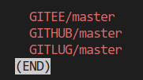

   我们可以先不管 master 是啥意思，斜杠左边的就是全部的远程仓库。按 q 退出。

   > 如果你的仓库是 `git clone` 下来的，那么其会有一个默认远程仓库加 origin，如果只需要推送到 origin 则只需要 `git push` ，不需要指定存储库。

2. 拉取

   如果仓库是 git clone 下来的，拉取只需要 `git pull` 就可以。否则你需要先查看自己的 git 分支：

   ```bash
   git branch
   ```

   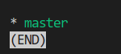

   按 q 退出。接下来要从上边的远程分支里选择你要从哪拉取。比如说选择 GITREMOTE/name1（比如GITEE/master），本地分支为 name2，则输入命令为：

   ```bash
   git pull GITREMOTE name1:name2
   ```

## 一键推送脚本

助教本人写了推送脚本，我平时的推送可以快速一键完成。

linux 脚本：

```bash{.line-numbers}
#!/bin/bash

if [ -z "$1" ]; then
    read -p "input your commit log: " LOG
else
    LOG="$1"
fi

LOG=$(echo $LOG | sed "s/\ /\\\ /g")

ADD="git add ."
COMMIT="git commit -m $LOG"
PUSH1="git push GITLUG"
PUSH2="git push GITHUB"
PUSH3="git push GITEE"

for cmds in "$ADD" "$COMMIT" "$PUSH1" "$PUSH2" "$PUSH3"
do
    if $cmds 2>/dev/null ; then
        echo -e "\033[32msuccess:\033[0m $cmds"
    else 
        ERRVAL=$?
        echo -e "\033[31merror:\033[0m $cmds " >&2
        exit $ERRVAL
    fi
done
```

在仓库根目录新建一个文件叫 `push.sh`，把以上内容添加过去。注意把 PUSH1 PUSH2 等的内容修改为自己的远程仓库名字。

在仓库根目录执行：

```bash
chmod 744 push.sh
```

建议在 gitignore 里添加这一项。然后每次有更改，执行

```bash
./push.sh "提交消息"
```

然后就可以一键提交、推送。

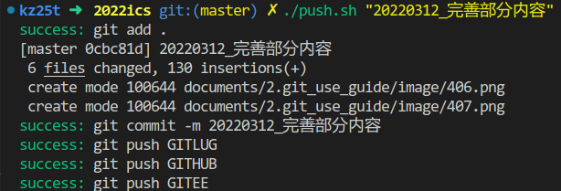

windows 也有对应的脚本：

```bash{.line-numbers}
@echo off
echo 正在进行本git仓库提交，与gitee和github的推送。
echo.
echo 现在进行本地提交。
echo.
set /p p=输入提交消息：
rem echo %p%
git add .
git commit -m %p%

echo.
echo 现在进行gitee推送。
echo.
git push GITEE

echo.
echo 现在进行github推送。
echo.
git push GITHUB

pause
```

同样类似地在仓库根目录建立 `push.bat` ，复制粘贴以上内容，修改 14行和 19行的远程仓库名字。添加 gitignore ；需要使用的时候启动脚本后输入提交消息即可。
