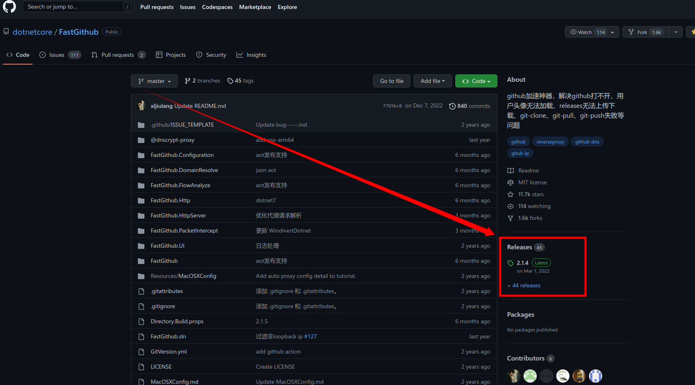
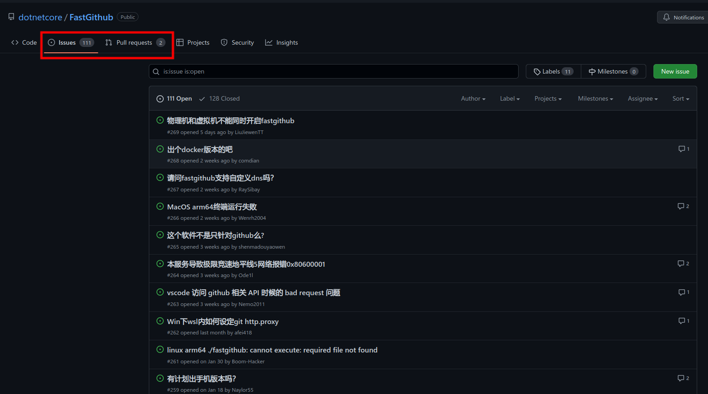
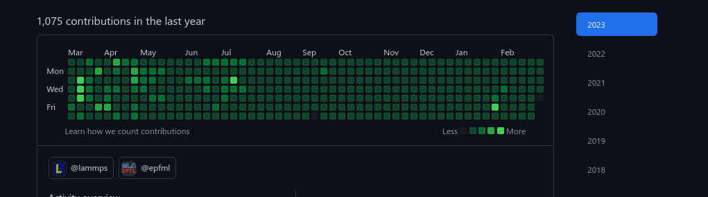

# GitHub 的使用

（其实我也没咋用过 GitHub 的一些高级功能，像 copilot 等我都没用过）

GitHub 除了可以像之前讲的线上仓库那样编辑自己的仓库，还有很多好用的地方。

另外一些内容我会放在计算机科普哪里，这里我就不再赘述了。

以下所说的功能，大部分 gitee 也有。

## GitHub 的访问

除了某些不能讲的方法，我这里提供两种方式。

一种是**镜像站**。我的理解是，镜像站是一些人利用一些资源，复刻了原网站的内容或资源。那为什么不去访问原网站呢？这一般是因为原网站速度慢或难以打开。

GitHub 的一个镜像站是 [https://hub.nuaa.cf/](https://hub.nuaa.cf/) ，如果你需要访问别人的仓库，或者从 GitHub 上下载内容，可以把原 GitHub 网址中的 github.com 替换成 hub.nuaa.cf，即可实现访问和加速。

就助教本人而言，有几次在 GitHub 上下载速度只有几百K，但是使用镜像站能达到大约 10M/s 左右。

需要注意的是，镜像站可能会利用你的信息，所以建议不要在镜像站上输入账号密码（也就是登录）。

另一种是[fastgithub](https://github.com/dotnetcore/FastGithub)；这是一个开源软件，运行在电脑上可以加速 GitHub 的访问。之前有人说“我上 GitHub 是为了上 GitHub”，这形成了一个死锁。当然你现在应该知道咋下载这玩意了吧。

## GitHub 上的开源软件

一些开源软件要求你在 GitHub 上下载安装，那怎么下载呢？

以上边的 fastgithub 为例。我们要下载并不是要看源码，显然不应该用 git clone；其实需要注意的是这个：

对于很多开源软件来说，其源码在 GitHub 的仓库里；但是软件用户很多时候不关心源码，而是希望得到一个能直接运行的软件。开源软件的开发者就经常把代码编译为可用的二进制可执行文件（称为制作发行版）之后，手动添加到 release 里。点击 release，新打开的页面有历史各版本的发行版可供下载。

至于选择哪一个，这不是本文档讨论的内容。

## 开源软件的问题

开源软件也经常出现一些 bug 等问题。如果你遇到 bug，可以在仓库旁边提出 issue，或者有能力的可以自行修改代码并提出 pull requests

## GitHub 的社交属性

既然名字里带有 hub，那必然有社交属性。

如果你看到了某个开源仓库，你觉得作者很有实力，则可以点开其主页点击 follow，也就类似于关注；你 follow 的人的动态（比如他推送了什么东西）会显示在你的首页。（首页就是`https://github.com`）

你也可以利用 GitHub 制作自己的个人主页（我没干过这事，我不感兴趣，但是有很多大佬都是这样的）

GitHub 一个人的主页里一般会有一个这样的东西：

这个是最近一年来，该账号的贡献次数，包括 push 等操作。越绿表示贡献越大。

## GitHub 的 fork

Fork 操作指的是从别人的一个仓库里复制一份成为我自己的，这样自己就可以修改仓库的内容，比如进行二次开发等，而不受对方仓库的权限限制。当然修改只能改自己的，不会影响得到对方的仓库。

如果对方仓库更新了，也可以把更新内容同步到自己 fork 的仓库上。
