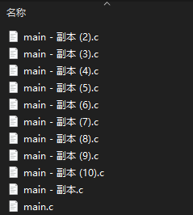

# git 简单用法

本文介绍 git 的简单用法，原文为X助教于 202206 所写，于 202210 开设习题课讲解。

这里基于 VSCode 介绍 git 的用法，只介绍简单的操作，不涉及复杂操作，最后会简单介绍命令行的 git 使用。

网上绝大多数教程都是讲命令行的操作，这样不仅容易出错，还不直观。很多人开始就讲 ssh 连接，那个也容易出问题。我尽可能少讲各种对新手不友好的内容，以便于读者尽快理解，尽量实现一篇文档解决全部入门问题。

我认为 VSCode 的相关插件是很好的入门选择，便于理解，在实际教学中也取得了相对不错的效果。作为一个经过多次实践的文档，我觉得水平应该还算可以。

**提示** 学习使用 GitHub 之前请一定学会使用本地 git，作者就是当年被坑了，有人叫我赶紧学学怎么用 GitHub，但是当时本地 git 都没学会。后来跟网上的教程学习，踩了巨多的坑。

本次重写文档，主要把较长的文档分割成为几个层次。

如果阅读完毕，请点击[回到上一级文档](../README.md)。

## Git 的简单介绍

用人话翻译一下网上的说法，Git 是一个*开源的版本管理*工具，最早原作者是 Linux 之父 Linus，其最初是为了给他写 Linux 内核代码用的。

“开源”指的是源代码公开，可以随便看。一般开源软件的代码会放在 GitHub 上。开源一般意味着免费，火爆的开源软件一般意味着优秀、高效。“版本管理”指的是记录一份代码历史上的各种版本。比如，一个软件发布时版本为 1.0，后来修复 bug 或者做了新功能后变成了版本 1.1，这时候可以用 git 记录它 1.0 版本的代码和 1.1 版本的代码，这就是简单的版本管理。

### Git 其他的功能

- 对比某个文件的某两个版本的差异，比如别人修改了代码之后通过 git 查看他改了什么；
- 将文件回退到之前的某个版本，可能是因为新的代码有 bug 覆盖了旧的安全的版本；
- 查看文件的某个部分是什么时候更改的（一般以行为单位），以及这个版本提交时候的提交的提交消息是什么。
- 使用 `gitignore` ，表示某些文件不被纳入git的管理，比如编译过程中的中间文件。这种东西不需要被管理，且占用大量空间，如果被 git 管理就会造成占用太多的空间。
- 分支管理，便于多人合作，也便于单人编写复杂的工程。

稍后我介绍这里的前四个功能并简单介绍最后一个。

### 大家可能遇到过这样的情况

- 一个大作业有两个部分，第一个部分完成之后很开心，接着写第二个部分。在写第二个部分的时候对之前的代码做出了修改，然后……发现第二个部分跑不起来，第一个部分已有的也出现了bug
- 这种事情太令人**蚌埠住了**，于是你尝试每次写一部分就存一个副本。长此以往：

  

  不仅如此，你还不知道每个副本是干啥的。

- 这种事情太令人**蚌埠住了**，于是你尝试给每个副本写注释。
- 然后你发现，如果想要对比之前的某个版本和当前版本的差异，甚至还要一行一行的看，这种事情太令人**蚌埠住了**。
- 在小组大作业中，很多人都要写代码，甚至涉及同一个文件。于是，群文件里各种副本、后缀的文件满天飞，咱也不知道哪个文件是谁改的、做了什么修改，错了也不知道是哪个憨憨写的，这种事情太令人**蚌埠住了**。
- 给助教发代码debug，助教说你的问题太大了，于是对整个文件甚至多个文件大卸八块做修改。当你再次接到文件的时候不知道做了哪些修改，这种事情太令人**蚌埠住了**。

怎么办？学会git解君愁！

这些东西应该是计算机相关领域的专业大二（最晚大三）要学会的东西。我本次只讲一些常用的东西，git分支等比较复杂的东西请自行探索。


（这是著名梗图，助教本人并没有看过）

## git配合vscode使用的预备条件

预备安装：

- 软件安装：根据你的操作系统选择安装 git
  - Windows [git下载地址](https://git-scm.com/)，找到对应的版本，一路next（除了选择安装路径）
  - Linux 使用包管理器安装，即使用命令 `sudo apt install git` （对Ubuntu等）或 `sudo yum install git` （对 CentOS 等）
  - Mac OS 助教没用过，可以自己上网搜。

- VSCode插件安装：很多人有不同的选择。我推荐安装插件`GitLens`和`Git History`，助教本人平时使用这两个就能有很好的效果。

要求：git安装完毕后打开命令行输入`git --version`能显示出版本信息。如果没有或显示找不到命令类似的提示，一般是因为没有把 git 所在路径加入环境变量。[解决办法](https://www.cnblogs.com/-mrl/p/11246666.html)

```bash
> git --version
git version 2.35.1.windows.2
```

VScode对git有很好的支持，使用vscode运行git对新手比较友好。

## Git 的使用

Git 的使用分为本地 git 和网络 git，后者需要先学会前者。

建议阅读顺序：

[二进制文件和文本文件](../3.computer_simple/README.md)（其实没啥大用，不看也行）

[本地Git使用](1.git_local.md)

[网络Git使用](2.git_online.md)

[GitHub的使用](3.github_use.md)

 ---

[回到上一级文档](../README.md)
