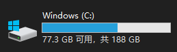
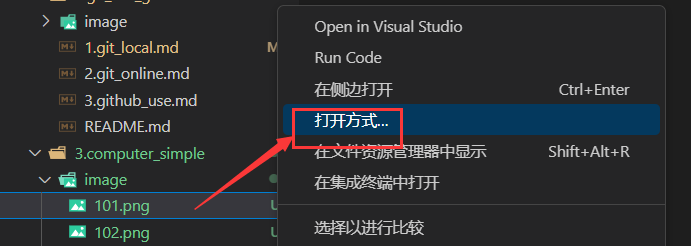
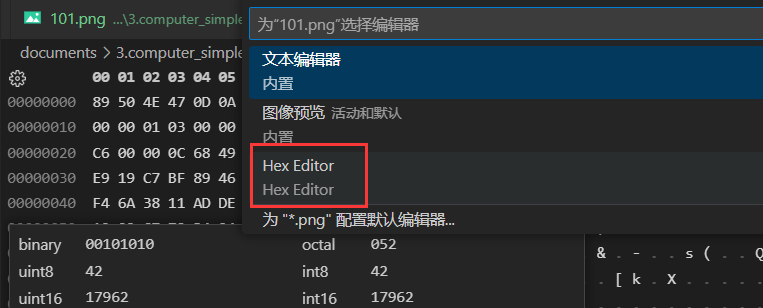
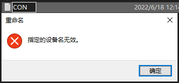
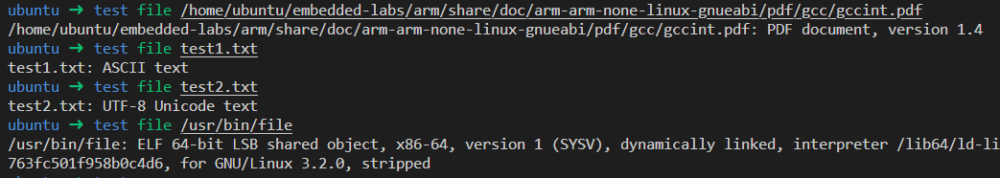

# 第1节 二进制文件与文本文件

## 主存与辅存

计算机文件及存储设备的大小一般按字节（B）计算，一个字节有8个二进制位（b），可以表示8位二进制数。衡量文件大小的单位一般为B、KB、MB或GB；衡量存储设备容量的一般用GB或TB计算。

$$1K=10^{3}（数学常用）或2^{10}=1024（部分情况常用）\\M换算K、G换算M、T换算G也一样$$

有的时候不同操作系统等的换算方式也不一样，只能说字节表示是最准确的。甚至助教本人在安装 kali linux 的时候，装机的时候按1000，装完了又是1024，我感觉这很离谱。

计算机内的文件以二进制形式存储于辅助存储设备中。一般计算机的辅存设备比较大，比如现在市售硬盘普遍在100G到几个T左右。

（注：辅助存储设备包括硬盘、磁盘、U盘等。一般计算机的外壳里有1~2块固态硬盘。远古时代常用的软盘也属于这个东西。）



<p align="middle"><font color="AAAAAA">这个东西就属于辅存。</font>

当计算机处理文件的时候需要调入主存储器，现在的主存储器可以与内存画等号。

内存是由非常多的字节组成，当今个人（或家用）计算机的内存大小通常在8G到64G左右。对每个字节赋予一个编号，称为地址，也就是C语言所谓的指针。

Windows下，右键“此电脑”点击属性可以查看电脑内存大小。


<p align="middle"><font color="AAAAAA">这个东西就属于内存。</font>

另外：很多手机广告中说存储容量：

```bash
产品参数：
产品名称：****
存储容量: 8+128GB 8+256GB
网络模式: 双卡双待
CPU型号: ****
```

其存储容量中，“8+128GB”的“8”指内存，“128”指辅存。有些销售人员会说什么“8G运存，128G内存”，这显然是外行在胡扯。另外，很多手机会给辅存起个名叫“内部存储”，这也是一种误导。当然，手机和电脑大都在壳子里有辅存设备，这也容易让人称辅存为内存。

## 二进制文件与文本文件的定义

其实按照上面所说，文件都以二进制存储在辅存设备中，所以其实所有的文件都可以视为二进制文件。所以我们先说一下文本文件的定义。

说句人话，如果使用文本编辑器（比如记事本、VSCode等）打开，看到的东西是人类容易看懂和理解语言，那就可以说这是文本文件。

所有文件都可以视为二进制文件，不过我们为了方便，以下使用定义：所有计算机文件除了文本文件，都视为二进制文件。（其实计算机程序设计A课上都讲过类似的）

判断文件是二进制文件还是文本文件的唯一准确方法就是看文件内容，不过使用后缀名也基本不会出错。只是有的人会恶意修改后缀名，比如很多计算机病毒都尝试隐藏exe的后缀。

如果要查看二进制文件的内容，一般要使用专门的软件，比如打开 pdf 需要 pdf 阅读器，而不能使用 LC3tools 。如果需要查看一个文件各个字节的二进制数值（包含二进制文件和文本文件），可以使用 VSCode 安装 HexEditor 插件查看。





文本文件的主要文件类型（Windows）：

- txt，常见文本文件，双击默认使用记事本打开
- c/cpp/py等计算机语言源代码
- bat/sh批处理文件，sh主要用于linux
- markdown/md/tex等排版工具
- 甚至有的pdf也是文本文件

二进制文件的主要类型：

- doc/ppt等办公用文件
- exe/elf可执行文件（elf主要用于linux）
- bmp/png/jpg/gif/mp3/mp4等媒体文件
- 大部分pdf

**文件的后缀只是为了关联默认的启动程序以及方便管理，跟内容无关。** 把文件名字乃至后缀改了，内容并不变。

文本文件的特点有：

- 大小比较小，一般从若干字节到1M左右，很少超过1M。而二进制文件则可能很大，比如说达到几个G；
- 文本文件的抗干扰性强，比如在原本有空格的地方加一个空格，原本有回车的地方加一个回车，也有一定概率使得文件仍然可用，比如C语言文件这样折腾基本不会出事（当然，字符串等关键地方除外）；二进制文件抗干扰性差，一处损坏差不多就寄了。
- 文本文件损坏一部分之后，另一部分仍然可以仍然有价值，比如说本文后半部分删了前半部分仍然可用。二进制文件则有可能一点价值都没有。
- 文本文件读取速度慢，二进制文件读取速度快。
- 几乎任何一个文本编辑器都可以浏览、编辑各种类型的文本文件，而二进制文件大多有严格规定的格式需要用特定的软件。比如说你可以用 vscode 写代码，也可以用记事本写代码（Windows 的记事本其实叫 notepad）

## 文本文件的C语言操作

### 两个控制字符

- '\r'：carriage **r**eturn，光标移动到行首，ASCII=13
- '\n'：**n**ext line，光标移动到下一行，ASCII=10

我们常见在C语言中加入'\n'表示换行。

实际上，如果我们用printf系列函数（含fprintf）在windows上输出，这个'\n'起到了"\r\n"的作用。可以尝试一下单独输出'\r'：

```C
#include<stdio.h>

int main(){
    printf("Hello World!\r");
    getchar();
    return 0;
}
```


可见单独输出'\r'，光标移到了开头，并没有换到下一行。

## 文本文件和二进制文件的打开方式

```C
#include <stdio.h>
// other code
FILE* fp1 = fopen("name.txt", "r"); // 文本模式打开
FILE* fp2 = fopen("name.png", "rb"); // 二进制模式打开
// other code
```

在 Windows 下，文本文件和二进制文件都可以用二进制模式打开；二进制文件最好不要用文本模式打开。

> 在 linux 或 macOS 下，两种方式打开没区别。

提醒一下，并不是满足谭浩强上所说的文件命名规则的文件名就能创建。比如说你不能对一个文件命名为CON：



> “屏幕被视为一个文件。”——谭浩强

这个文件的名字就是CON；stdin、stdout、stderr等宏是CON用文本模式打开的。

## 文件的输入输出

```C
#include <stdio.h>
#include <string.h>
// other code
FILE* fp1;
// other code
const char* const p = "Hello World\n";
fprintf(fp, p);
fwrite(p, strlen(p), 1, fp);
// other code
```

并不是说：二进制打开不能用 fprintf/fscanf ，或文本打开不能用 fread/fwrite ；其实这并没有什么绝对关系。以上代码中，fprintf 和 fwrite 的效果没有任何区别。

那么文本/二进制打开、fwrite/fprintf有什么性质呢？我说一下我的个人理解是，fscanf/fprintf 是为了方便处理文本输入输出，对于 int 等格式，不需要手动转换成字符串。主要区别在文件的打开方式上。以下两句均为 Windows 的结果。

输入文件：文件使用二进制打开时，文件有什么就可以输入得到什么；如果使用文本模式打开，文件中的"\r\n"在输入中得到'\n'字符。

输出文件：与输入文件相反。二进制打开后，向文件输出什么就得到什么；文本模式打开后，向文件输出的所有'\n'被替换为"\r\n"。

以上结论都是我做了不少实验做出来的，以下展示其中一个结果：

```cpp
#include <stdio.h>

int main(){
    FILE* fp=fopen("test.txt","rb"); // 1
    if(fp==NULL)return -1;
    printf(R"('\n'=%d, '\r'=%d, '*'=%d
)",int('\n'),int('\r'),int('*'));
    char ch=0;
    fread(&ch,1,1,fp); // 2
    while(!feof(fp)){
        printf("%d ",int(ch));
        fread(&ch,1,1,fp); // 2
    }
    printf("file length: %d\n",ftell(fp));
    return 0;
}
```

（2处也可以使用fgetc()）

文件test.txt：

```bash
*
*
```

实验结果：

- 1处使用`rb`时，不管2是什么，输出：

  ```C
  '\n'=10, '\r'=13, '*'=42
  42 13 10 42 file length: 4
  ```

- 1处使用`r`时，不管2是什么，输出：

  ```C
  '\n'=10, '\r'=13, '*'=42
  42 10 42 file length: 4
  ```

## 扩展阅读

Linux 有一个命令（工具）叫 file ，该命令可以分析某个文件的类型，能够给出比较详细的信息。



如果结果是 text，则该文件是文本文件。对于二进制文件，改名了可以给出文件类型等信息。

 ---

[上一级目录](README.md)
