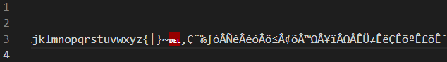

# 第2节 文本文件的编码

想必不少人都听说过 ASCII ANSI UTF-8 UTF-16 GBK GB2312 Big5，甚至是 UTF-8 with BOM 这种神奇的编码。很多网上的人都不好好讲，这里我尽量讲的明白一些。

## 0. 文件编码与乱码

由于计算机不能直接保存文字，需要使用二进制保存，所以其中涉及一个映射。

我举个例子，比如说我们能看见的文字：

```text
坤 喜欢 唱 跳 Rap 篮球
```

可以把两个空格之内的内容解释为一个“文字”。

但是假设某种记录介质只能记录小写字母组成的单词，也就是说\(a-z)+，我们可以定义几个映射：

|文字|坤|喜欢|唱|跳|Rap|篮球|
|-|-|-|-|-|-|-|
|映射1|Kun|likes|singing|dancing|rapping|basketball|
|映射2|Kun|aime|chanter|sauter|rap|basketball|

假设我们正在编辑这些文字，在保存的时候可能会选择一种映射保存。但是打开的时候也应该以对应的映射打开。比如说当我们以映射1保存后，如果再以映射2打开，则“坤”字可以正常显示，但是解读到 likes 这一项的时候，映射2找不到对应的项目，解读出现问题。

### 0.65534 文件乱码怎么办

答：可以试试用 vscode 解决。


如果看起来英文和数字比较正常，那么还是比较容易解决的。


点击右下角某个编码，选择用编码重新打开。一般情况下会提示“根据内容推测xxxx编码”，一般都是对的。

一个一劳永逸的办法是，打开 VSCode 的 settings.json（ctrl+shift+p -> 首选项：打开用户设置(JSON)），在打开界面的大括号里添一行：

```json
"files.autoGuessEncoding": true,
```

如果报错则记得整理好逗号（除了大括号内的最后一行，其他的每一行末尾应该有一个逗号）。这个选项是 vscode 打开文件的时候自动推测文件的编码方式。

我解释一下“通过编码重新打开”和“通过编码保存”是什么意思。第一项是，已知这些二进制数据不变，试试用其他的编码规则去解释这些二进制数据；第二项就是已知这些文字是什么，然后对这些文字使用某个编码规则转换成二进制数据。

### 0.65535 网页或文件名乱码怎么办

比如说这一段文字：浣犲ソ涓栫晫

还可以用 vscode 尝试解决。

从源文字复制下来，到 vscode 里新建一个文件粘贴进去。然后右下角以编码A保存后，关闭该文件并重新打开。让 vscode 帮你猜一下这是啥。

编码A 一般从 UTF-8 UTF-16 GB2312 Big5 中选一个。如果不行就再试试。

> 上边的示例如果用GB2312保存后再打开，就会显示“你好世界”。

## 1. 最基础的ASCII码

需要注意的是，ASCII 码只有 7 位，8 位的是 char 类型。

对于 ASCII 码能表示的字符，包括简单的控制字符（EOF 换行 等）和数字、字母、部分标点符号等。这些东西是最不容易出错的，几乎在任何编程平台、操作系统、编译器、终端都不会乱码。

因此，简单编程输出的时候尽量使用英文。

如果一个文本文件仅包含这些字符，那么我们可以称为简单 ASCII 文件。

利用上一节讲的 linux 的 file 命令，如果文件是简单 ASCII 文件，则其一般输出包含 `ASCII text` 这几个字。


## 2. char 类型对 ASCII 的扩展

因为 char 类型有8位，所以如何利用上边那一位是我们关注的内容。

> 一个容易被忽略的点是，char 类型是有符号的还是无符号的其实这是未定义的。如果有强烈需要，可以用 unsigned 或 signed 修饰。如果仅仅使用低7位，很多时候可以不做区分。
>
> 就本人经验而言，char 在一般情况下都是有符号的，但是我也见过一些特殊的情况，char 是无符号的。

这里我们为了直观，我们把 char 当无符号的。

### 扩展带来的问题

一个问题是，扩展后，我们还要以一个字节为一个单位去从二进制数据翻译出来一个字符吗？或者说，每次读取一个字节，然后去查找吗？如果不是这样，那如何兼容简单 ASCII 文件？

## 3. 扩展1：扩展 ASCII 码

一种想法很直接，那就是按每个字节为一个单位。至于 ≥128 的字节，赋予其其他意义。比如英镑、正负号、二次方等。



但是这显然是不够用的，很多国家的语言有远超这个数字的文字数量。

在曾经那个网络不发达的年代，很多国家自行制定了一些兼容 ASCII 但不兼容扩展 ASCII 的标准。

## 4. 扩展2：中国大陆的 GB 系列

Windows 在全世界广泛使用，曾经在中国大陆普遍使用 GB 系列编码的时候，为了满足使用需求，其当时也主要支持 GB 系列的编码。

GB 系列编码主要包括 GBK GB2312 GB18030 三套国家标准，我感觉对于常用汉字差不多，所以就不再区分，下文统称 GB 编码。

使用 Windows 编程的人，其 C 或 C++ 文件一般是 GB 编码。对应的，Windows终端（命令行）默认也是 GB 编码。一些古老的 txt 文件也可能是 GB 编码。除此之外，现在很少见 GB 编码文件了。

举个例子，参考以下代码：

```C
#include <stdio.h>
#include <string.h>
int main() {
    const char *p = "你好世界";
    printf("%d %s\n", strlen(p), p);
}
```

以GB保存，编译之后运行结果为：


如果把文件换成 UTF-8编码，结果就是：


可见，当终端编码和输出编码不同的时候会乱码，而且**GB的一个汉字看起来是两个字节，UTF8看起来是三个字节。**

把“你好世界”用 GB2312 保存，用 hex editor 打开：


可见每个字节都大于128（后两个字节是 `\r\n` ）

那么它是如何兼容 ASCII 的呢？我们可以尝试以数据结构类似“前缀码”的思想：

- 从开始逐个读取字节
- 如果读取了一个字节小于128，则直接按ASCII显示。
- 如果读取了一个字节大于128，则再读取一个字节。
  - 如果第二个也大于128，则组合成一个字，输出。当然这也有可能解码失败。
  - 如果第二个字节小于等于128，这是不合法的组合，解码失败。
  - 解码失败一般显示问号。
- 继续读取直到文件结束。

这样看来，简单 ASCII 文件可以用 GB 解码，而一个汉字则需要2个字节。这样看来，其除了 ASCII 编码的文字，还可以大约编码 1.6 万个文字。实际上这些空缺并没有完全利用（所以第二个字节大于128也可能解码失败）；目前支持大部分常用简体和繁体中文。

据我个人尝试，好像还支持日语，但是不支持韩语。（我不了解日语，都是百度翻译查的）


如果把韩语用 GB 保存之后，关闭文件再打开，就只有几个问号了。

GB 的广泛应用，和当年计算机存储空间太小有关。当今广泛的 UTF-8 一个汉字一般三个字节，在曾经那个年代省一个字节是很有意义的事情。当然，现在占用存储和内存的主要是大型数据库和媒体文件等，一个字节的影响已经微乎其微了。

GB 编码常用汉字是按拼音排序的，不过多音字只有一次编码。所以你甚至可以用简单的字符串排序来实现按拼音排序。

## 5. 扩展3：某省份的 Big5 编码

我国海峡对面的某个省份，曾经自行研究了 Big5 编码。该编码主要针对繁体中文设计。


把文件以 Big5 编码后重新打开就……额


简体阵亡。

还有经典的“忧郁的台湾乌龟”：


Big5 编码同样适用两个字节编码中文，第一个字节也是大于128的，但是第二个则不一定。


## 6. UTF-8 编码

UTF-8 编码是现在的主流，几乎支持各种语言。当然对于中文一般是3个字节；事实上一个字符一般是1-4个字节。

UTF-8其实涉及两层编码，第一层是把字符编码为 Unicode ，第二层是把 Unicode 编码为 UTF-8；当然其也可以编码为 UTF-16 等。有些网上的教程不讲分层导致不好理解。

### 6.1 字符编码为 Unicode

Unicode 又称万国码，基本上所有个人计算机都支持该编码，且能够编码几乎各种语言字符。

目前 Unicode 已经有十几万个字符，显然16位二进制数是不够用的。事实上规定只能使用0000-10FFFF这些编码。这些数字有110多万个，在可预见的未来还是很够用的。

```text
# Unicode 字符块（部分）

0000—007F 基本拉丁字母
0080—00FF 拉丁文补充1
...
0370—03FF 希腊字母及科普特字母
0400—04FF 西里尔字母
...
0E00—0E7F 泰文
0E80—0EFF 老挝文
...
2200—22FF 数学运算符
...
2E80—2EFF 中日韩部首补充
2F00—2FDF 康熙部首
2FF0—2FFF 表意文字描述符
...
4DC0—4DFF 易经六十四卦符号
4E00—9FFF 中日韩统一表意文字
A000—A48F 彝文音节
A490—A4CF 彝文字根
...
```

从这个角度来看，英文编码至少需要7位表示，中日韩文至少需要16位（9FFF有16位）。

### 6.2 Unicode 编码为 UTF-8

从上面可见，Unicode 并没有考虑兼容和解码问题。因此兼容和解码实际在这一层完成。一种编码方案就是 UTF-8 编码。

UTF-8的编码规则：

- 若 Unicode 小于 0x80（也就是只需要7位），则其 UTF-8 只有一个字节，第一位为0、后边为 Unicode 的7位。这样和 ASCII 码相同。
- 如果需要N个字节来编码 Unicode，则第一个字节的前n位都是1，第n + 1位为0，后面字节的前两位都是10。剩下的二进制位则可以用于表示 Unicode 码。

这里同样利用了前缀码的思想。举个例子：

问：两个、三个字节的 UTF-8 字符能表示哪些范围的 Unicode？

答：两个字节的分配：110xxxxx 10xxxxxx，可用位数11位。但是7位的只需要一个字节，因此两个字节可以表示 \[0x0080,0x07FF] 内的字符。希腊语就在这里。

三个字节：1110xxxx 10xxxxxx 10xxxxxx，可用位数16位。但是11位只需要1-2个字节，因此三个字节可以表示 \[0x0800,0xFFFF] 内的字符。中文就在这里。

之前我们已经验证使用 UTF-8 的汉字输出 hello world 是每个字三字节，现在我们换成希腊语。


把空格删了以减少干扰，可以数出来有13个字符。

```C
#include <stdio.h>
#include <string.h>

int main() {
    const char *p="ΓειασουΚόσμος";
    printf("%d %s\n", strlen(p), p);
}
```


和我们之前的推算一样。

因为 UTF-8 除了 ASCII 文字，剩下的最高位都是1，因此 UTF-8 实际编码的文字以 GB2312 解码基本都能解码一些汉字出来，虽然大部分都是不咋常用的汉字。

Python 代码文件一般是 UTF-8 编码，python 的 str 类型是按字符而非字节运行的。因此10个汉字和10个英文的长度均为10；而C语言则按字节存储，不管文件是 GB 还是 UTF-8，如果是 GB 那一个汉字有两个 char、UTF-8则是三个 char；这也是C语言接近硬件、python 相对隔离硬件的一个体现。应用的时候需要注意选择合适的编程语言。

### 6.3 UTF 家族的其他成员

可能很多人都见过，有的格式名字看着和 UTF-8 挺像的，我来简单介绍一下。这些东西都是基于 Unicode 的实现。目前这些内容最主流的还是 UTF-8，其他的都很少见。

1. UTF-8 with BOM
   BOM 是一个文件头。UTF-8 with BOM 的文件相比于表示相同文本的 UTF-8来说，文件前边多了三个特定字节，这就是 BOM 头。BOM 头可以用来识别这个文件的编码格式，这样解码的时候就不用猜了。

   不过实际上这个想法并没有得到广泛的应用，因为它有一定的弊端，比如说不方便变成、与既有格式不兼容等。不推荐使用该编码格式。
2. UTF-16
   这个最小以16位为单位编码文字，显然这样就无法兼容简单 ASCII 文件，所以更不推荐使用。

   对于 Unicode 编码不超过16位的可以直接使用 Unicode 编码；对于17-20位的：

   - Unicode 编号（二进制）：abcdefghijABCDEFGHIJ，每个字母代表一个二进制数。
   - UTF-16 编码：110110ab cdefghij 110111AB CDEFGHIJ

   这样看起来甚至两者还有冲突，那就是一个编码16位的 Unicode字符，如果高6位是 110110，则二者无法区分。事实上这个前缀在 Unicode 里是被保留的。
3. UTF-32
   这个就更离谱了，每个文字都是32位，直接写 Unicode 码。我没见过有谁用过这个。

好在实际上文本文件一般体积比较小，多一点体积影响不大。所以使用 UTF-8 现在是很流行的格式。

Linux 终端默认就是 UTF-8 编码。
