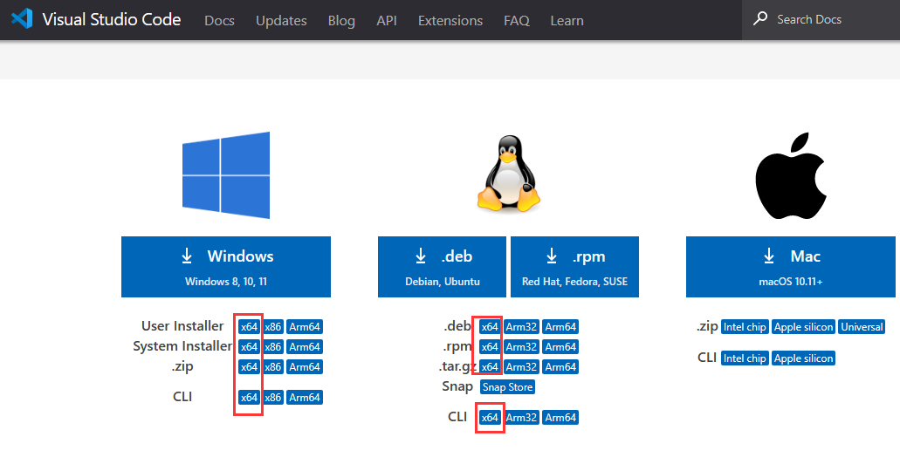

# 第3节 计算机平台与操作系统

这一部分也是经常有人故弄玄虚搞的啥也看不懂的地方。助教本人在编写这一部分的时候尽量减少一些无所谓的东西，增加重点骨干内容的理解。

## 1. 计算机硬件平台初探

我把目前常见或者经常有人提到的硬件平台的重要信息列个表，再结合 LC3 对（鞭）比（尸）一下。

### 1.0 硬件平台和实际电路的关系

硬件平台给了一种规范，至于实际电路怎么实现则一般没有规定。比如我们的 LC3的 ADD 指令，加法器咋设计都无所谓，但是需要满足 ADD 的要求。

### 1.1 位数参数

|平台|LC3|8086|x86_32|x86_64|ARM32|ARM64|RISC-V32|RISC-V64|
|-|-|-|-|-|-|-|-|-|
|位数|16|16|32|64|32|64|32|64|
|地址空间\*|16|20|32|48|32|48|32|56|
|int大小|16|16|32|32|32|32|32|32|
|long大小|\*|32|32|64|32|64|32|64|
|int\*大小|16|32|32|64|32|64|32|64|
|指针Reg|16|16+16|32|64|32|64|32|64|
|GPR大小|16|16|32|64|32|64|32|64|
|指令长度|16|\*|\*|\*|32|32\*|32|32\*|
|存储单位|16|8|8|8|8|8|8|8|
|R/CISC\*|R|C|C|C|R|R|R|R|

解释一下各个星号：

- LC3 没有定义 long（其实也没有定义 int，这里是按我们一般的认知计算的）
- 现代的体系结构（上表除了LC3）的地址空间提供实地址和虚地址（稍后简单介绍），这里写的都是实地址。
- 8086、x86_32、x86_64的指令长度可变，从1个字节到十几个字节都有。听说还有几十个字节的。
- ARM64 和 RISCV64 的指令多数32位，但是也存在一些变长指令。（其实 ARM32 和 RISCV32 也有变长指令）
- RISC指简单指令集，CISC指复杂指令集。

### 1.2 名词集群1

这玩意把我绕进去太多次了，网上讲的大多数很绕。我简单总结一下，大多数情况了解以下内容就行了。（不过我也不能保证全对）

- x86系列（以下全都是 x86）
  - 8086，Intel 最早研发
    - DOS 年代和早期 win 98 一般运行在 8086 平台上。
    - 是上世纪的东西，目前基本没人用
  - x86_32，是基于 8086 进行的升级。
    - 经常被称为 x86（导致现在说起来 x86 几乎就是指 x86_32 了）
    - 有一个不为人知的名字叫 IA-32
    - i386=80386、i586=80586、i686=80686 是 x86_32 的主要成员
    - 其中i586兼容i386，i686兼容i586，且越往后功能更强
    - 除了 Intel， AMD 也推出过 x86_32 CPU
    - 晚期 win 98、Windows XP 等操作系统主要运行于该结构。
    - 个人电脑用 x86_32 差不多都是 2010 年以前了。
    - 其仍然在部分嵌入式系统、古老工业机械控制上发挥余热。
    - 最多支持 4G 内存，对于高级磁盘格式也无能为力
  - x86_64，基于x86_32升级
    - 基本但不完全能兼容 x86_32
    - 最早开发的是 AMD，现在两个巨头 Intel 和 AMD64
    - 现在 x86_64=x64=AMD64
    - IA-64 **不等于** x64, IA-64 是 Intel 一个比较失败的产品，功能强大但很少见
    - 现在的个人电脑，除了苹果用 ARM ，别的基本上都是这个
    - 能够运行绝大多数 x86_32 时代的程序，但是新的程序一般都开发64位
    - 编译器可以生成32或64位程序（参数 `-m32` 生成32位的，默认64位，建议linux）
- ARM 结构
  - 是 ARM 公司制定的标准，自己基本不参与实际设计，ARM 公司躺着收专利费
  - 苹果电脑(纠正：近几年的苹果电脑)、大部分手机都用 ARM，很多微控制器芯片也是 ARM
  - 是一代实用的简单指令集，信息学院“计算机原理与嵌入式系统”讲这个。
  - aarch64=ARM64，手机基本上都写 aarch64（我也不知为啥）
- RISC-V 架构
  - 是开源免费的架构，有很多国产芯片往这个方向努力
  - 实际应用远不如 ARM 广泛，生态也不行，但是进步很快
  - 好像阿里巴巴出过一个 RISC-V 笔记本
  - 计算机学院“计算机组成原理”课程讲 RISC-V，Vlab 平台自带很多 RISC-V 的工具。
- 龙芯架构
  - 英文名 Loongarch，国内有很多研究人员，我们学校也有很多相关人员和比赛
  - 是一种 RISC 指令集
  - 处于起步阶段，目前由基于龙芯的笔记本。

### 1.3 名词集群2

- 模拟器：模拟某个硬件平台的运行。比如在 x64 软件模拟 RISC-V，运行效率低。一般应用于简单学习。
- 交叉编译器：在某个硬件平台上编译能在另一个平台上运行的程序。一般都基于 linux 开发。交叉编译过程往往比较繁琐。 Vlab 自带 RISC-V 交叉编译器。

### 1.4 体系结构的其他影响

1. 硬件兼容性

   如果你在 x64 上运行 linux 虚拟机，请选择 x64 能兼容的平台，比如 x64 或 32位（有时候写 x86，也有的写 i*86）；同理对于苹果电脑安装虚拟机请选择 ARM 架构的。

   对于二进制可执行文件，即便操作系统一样，如果平台不一样也不好运行。比如说假如有个人在 ARM 电脑上安装了 Windows，他编译的 exe 给 x64 的电脑是不能运行的。

   因此，很多闭源软件不方便在不太应该出现的（体系结构,简称arch+操作系统,简称os）组合运行。

2. 运行开源软件

   如果真的出现了奇怪的（arch+os）组合，那么可以尝试编译，当然这里的 os 最好是 linux，否则很难编译。

3. 选择合适的软件版本

   很多软件都会有不同的版本对应下载，请选择对应体系结构的版本。

   比如说 [VSCode官网下载链接](https://code.visualstudio.com/#alt-downloads) 就有很多版本，如果电脑是 x64 的，请尽量选择 x64 的，实在没有可以选择 x86 的。

   

   至于具体选哪个：

   - Windows 下：User 和 system 的区别在于，只能给单个用户使用还是给操作系统上全部的用户使用。zip 解压即用不用安装，但是如果要经常使用建议不要选。CLI 是命令行工具。
   - Linux 的选择我不在这里介绍，会在其他文档介绍。

4. CISC 和 RISC

   CISC比较复杂，RISC比较简单。

   CISC中，有些指令可以一次执行很多的运算，比如……矩阵乘法甚至求逆。RISC比较简单，虽然一般比LC3的稍多一些。

   早些年没有编译器的时候，程序员使用汇编编程。这时候如果一条汇编能干很多事会给编程带来很多方便。后来编译器的能力越来越高，很少有人再用汇编实际编程（lab6感悟：能用高级语言就不写汇编）；而且随着一些硬件技术的进步，CISC最高效的使用方式反而是使用其简单的指令，甚至其电路设计的时候都设计为把复杂指令转换为简单指令组合。但是为了兼容以前的软件，目前复杂指令模式的研发并没有停止。

5. 专用硬件（如FPU等）

## 2. 操作系统初探

操作系统是一门比较重要的学问。

### 2.1 我当年学完 LC3 之后的一些疑问

这些疑问我感觉很多同学也有遇到过。但是很多时候都是操作系统的问题。

1. LC3 只能同时运行一个程序，那个人计算机是如何同时运行很多程序的？

   答：这里涉及操作系统的作用。

   一般电脑个人 PC 都有多个内核，每个内核单独运行程序可以实现同时运行多个程序。但是一般同时运行的程序数量远超内核数量，这实际上是由操作系统实现的。

   电脑刚开机的时候运行操作系统内核，开机后，操作系统把 CPU 按照一定的顺序（由特定的算法算出来的顺序）交给各个程序，不过并不是要等程序运行完毕才开始下一个。

   > 举个例子，假设有一个时钟中断，1ms自动发生一个中断。在某时刻t，操作系统把CPU交给程序A；过了1ms，程序A没有运行完毕，但是中断来了，操作系统进入中断程序，这个中断程序把A的状态保存起来，根据算法找一个程序B，把CPU交给B；经过一段时间之后操作系统处理了多次中断，此时算法又选择了还没完成的A，把A之前保存的状态读取之后恢复到CPU上，继续运行程序A；这样就可以看起来同时运行多个程序了。
2. LC3 怎么实现 malloc？

   答：malloc 是操作系统服务。

   当程序运行到 malloc 的时候，程序给操作系统发送信号，操作系统接到信号之后起来处理这个函数。操作系统有记录哪些内存给哪些程序使用，还有哪些没有使用。操作系统从没有使用的地方找一块内存，记录其首地址之后返回给程序。
3. 我能不能修改别的程序的内存？能不能把内存都清零了？

   答：一般不能，这是因为操作系统保护。

   随意访问一个不能访问的地址会被操作系统拦截。因此，你可能有这样的想法，就是在 LC3 里写几行代码，改变 LC3 的内存或者大部分内存的数值。实际的电脑中并不可以。

   操作系统保存每个程序能访问的内存区域，出了这个区域就不能访问了。

4. 我写一个程序，大概是：

   char\* p=malloc(1GB);for (i from 0 to 1G)p\[i]=0;printf(p);getchar();free(p);

   同时运行多个这样的程序，发现他们的 1G 居然有重叠，那是为什么？

   答：还是操作系统的功劳。操作系统对每个进程（正在运行的程序）记录一张表，能够把程序访问内存的地址进行转换。程序里获得的地址不是真是的内存单元，也就是 p 不是真的地址。当程序访问内存的时候，该地址经过操作系统的转换成为真的地址并访问真的内存。

   这样进程就不能改动另一个进程的内存，即便其地址相同，经过操作系统转换后指向不同的实际内存地址。

5. 还是上边的程序。假如我的电脑内存有 4G（比如 Vlab），那么同时运行四个上边的程序，电脑就应该会崩溃，因为它把内存占满了。但是实际上我们甚至可以开5个甚至6个。这是怎么做到的？

   答：还是和操作系统有关。对于一些暂时不会用到的内存，操作系统可能会把这些内存放到外存里，有限的内存给需要用的进程使用。当有进程需要重新使用那一块内存的时候再从外存里加载进来。这样就实现了“蛇吞象”的效果。

### 2.2 常见的操作系统和硬件平台组合

- Windows + x86
  这个有人称为 wintel 联盟。
  - 8086+DOS/win98
  - x86_32+win98/xp/vista
  - x64+vista/win7/win10/win11
- Linux + x86
  Linux 对 x86 系列的体系结构的支持是最好的，不过其历史兼容性不如 Windows
- ARM+Mac OS
  苹果公司专属

不属于以上组合的不容易找到全套的软件。其他的组合还有：

- Linux+LoongArch
- Linux/Windows+ARM，近几年这两个平台也开始逐渐开发 ARM
- Linux+Risc-V

### 2.3 Unix系列发展史

很多人都会提到 Unix，因为这个操作系统后来衍生出了很多标准和套件，对编程有很大帮助，提供了很多方便。不过这一块也是网上胡扯重灾区，很多人网上写的发展史和shi一样，而且把它和 GNU 混在一起（虽然确实有不少关系），但是又把这些内容讲的极为杂糅。

#### 2.3.1 Linux 简史

1. 几十年前曾经有人开发了 Unix 系统（最开始不叫 Unix），当时是免费的，而且比较好用，很受欢迎。
2. 后来 Unix 经过多次转手，形成了复杂的版本和版权关系，后来还想收钱。于是就有个大神(Linus Torvalds)自己写了个系统，这就是 Linux，其支持几乎全部在 Unix 上的操作。而且它是开源的，就有很多 Unix 用户转过来支持 Linux，于是发展壮大到现在。

#### 2.3.2 GNU 简介

GNU这事确实不得不讲：

GNU 提供了一套完整的编程软件，而且全是开源免费的。Linux 就是 GNU 的一个产品，全称 GNU/Linux，虽然平时很少有人这么说。你可以完全用 GNU 的产品完成程序开发。比如安装 GNU/Linux 操作系统，使用 ~~GNU/vim~~（注：vim好像不是GNU的）GNU 的 nano 编辑器编写代码，使用 GNU C Compiler（gcc）编译程序，最后在 GNU/Linux 上利用 GNU 的库运行。

#### 2.3.3 POSIX 简介

这个东西也不得不讲，虽然估计很多人没听说过。

POSIX 是一个软件标准，定义了操作系统必须实现的命令、接口。如果你使用 POSIX 规定的接口编程，那么程序就能任意在不同的但支持 POSIX 标准的操作系统上运行。

> 举个例子，我们想定义一个接口叫 POSIX_printf（我瞎说的），各个支持 POSIX 的操作系统必须支持，并实现相同的功能。
>
> Windows 使用 printf 都会直接输出，Linux 使用 printf 只有缓冲区满或遇到回车才会输出。假设 POSIX_printf 要求必须直接输出，那么 Windows 和 Linux 都需要对自己的 printf 进行包装（当然 Windows 直接加进去就行， Linux 需要加 fflush 等，当然也可以用别的方式实现，比如 putchar），这样如果用 POSIX_printf 编程，在两个平台上的功能相同。

Unix 后期的各种版本、各种类 Unix 操作系统（含 linux 和 macOS）都支持 posix，Windows 默认不支持。

#### 2.3.4 类 Unix 操作系统

类 unix 操作系统是由 unix 衍生出来的、有一定相似性的操作系统，包括 GNU/Linux、FreeBSD、macOS 等，需要注意的是其中有开源软件，也有闭源软件。
