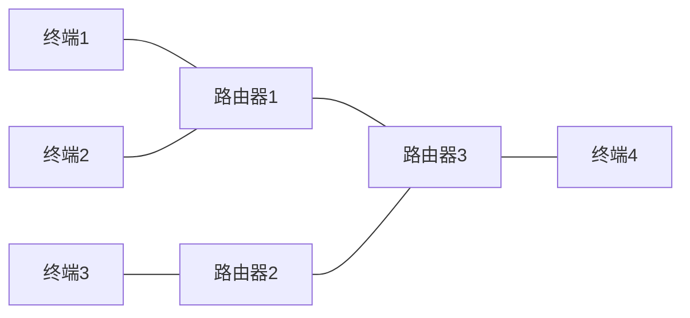

# 第4节 网络服务简介

本节助教以自身微薄的计算机网络知识，来讲一讲网络服务的一些简单内容。

## 1. 网络服务器

网络服务器，从硬件来讲，其本身也是一台计算机。

从访问逻辑上来讲，当个人用户访问某个网站（比如 baidu.com）的时候，其本质是自己的设备和网络服务器建立了连接，双方相互发送数据。在浏览器浏览的时候，浏览器把用户的动作（鼠标移动、键盘输入等）信息生成数据发送给服务器，服务器经过计算、处理后把数据返回给用户设备。

对于百度这样的访问量很大的网站，服务器一般都是特别定制的高性能计算机。如果是小网站，平时没多少人访问的，可以用老旧电脑做服务器。

如果网络服务器关机了，那么这个网站就无法访问。

## 2. IP地址与端口

我介绍一个东西叫网卡，这个东西是一个网络设备。由电脑内部部件向外发送的数据，经网卡发送到网络上；其同样从外部接收数据。

一台电脑一般不止一个网卡，比如现在的笔记本一般能连接有线网、无线网（WiFi），两个方向各自具有一个网卡。另外一般还有一个网卡是自己的输入连接自己的输出，一般用来测试本地网络。

网卡甚至可以是虚拟的，比如安装了 VMWare 虚拟机之后，自己的电脑就会虚拟一个到虚拟机的网卡。

IP地址是对网卡而言的，电脑的每个网卡都有自己的 IP 地址。在 Windows 下可以使用 `ipconfig` 命令显示自己的网卡和 IP 地址信息；linux 上则使用 `ifconfig` 命令。

在 linux 下，使用 ifconfig 一般会显示出来至少 wlan0（0号无线网）、eth0（0号有线网）、lo（localhost，本地）三个。对于不连接网络的网卡，其 ip 地址是没有意义的。（本地也算是连接了网络，只不过这个网络不是互联网）

### 2.1 IPv4 地址

IPv4 地址是目前最常用的 IP 地址，其一般形式为 a.b.c.d ，四个字母各自代表一个0-255的数字。网卡一般都具有 IPv4 地址。

如果你在本部连接 eduroam，则你的联网的网卡的 ipv4 地址应该是 114.214.xx.yy；如果你连接校园网，那么打开[ip138](https://www.ip138.com/)或[中科大测速网](http://test.ustc.edu.cn/)都能看到你的ipv4地址，而且和你的网卡上的地址相同。

互联网 ipv4 地址的分配和地区有关，比如某些地址只能用于合肥，某些地址只能用于美国。

IP 地址不止能用于互联网，如果咱自己多少几台设备想办法连接起来，它们也能组成一个网络，也能具有 IP 地址。甚至同一台设备还可以连接不同的几个网络，毕竟一台设备可以有多个网卡。

值得注意的是，ipv4 地址最多只有 256^4 个，也就是大约42亿。目前看来显然是不够用的，平均下来每个人只有大约 0.6 个 IP 地址，而且考虑到实际上路由器、服务器等各种设备也需要 IP 地址、还有些 IP 地址不能用，因此 IPv4 、很不够用。不过考虑到网络实际上有大量的 IPv4 需求，所以我们还得让 IPv4 再苟延残喘一阵子。

一种常见的技术是 NAT 转换。比如说你在中区宿舍连接 elearning 或者去高新区连接 eduroam（确实，eduroam在高新和本部甚至不一样），使用 ipconfig 或 ifconfig 查出来你的 ipv4 地址一般是 100.64.xx.yy 或 100.65.xx.yy：

```text
助教自己在 linux 上使用 ifconfig 的结果
wlan0: flags=4163<UP,BROADCAST,RUNNING,MULTICAST>  mtu 1500
        inet 100.65.63.101 
```

但是打开 ip138 查看你的 IP 地址的时候却不是。这就是 NAT 技术，给你一个 100.64或65 让你的设备能上网，但是上网发出去的数据随后被路由器包装成另一个 IP 地址发出去。可能有离你很近的人，在自己的设备上查到的 IP 地址和你不一样，但是 ip138 上查到的和你的一样。与此同时，可能有一个离你很远的人和你拥有一个同样的 100.64 这样的地址。这样减少了互联网 IP 的使用，使得 ipv4 能继续苟延残喘。比如说你和室友连接到同一个路由器，你的网卡地址是 100.64.11.22，你的舍友是 100.64.11.33，经过路由器包装后都变成了 12.34.56.78，这就减少了一个互联网上的 IP 的使用。ip138 网站只知道数据是从 12.34.56.78 发过来的，所以显示两人的 IP 是相同的。发回数据的时候也是向 12.34.56.78 发回。

那为什么给你室友的 QQ 消息你看不到呢？这是另一个技术，此处不再讲解。

像之前所说的，本部的 eduroam 那样，一台设备在互联网上独占一个 IP 地址，这称为公网 IP，这是一件奢侈的事情。

### 2.2 IPv6 地址

网络协议从 ipv4 到 ipv6 进行了一次较大的变革，除了安全性等的提升，最引人瞩目的是 IP 地址从4字节变成了16字节。这样在可预见的未来，IPv6 都不会被用完，所以其也不需要 NAT 这样的技术。

IPv6的一般表示是 a\: b\:c\:d\:e\:f\:g\:h，每个字母代表2个字节的4个16进制数字。实际上由于 IPv6 位数太长，所以中间往往有连续的多个0，一般允许把连续的多个都是0的字母，连同中间的冒号都去掉。比如助教自己的地址：

```text
wlan0: flags=4163<UP,BROADCAST,RUNNING,MULTICAST>  mtu 1500
        inet6 fe80::82b6:55ff:xxxx:1321
```

中间的两个冒号表示，在这个地方填充0直到填充到16个字节。

### 2.3 IP地址的获取

网络终端设备连接到网络的时候，网络设备会为其分配一个 IP 地址。根据设置，这样的 IP 地址可能是 NAT 转换后的地址，或者是公网 IP，也有可能是其他设置。其实也可以手动填写 IP 地址，不过这样可能上不去网。

### 2.4 网络端口

一台计算机上可能有很多个需要进行网络通信的进程，区分这些进程靠的就是端口号。端口是一个虚拟的概念，不是物理上存在的设备。一个网卡可以分配65535个端口号，但不是每个端口都能随便使用。

一些较小的端口号是有规定的，比如端口号 80 是提供 http 网页服务的。一般的程序可以使用中间的一段端口号。

## 3. 路由器与DNS

简单表示一下网络结构：



终端和路由器中间可能还存在其他的设备，如集线器等。终端可能是个人使用的网络设备（比如手机、电脑）也可能是网络服务器。

终端和路由器的接口（不是端口）都有 IP 地址，在 IPv6 中，互联网上这些设备的 IP 地址都是唯一的。

当访问一个确定的 IP 地址时，发送的数据会自带目的地的 IP 地址。

一般而言，访问一个网络服务器，需要从你的设备首先连接到一个路由器。网络中间有很多路由器，它们彼此相连。这个路由器会检查目的 IP 地址，根据目的 IP 选择下一步转发到哪个路由器，因为这个路由器可能连接了很多个其他路由器；当转发到最后一个路由器（也可能第一个路由器就是最后一个），这时候路由器发送给对应 IP 地址的网络终端设备。

但是如果并不知道目标是哪个 IP，比如只知道目标是 baidu.com，这样的访问就很难像上边那样进行。这时候需要首先访问 DNS 服务器，DNS服务器会根据你想访问的域名告诉你 IP 地址，这时候就能像上边那样访问了。

一台 DNS 服务器可能也不知道，这时候它会问其他的 DNS 服务器。可能有些人看到过类似于“全世界13台根域名服务器，10台在美国，美国可以切断中国网络”这样的营销号内容。这13台根域名服务器就是知道的最多的 DNS；实际上这里说的根域名服务器是 ipv4 的，而在 ipv6 时代，我国已经在南京、兰州等地布局了 ipv6 根服务器。
