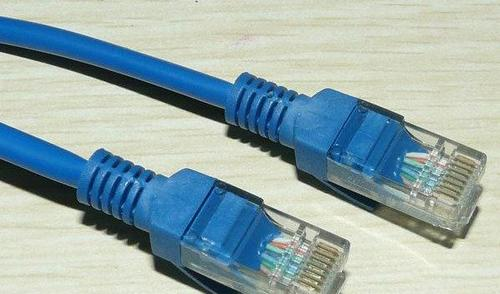
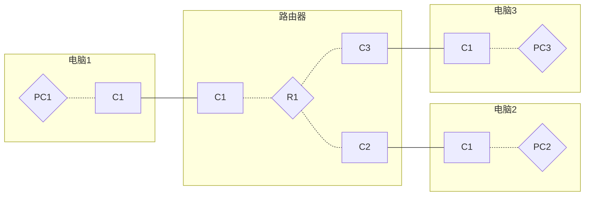
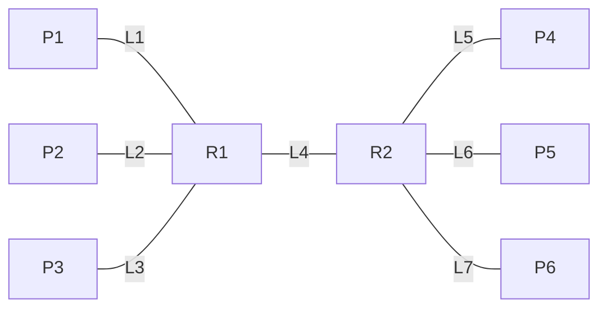
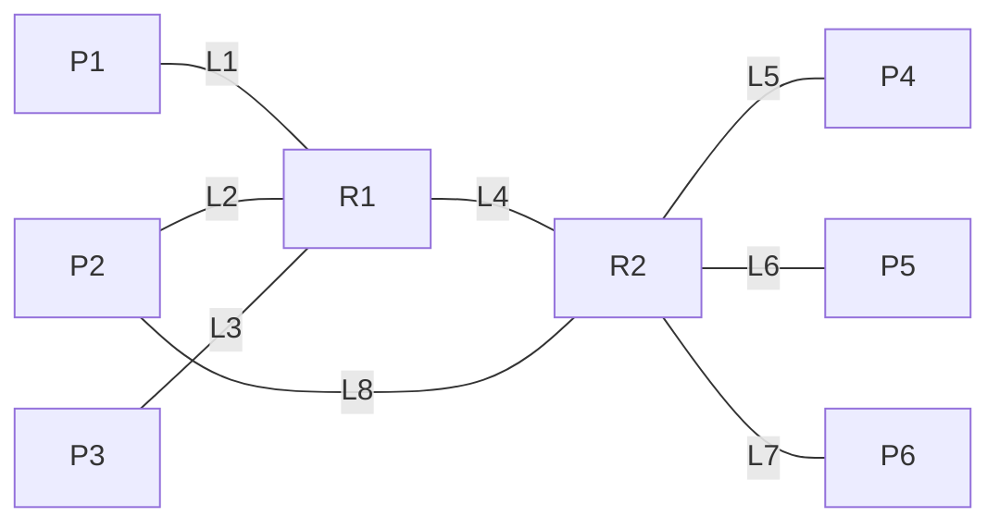
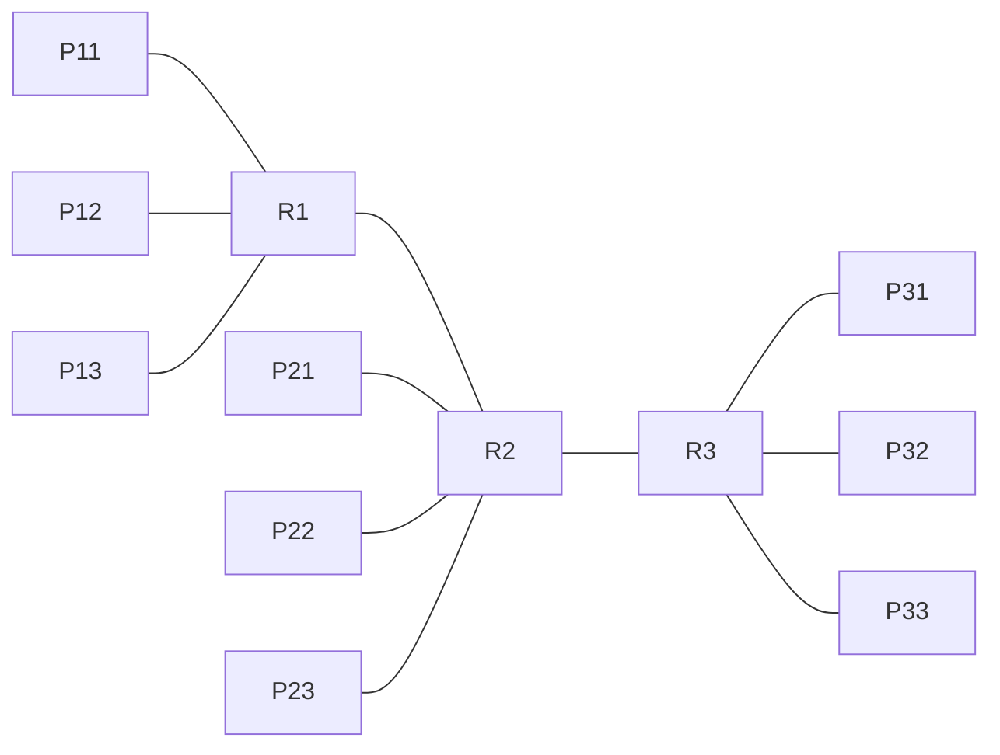
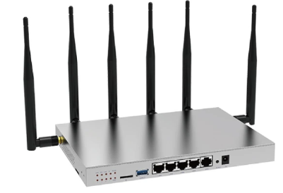
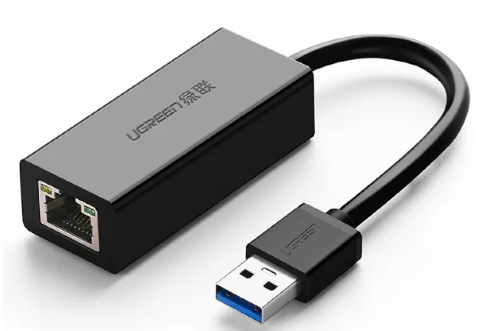
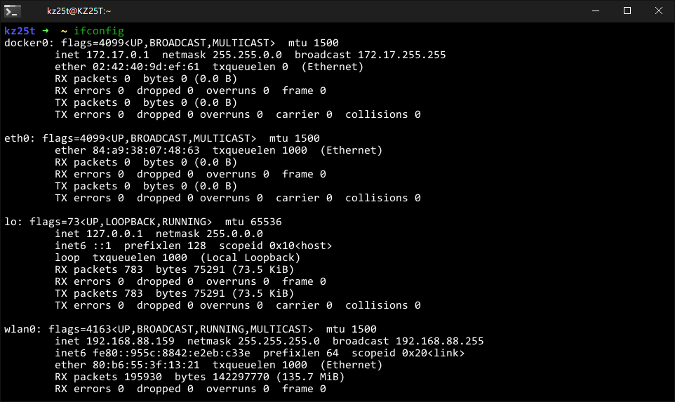
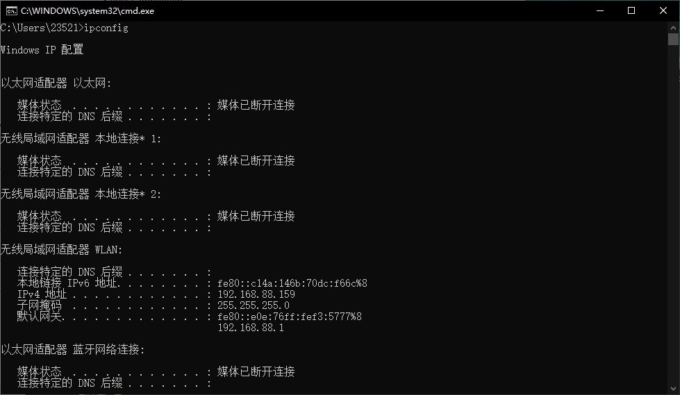

# 计算机网络简介（1）

声明：

1. 作者本人对计算机网络了解比较少，部分内容可能不正确，但本人将会尽力保证内容正确性。
2. 本文的主要目的是给计算机相关专业（尤其是偏软件的）对网络体系有一个简单的了解，与信院或计科的《计算机网络》课程目的不同，也包括一些该课程不涉及的内容。
3. 本文涉及的图片仅做学习使用，我没有任何打广告的想法。如果觉得冒犯，请联系本人。
4. 本文涉及的 IP 地址仅做教学使用，如有冒犯你的 IP，希望能够取得谅解。如果希望因此修改，请联系本人。
5. 本文内容包含 AI 辅助生成。

本文的讲述以循序渐进的方法开始，从简单的网络逐步进化到更复杂的网络，以及接近现代的网络体系结构。我隐藏了一些不好理解的底层细节，这些内容可能需要在计算机网络课程里学习。总的来说我的目标是，看了本文之后能对网络有简单了解，以及学计算机网络的时候不至于被那些书的乱七八糟的内容分配搞得很迷糊。

[TOC]

## 1. 两台计算机的网络

网络的目的是信息传输，能让不少于两台计算机传输信息就是网络。那么我们首先搭建一个两台计算机的网络，假设两台计算机相距非常近，而且没有其他的网络连接。我们从有线网开始。这样需要的设备是网线，网线的两头是一样的。

计算机上插网线的地方叫做网口，就是下图中间长得像“凸”字的。

网口是一个物理实体，或者说一个事实存在的物体。网口后边有一个硬件叫做网卡，充当网口这个物理实体和操作系统这个软硬件结合体之间的交流。网卡是一个输入输出设备，操作系统像读写硬盘一样，向网卡里读写数据（接收/发送消息），但是发送消息会很快被另一台计算机的网卡收到。同样，接收的消息来自于另一台计算机。

接收的时候，就像《计算系统概论》里讲输入设备可能有向操作系统发送中断或者操作系统等待数据的两种接收方式。如果您不理解这句话，请自行搜索：中断。

假设网线里有两根线，一根线用来 1 向 2 发送信息，另一根反过来。这很好，可惜只有两台计算机。虽然如此，两台计算机也能通信，可以发送文件或者联机游戏。

有线网在现在一般被称为**以太网**。

## 2. 更多计算机的网络

在有线网的前提下，如果现在增加到三台计算机，现在给三台计算机编号为 1、2、3；那么简单思考之后，有一些简单可行的解决方案：

1. 每台计算机两个网口，用三条网线组成一个三角形。收发消息的时候，计算机只给连接目标方向的网卡读写数据。

   这样显然有不小的缺陷，主要是可扩展性极低。比如有 10 台电脑通信就需要 45 条网线，每台计算机至少 9 个网卡。

2. 使用一个三头的网线，一根线连接三台计算机。

   这个缺陷也很大。首先网线需要多少条线？假如只有一根线，那么同时只能有一台计算机写入数据；如果有三根线，每根线给一台计算机写而另外其他的计算机读，那么这样的数据线也不好扩展，但总比第一条容易扩展。但是，计算机 1 给 2 发送的数据，3 也能收到，这又引发安全问题。如果要避免这样的安全问题，那么需要 6 根线，这样扩展性能更差。

这里我们可以给出解决方案：采取一个中间机器，中间机器有三个网口以及对应三个网卡，三个网卡分别连接网线到三台机器；而每台机器发送消息的时候，带上目标地址，比如 1 发出消息：我要发往 2，内容是 xxxxx；而这个消息首先到达中间机器，中间机器从某个网卡读数据，识别目标位置之后向通向目标的网卡写入数据。

下图 C 开头的代表网卡和网口，R 表示路由器。

这样的设备，我们可以选择 **路由器**，也可以选择交换机。这里我们为了便于理解，隐藏一些细节，先不考虑交换机的问题。另外，我们应该已经熟悉了网卡和网口成对的概念，以及“网卡-网口-网线-网口-网卡”的这一条线的模型，因此以后的图上，我们直接用一条线省略这一网卡到网卡的内容。

> 交换机和路由器有相似之处，但是区别也很大，甚至工作在不同层面上。请千万不要混为一谈。这里只是因为路由器和交换机都可以完成上面的简单任务。

## 3. 两个路由器的网络

假设我们现在设备如下：

- 6 台电脑，每台电脑有一个网口；
- 不限制的网线和路由器，每个路由器有 5 个网口。

现在让 6 台电脑互联，一个路由器肯定不够，但是可以设计为如下网络，当然每台路由器有一个网口没有被占用：

这样 6 台电脑就可以连通。当然 R1 和 R2 都需要设置策略，比如当 R1 需要转发一个去 P4/P5/P6 的包的时候，就应该往 L4 去发。假如现在有个消息：P2->P5，那么 R1 通过 L2 知道之后就应该把它放在 L4 上。

> 这样的转发策略是怎么获得的，这个问题是计算机网络课程的内容，此处不做讨论。

现在我们玩点花的：假如 P2 有两个网卡，网卡 1 通过 L2 连 R1，网卡 2 通过 L8 连 R2：

现在 P2 的某个程序把数据从网卡 1 发往他自己的网卡 2，那么应该经过 L2->L4->L8 三条线。而按照之前的方法，R1 收到从 L2 的消息，经过分析，这是要往 P2 去发，那么又会从 L2 发回去，这不能满足程序的要求。看来，精确到设备的编号并不能解决这种问题，而如果编号精确到网卡，就能解决。

因此在此类网络中，**每条线的两端是平等的，分别有一个在这个网络中独一无二的编号。**

这样 P2 将会获得两个编号，同时，R1 和 R2 的五个网卡也能分别获得 5 个编号。（当然 R1 有一个编号的网卡没有使用）假设我们这样赋予编号：L1左边编号为 11，右边网卡为 12；L2左边为 21，右边为 22……以此类推。那么从 P2 网卡 1（21）发送到 P2 网卡 2（81），也就依次经过：21 22 41 42 82 81 总计 6 个网卡。

从 P2 出来的数据会标识：目标 81，下一个目的 22；从 R1 出来的数据会标识：目标 81，下一个目的 42……等等。

这样的编号，我们称之为 **IP地址**，IP 地址其实是一个数字，诸如 `192.168.12.34` 这种是 IP 地址数字的表示方式。

## 4. 更多路由器的网络

假如我们有 9 台计算机，那么至少需要三台路由器；三台路由器可以连成一线：

假如从 P1x 到 P3x，那么需要经过三个路由器，而实际上 R1 可以和 R3 再连一条网线从而减少 P1x 和 P3x 的延迟，同时也能减少 R1-R2-R3 的网络负载。如何优化网络，路由器如何根据目标 IP 地址调整路由算法，这都是后续计算机网络所需要学习的内容。

这已经是一个简单的网络了，比较早期的互联网就和现在这样比较像了。当然，实际网络中有巨多无比的路由器，有些路由器性能很强大，能够担任主干网络的任务；靠近终端的路由器则性能一般不高，但是能满足各设备的上网需求。

人为也可以控制路由器的策略。比如假如 P1x 到 P3x 的流量需求很大，现在架设了一条从 R1 到 R3 的网线，但是该网线性能比较低。因此运营人员可以借机敛财，规定：谁充了 VIP 谁可以利用该网线，否则就只能走 R2 绕路；也可以针对性封禁某些 IP 地址，比如说禁止 P1x 访问 P33，那么可以在 R1 中设置拦截前往 P33 网卡对应的 IP 地址的数据包。

> 数据包：在网络数据传输中，所有的数据并非是直接全部一次性跑过去的。试想如果传输数 G 的文件，如果一次跑过去，那么几乎必然遇到干扰而中断传输。
>
> 实际在发送中，发送方需要把发送数据按照数据包相关协议的长度限制（一般限制数据最少以及最多有多长），分为若干段，加上一些头部信息，分别发送到网络中。
>
> 头部信息包括但不限于：
>
> - 发送源 IP 地址及端口（端口后边介绍）
> - 发送目标 IP 地址及端口
> - 控制信息（表示数据包的类型）
> - 校验信息（用于简单判断数据包的数据是否出现传输错误，如果不能满足校验则一定出错，能满足校验则几乎正确）
> - 经过的路由器数量（所以数据包的头部在传输过程中是会变化的）
>
> 数据包某些意义上使得传输负载增加，但是也方便了数据传输，比如说多线程下载（多线程分别接收数据包）、断点续传等都和数据包有关。另外，网络中出现数据包传输错误（包括数据错误不能通过校验，或者一部分数据包没能抵达目标）都是常见但不严重的事情，计算机网络这门课上会讲一些这些情况的处理办法。

## 5. 继续深入物理结构

以上物理结构已经基本可以实现互联网了，但是在此基础上我们稍微继续深入物理结构。

人们不满足于有线网络，于是无线网络开始兴起。

在这之前我们需要首先介绍一下局域网和互联网的概念。局域网就是说一个网络覆盖于一小片区域，比如一个计算机教室；互联网就是地球上的大部分设备连起来的网络，跨越各个大洲。另外还有什么“城域网”“广域网”的概念，都是没什么意义的概念，我们在此可以忽略它。

互联网只是人类局限于当前认知而定义的，假如未来有一个具有网络且横跨多个星球的外星物种来到地球，那么这个外星人可能会觉得我们的互联网也只是局限在地球的局域网。

从技术角度上来讲，我国是接入互联网的。某些网站访问不了是因为网关限制，而非局域网。

### 5.1 从有线到无线

首先需要区分 WiFi 和 WLAN 两个概念。WLAN 是 wireless local aera network，换句话说只要是无线连接的、满足一定规定条件的局域网，都是 WLAN；**WiFi 是 WLAN 的一种连接方式，也是最常见的连接方式，或者也可以说 WiFi 是 WLAN 的子集**。WLAN 除了 WiFi，还有其他连接方式，但大多不常见。以下以使用 WiFi 连接的 WLAN 为例。

> 有说法称，其他的 WLAN 连接方式还有红外、蓝牙等。我比较认可这一点，但是关于它们是否属于 WLAN 的连接方式，我并没有找到准确出处。

比如说家里想要一个 WiFi，那么需要一个 WiFi 无线路由器，这个路由器背面连一根有线网线通往互联网，正面一般是几根柱子（其实是天线）。当然可能还有更多的网口以同时实现有线网和无线网路由器的功能。

（随便找了个图）

这个路由器有且仅有一个无线网卡，因为它不是接网线的，所以不需要网口，**这也是为什么我之前在强调网卡**。无线网卡利用这些天线来收发 WiFi 信号，可以和很多个设备连接（但并不是无限个），比如电脑、手机等。这个网卡有一个 IP 地址，与之连接的手机、电脑的网卡也在这里分别有一个 IP 地址。也就是说，一个无线路由器的无线网卡 IP 可以对应很多终端设备的无线网卡 IP 并与之连接，但是各个终端之间无法直接连接，如果想用 WLAN 玩联机游戏，则网络数据包需要经过无线路由器转发。

另外它还具有有线路由器的功能，下面的一排网口，每个网口再对应一个网卡，有一个通往外界互联网，剩下的可以连接其他终端。

一般情况下，**有线网=以太网=Ethernet，无线网=WLAN≈WiFi**，目前的大部分电脑都能连接有线网和无线网，因此一般至少有两个网卡，一般英文 W 开头（一般是 wlan 开头）的是无线网卡，E 开头（一般指 Ethernet）是有线网卡。

> 在连接有线网的时候，作为终端用户，只需要把网线插上，就能连接到唯一的一个路由器上，如果要求手动配置 IP 的就配置，然后根据对应的 WiFi 认证就好。而连接 WiFi 的时候，启动 WiFi 功能，需要根据名字选择一个 WiFi（WiFi 名字称为 SSID，比如 eduroam 或 ustcnet 等），经过认证（比如家用的一般是输入密码认证，eduroam 比这要复杂但我不清楚这是什么认证，还有 ustcnet 以及一些商场宾馆的 WiFi 弹出一个网站需要登录认证的）才能上网。
>
> 安全问题：SSID 一般可以自己设置，所以可能有重名的 WiFi，这一点容易引发安全问题。另外，WiFi 作为无线信号，无法确定会被传输到什么地方，所以在某个范围内的各种设备都可能接受，因此存在窃听风险。为了解决相关问题，WiFi 设置了不少安全方面的协议，我曾经浅读过一些文档，不过了解仍然比较少。至今 WiFi 的安全问题仍然有很多人在研究。

如果你的电脑缺少必要的网卡（比如有些轻薄本没有有线网卡，或者需要更多网卡），那么可以连接外置 USB 网卡。

### 5.2 从硬件到软件

网卡设备有很多制造商竞争制造，但是我们希望每个网卡都能给操作系统所用。从网卡能给软件处理的数据，到应用程序能处理的格式化的数据，这中间是经过一个叫**驱动**的操作系统软件的所为。

现在大部分情况下，安装操作系统之后就能直接上网，这是因为一般的操作系统已经集成了大部分常见网卡的驱动。如果你的网卡非常怪异，那么它可能需要在安装操作系统之后单独安装对应品牌和对应操作系统的网卡驱动。

### 5.3 从终端到路由

按照上文的结构，诸如个人电脑（PC）这样的设备收发并处理信息，我们称为网络终端设备，而路由器这样的设备只转发数据（从一个网卡读取数据包，分析数据包的 IP 并转发到合适的网卡），我们称为网络路由设备。有没有可能一个设备不仅转发信息，还拿出一部分自己用呢？其实这在现在很常见，比如说热点，这一定是无线网。一个电脑开了一个热点，就像同时具有终端和路由功能的设备。**这也是路由器的每个网卡都要给一个 IP 的意义之一。**

对于热点这样的东西，我先说一个简单场景，比如作者现在的地方无线网络非常差而有线网络是可用的，那么我用有线网络接入笔记本电脑，使用电脑的无线网卡启动热点给手机之类的设备上网。然而热点设备连接互联网的一般方式是用无线网。

除了“热点”，还有两点值得讨论：一个是虚拟机，一个是多网卡的选择。虚拟机会在下一节讲。如果电脑同时有多个网卡连接有网络，而应用程序需要发送一个数据包（包括目标 IP 地址），那么选择哪个网卡发送数据呢？这也是操作系统本地的路由方案决定的。（具体怎么做的我还并不清楚）

### 5.4 从实体到虚拟

之前所说的网卡都是物理意义上的网卡，实际上网卡是可以虚拟的，就像虚拟机一样。这种虚拟是在操作系统层面所做的。

- 对于网络热点，操作系统虚拟了一个新的网卡来连接其他设备，不过实际数据发送还是通过无线网卡。这样，即使热点设备通过无线网来连接互联网，其也能启动热点来给其他设备上网。
- 包括 Linux 和 Windows 在内的大部分操作系统，会有一个虚拟的本地回环网卡，**“本地回环”的意思就是，从这里发送数据包，会立马回到这里。**这个网卡一般用 lo 或 local 等名字，IPv4 地址一般为 `127.0.0.1`，IPv6 地址一般为 `::1`；如果发送目标地址为 `127.0.0.1`，那么就一定会使用这个网卡发送。这个网卡一般用于测试一些网络应用程序。比如说你开发了一个聊天软件，希望用这个软件和同学聊天，在聊天开始之前需要输入对方的 IP 地址。这个软件在开发过程中可以用这个地址来测试软件功能，就不需要多台电脑了。另外也可以自己同时作为服务器和客户端（稍后会讲）。
- 如果你的电脑安装了虚拟机，那么操作系统也会虚拟一些网卡，实现自己电脑和虚拟机的连接。包括 VMWare、VirtualBox、Windows Subsystem for Linux(仅限 Windows)、Docker(仅限 Linux) 都会用虚拟网卡实现联网。

这样一般电脑都至少会有三个网卡：WLAN 网卡、以太网网卡和本地虚拟网卡。

在 Windows 上可以使用 `ipconfig`，Linux 使用 `ifconfig` 或 `ip addr` 命令查看网卡的一些信息，每一段都对应一个网卡，包括真的或者虚拟的。

这是我的 Linux 电脑的测试结果。在这里我的四段对应四个网卡：Docker 虚拟网卡、以太网卡、本地虚拟网卡、WLAN 网卡。

Windows 端貌似有点抽象：

我不熟悉 Windows，不过大致都是这个意思。

### 5.5 从低速到高速

距离很长的有线网一定要用网线吗？网线有很多缺点，比如同一根导线只能同时传输一个电信号，比如电阻导致能量的耗散（本段文字写于20230802，这会热门新闻之一就是韩国的室温超导），比如容易被物理窃听，比如速度可能不够快。

长距离有线网可能会使用光纤作为信息传输介质。光纤可以解决以上问题。而为了兼容以太网标准，实际上需要在光纤两端做一个转换，实现转换的设备之一就是**光猫**，一边连接光纤，一边是一个有线网插头。两个光猫用光纤连接相当于一条网线。光猫是没有 IP 地址的。

抽象：

实际：

还有一个概念叫宽带，我之前没了解过，现场查了一下。如果我没理解错，宽带表示“比较快的网络连接”，和具体物理设备是无关的。根据查到的一些资料，它们列出的宽带设备貌似都是有线的，但 chatgpt 和文心一言说宽带不一定是有线网。不过现在好像很少提这个词了，所以这不重要。

## 接下来

考虑到文档篇幅太长，请继续阅读下一篇：[续](./6.network.ver2-2.md)
