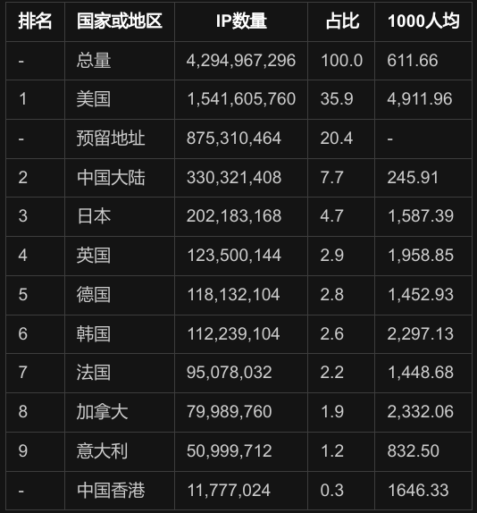
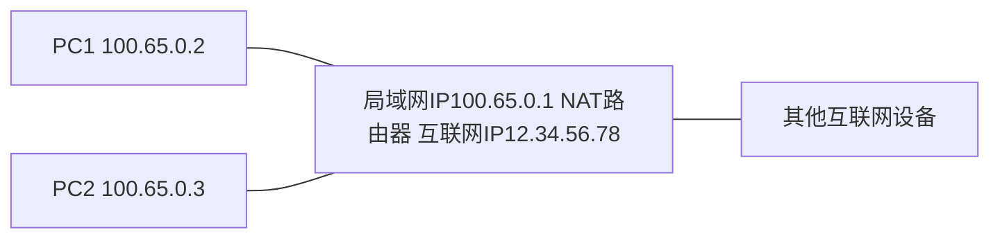
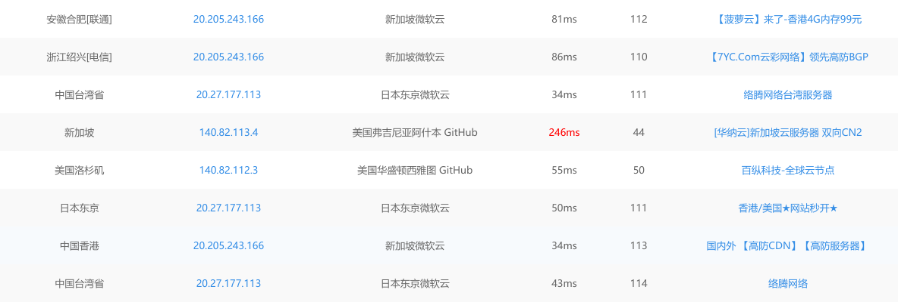
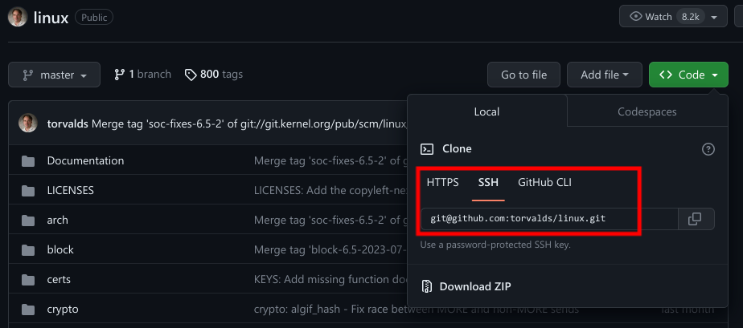
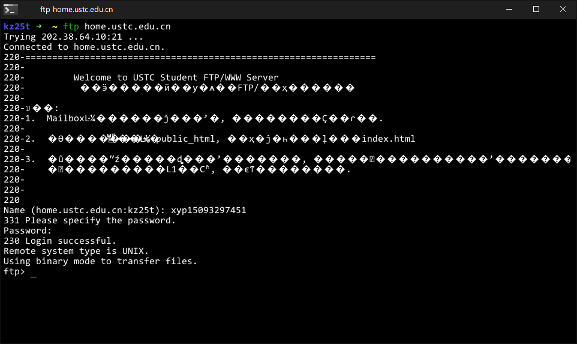

# 计算机网络简介（2）

续上文：[上文](./5.network.ver2-1.md)

[TOC]

## 6. IP 时代

### 6.1 IPv4

之前说过，一个网络中每个网卡给一个数字作为编号，也就是 IP 地址。

最早广泛使用的一种 IP 地址协议就是 IPv4(Internet Protocol version 4)，该协议规定 IP 地址可以使用 4 个字节，相当于大部分电脑（除了特别老的电脑比如 8086 及以前的）中 C 语言的 int（准确一点是 unsigned int），恰好很多设备的处理器也容易处理。其表示形式就是每个字节作为无符号整数，写出数字并把相邻的字节用点隔开，比如

```text
4个字节：0x76543210，先不考虑大端或小端表示
0x76=118
0x54=86
0x32=50
0x10=16
IPv4 表示为 118.86.50.16
```

大部分情况下人们所说的“IP地址”指的就是 IPv4 地址。IP 地址是互联网号码分配局分配给世界各国的，我国再把这些地址分配给各运营商，运营商再分配到各省市。外国的做法也差不多。

### 6.2 IPv4 的不足

四个字节只能表示 $2^{32}$ 个 IP 地址，这个数大约是 42 亿多，而世界人口已经……80亿了。况且这些 IP 地址还有一些做专门用途，比如上面所说的本地回环网卡的 IP 地址 127.0.0.1，这样剩下在公共互联网可用的大约有 36 亿；且不说网络中间设备的 IP 地址，仅考虑一人一个网络终端就能干爆两倍的 IPv4 地址。


另外，各地 IP 地址分配十分不均匀，以下是维基百科上部分国家和地区的 IPv4 地址分配数量：

|排名|国家或地区|IP数量|占比|1000人均|
|-|-|-|-|-|-|-|
|-|总量|4,294,967,296|100.0|611.66|
|1|美国|1,541,605,760|35.9|4,911.96|
|-|预留地址|875,310,464|20.4|-|
|2|中国大陆|330,321,408|7.7|245.91|
|3|日本|202,183,168|4.7|1,587.39|
|4|英国|123,500,144|2.9|1,958.85|
|5|德国|118,132,104|2.8|1,452.93|
|6|韩国|112,239,104|2.6|2,297.13|
|7|法国|95,078,032|2.2|1,448.68|
|8|加拿大|79,989,760|1.9|2,332.06|
|9|意大利|50,999,712|1.2|832.50|
|-|中国香港|11,777,024|0.3|1646.33|

以上表格好像在某些网站渲染不了，这是 vscode 的 MPE 的渲染结果：



> 声明：作者选取了前 9 名和香港地区数据；以上信息为本人在境外合法获取；已修改部分名称以适应我国法律要求、命名规范和阅读方便；根据原网站信息，该信息的年代比较早，大约是 2012 年。

看起来我们不仅总量不丰富，人均也……更是惨淡。（不过人均其实是在大约前 1/3 的）

为了让这么多设备上网，人们需要一些解决办法。首先很自然的就是，增加 IP 地址的位数，毕竟互联网已经发展多年，很多情况已经成熟；现在大部分上网设备硬件也都是 64 位的处理器，如果延长至 64 位甚至更多，实际上也不难。在这个想法的基础上，人们创造了 IPv6 协议；不过实际上还有很多应用和网站是给 IPv4 开发的，而且考虑硬件也很难直接全部改为 IPv6，为了给 IPv4 争取一点时间，人们也创造了一个 NAT 技术。

### 6.3 端口简介

在介绍 NAT 技术之前需要首先介绍**端口**。用人话来讲，端口是操作系统给每个网卡上不同的通信虚拟的一个编号，使用 16 位数字表示，也就是 0 到 65535；这也不是每个数字都随便用的，也有一些需要被保留，比如人们常说的 80 或 443（稍后会讲这是为什么）。

计算机的每个需要用来网络通信的进程都需要占用自己的端口号。这样设计的必要性是显而易见的，比如，你的电脑可能同时有一堆软件需要上网，包括浏览器、QQ（甚至可能同时登陆大号和小号）、微信或者是你自己写的网络程序。如果没有端口，那么操作系统从网络上接收了一个数据包，那么应该给哪个软件呢？显然不能给错，因为这样容易引发安全问题，用端口来区分就是一种做法。

一般个人电脑在使用的时候占用不了太多端口，65536 个是足够使用的。

### 6.4 NAT 技术与公网 IP

对于 IPv4 地址不够用的问题，一种可行的方法是 NAT 技术。准确来说，用于解决地址不够用的是 NAPT 而非原生 NAT，原生 NAT 很少有人用，这里就不介绍了。现在一般说 NAT 就是 NAPT，接下来我也用 NAT 来介绍。



以上图为例，当然这里看起来 NAT 路由器是无线的，因为连接两个 PC 只有一个 IP，以下来解释 NAT：

假如 PC1 的程序 A 占用 1234 端口，需要和 PC2 的占用 4321 端口的程序通信，那么就是直接 `100.65.0.2:1234` ↔ `100.65.0.3:4321`，就像之前所讲的网络那样；假如两个程序都需要和互联网上的 `87.65.43.21:1958` 通信，那么 `100.65.0.2:1234` 首先被 NAT 路由器接收：

`100.65.0.2:1234`→`100.65.0.1:2345`

然后 NAT 路由器再用互联网方向的网卡发出去：

`100.65.0.2:1234`→`100.65.0.1:2345`→`12.34.56.78:1145`

同样，对于 PC2 的程序，其也获得了一个互联网上唯一的 `IP:端口` 组合：

`100.65.0.3:4321`→`100.65.0.1:5432`→`12.34.56.78:4514`

于是 `87.65.43.21:1958` 认为两个消息都是 `12.34.56.78` 发过来的，但端口不同，所以不能认定是同一个用户。返回的过程也类似；甚至 `87.65.43.21:1958` 可能也是一个被 NAT 转换过的 `IP:端口` 组合。

NAT 地址仅在 NAT 的局域网里使用。NAT 路由器相当于局域网和互联网的连接器，做两边的信息交换，使得局域网的设备具有了和互联网交互信息的功能。

> **拓展阅读1**
>
> 一个非常大的 NAT 局域网的例子是朝鲜国内网络，朝鲜内部的网络终端如果想要访问互联网，那么首先要求访问的目标 IP 在该国规定的白名单内，然后通过朝鲜的一个具有 NAT 路由功能的服务器向外转发。

如果你的电脑的 IP 是互联网唯一 IP，那么称为公网 IP；然而对 IPv4 而言，现在很少有人能用到公网 IP；如果一个普通用户能直接获得公网 IPv4，一般是因为网络提供者很早就占有了很多 IPv4 地址。如果在科大中校区连接 eduroam，那么你的 IP 就是公网 IP，这也是十分少见的事情。

### 6.5 IPv6 与 MAC 地址

之前很多人认为 NAT 只是短暂的应对方案，真要解决还得靠延长 IP 位数。

假如延长到 6 个字节，那么平均每人可以分配到大约 3 万个 IP，这样看起来基本够用。那么不如首先给网络设备搞一个硬编码序号，就好像 DNA 刻在人体一样，用 48 位二进制数给设备编号，这就是 MAC 地址。

MAC 地址有很多好处，比如区分同一个 IP 发过来的数据有哪些是来自于同一个设备。毕竟即使是 `IP:端口` 组合也不能确保跟你通信的一直是一设备，如果趁设备不注意给它换了一个相同组合的呢？而 MAC 在一定程度上解决了这个问题（虽然不能完全解决问题，甚至某些时候不能避免重放攻击）MAC 看起来是出厂的时候写死在硬件里的，然而我们还有虚拟机这种东西……所以也不完美。

MAC 看起来更像手机号。

MAC 能否担任新的 IP 的重任呢？不见得。假设合肥有一台路由器，它往东西南北四个方向有四根主干网线。假如来了一个数据包，而只分析数据包的前几位就知道这是北京的 IP，那么就可以直接放去往北的干线，而不用管它是东城区的还是西城区的；对于上海的则直接放去往东的。如果改用 MAC 担当 IP，那么一台设备从广州跑到北京，路由选择也就不同。这样带来的麻烦太多，会使得路由器的转发策略极为复杂。

后来人们直接把 IPv6 搞到了 16 字节 128 位，表示方法是两字节一组用 16 进制表示，每组之间用冒号隔开。目前使用的 IPv6 地址往往有很多 0，如果在地址中有连续的两字节的组都是 0，那么可以用两个冒号连接这些组两边的数字，每个地址仅限一次使用（想想这是为什么），一般选择最长的。

比如：`fe80::cc3d:9906:3313:3158`，中间的两个冒号可以展开为 3 组 0 表示。`::1` 则省略了 7 组 0，一般是 IPv6 的本地回环地址。

IPv6 目前看起来数量巨大，取之不尽用之不竭。之前有小道消息说有可能会把 MAC 嵌入 IPv6 里，不过我感觉真实性很低。

IPv6 作为一个比较新的技术，目标是取代 IPv4，但不幸的是，这个过程看起来会很漫长。我国移动端的 IPv6 流量占比今年才刚刚超过一半。主要原因是，很多网站并不支持 IPv6 访问，甚至有些地方办理网络（宽带、光纤等）还有不给 IPv6 的（中国大陆几乎没有，可惜我现在的地方就没有 IPv6）。甚至人们在 IPv4 玩 NAT 玩上瘾了，以至于在 IPv6 上还搞 NAT，听起来十分离谱。

IPv6 的主要变更就是延长了 IP 地址长度，另外还对安全和效率方面做了一些优化，但这些内容并不重要。

常用的网速测速工具：

[test.ustc.edu.cn](https://test.ustc.edu.cn)，是 IPv4 网站，仅用于给 IPv4 测速。

[test6.ustc.edu.cn](https://test6.ustc.edu.cn)，是 IPv6 网站，仅用于给 IPv6 测速。

### 6.6 IP 的获得

现在人们上网的 IP 一般都是动态获得。即使你连接同一个网络，断开再重新连接之后，IP 可能也不一样。动态获得的一般方式是 DHCP，是设备刚连上路由器的时候，系统自动对设备的设定。这个我在这里无需细讲，主要是计算机网络课程里的东西。

对于比较老的网络设备，或者一些实验用、专用的局域网，也常常使用固定 IP 地址。手动配置 IP 地址一般包括如下项目：

- IP 地址。
- DNS 地址，非必须，可以多个但一般 1~2 个，若没有则只能通过 IP 上网。
- 子网掩码或子网掩码长度（musk）
- 网关（gateway）

IPv4 和 IPv6 都分别需要一套。除了 DNS，其他都是必须项目。如果是动态获得 IP，则以上项目也都会自动获得。以上四项的含义我稍后会讲。

很多网站服务器的 IP 都是固定的。至于什么是服务器……马上就到了！

### 6.7 子网掩码和网关

这里主要使用 IPv4 讲解，IPv6 和它差不多。其实如果你不理解这一部分，那么对后边的内容也没什么影响。我总感觉这一部分写的不是很容易理解，但是也想不明白问题出在哪。

为了简单理解，我们可以假设网络中不存在 NAT 技术，实际网络中把 NAT 路由器当终端设备就好了。

一个很常见的子网掩码是 `255.255.255.0`，它并不是 IP 地址，只是和 IP 地址的表示形式一样。它和 IP 一样是 32 位二进制数，前面 N 位为 1，后边 32-N 位为0，N 称为子网掩码长度，我见得最多的就是 24；子网掩码长度和子网掩码有相同的功能，而且看起来比子网掩码更直观、简单，所以我们也常常用子网掩码长度来代替子网掩码使用，或者直接把它叫子网掩码也未尝不可。

子网掩码的主要作用是判定是否在同一个 **子网**，判断方式是两个 IP 分别和子网掩码做与运算，或者说分别取出前 N 位看看是否一样。一个子网一般也用前 N 位表示，当然需要带上 N，比如 `114.214.191.0/24` 是中科大教育网的一个子网，事实上 `114.214.160.0` 到 `114.214.255.255` 共计 24576 个 IP 都是中科大教育网的 IP 地址。

举个例子，假设所有 IP 地址在 `114.214.191.0` 到 `114.214.191.255` 范围内的设备，其离开子网都需要经过某个特定的路由器；而这些设备属于互联网的一部分，我们说是在子网 `114.214.191.0/24` 里。这也是子网的表示方法，把前 N 位的数字，加上后 (32-N) 位的 0，用 IP 地址形式写出来，后边一个斜杠带上 N 即可。

子网内的两个设备通信不会离开子网，这是子网路由器选择所设定的。这使得互联网网络的路由转发（即路由器收到了某个数据，知道数据的目标 IP 地址，接下来需要把它发往哪个网卡）很容易。否则，如果路由器对每个 IP 都设定一个转发目标表项，这样的话路由器需要记录 $2^{32}$ 个表项（如果是 IPv6 就更恐怖了）。子网可以极大降低路由器转发表的数量。路由器只需要从转发表中依次匹配目标 IP 在哪个子网，找到第一个匹配到的表项就往对应的网卡转发。

> IP 地址相近的设备一般距离很近。

子网可以相互包含。假如 `114.214.191.0/24` 和 `114.214.190.0/24` 都被某个路由器所直接连接，那么可以合并为 `114.214.190.0/23`，进一步减小表项。

> 例题：请使用尽可能少的子网数量表示中科大教育网的 IP 地址。
>
> 解：中科大教育网的 IP 地址 `114.214.160.0` 到 `114.214.255.255`；
>
> 160 二进制是 **101**00000，那么只需要考虑 `101`-`111` 的合并即可。实际上，`101` 和 `11x` 即可覆盖。两者子网掩码长度分别为 16+3=19 和 16+2=18；因此科大子网可以表示为：
>
> 子网 `114.214.160.0/19`，对应 $114.214.(101\text{xxxxx})_2.\text{xxxxxxxx}$ 的地址。
> 子网 `114.214.192.0/18`，对应 $114.214.(11\text{xxxxxx})_2.\text{xxxxxxxx}$ 的地址。

**网关** 的意义是，如果目标地址是离开这个子网的，那么应该走哪个网卡离开，也就是说它是一个子网内部的路由策略。网关可以设置一些限制，比如禁止向外访问某个 IP 等。

## 7. 走向域名

### 7.1 CS 模型

CS 在这里全成 client-server，客户端-服务器模型。之前说的网络在通信方面是平等的，但是在服务提供方面，绝大多数情况都是 CS 模型。

比如说登录教务系统，首先要发送“登录”请求给教务系统的服务器，服务器处理你的请求并且把处理结果发回来。按照鄙人的粗浅理解，**服务器就是接收客户端的请求，处理请求并且把处理结果发给客户端的机器**。这只是功能概念模型，从网络结构概念来讲，服务器和客户端都是网络终端。从物理结构来讲，服务器是一台计算机。对于大型网站的服务器，一般是性能非常强的计算机。对于小的网站，服务器可以是几年前的老旧手机，只要能完成请求的处理就可以。另外，**服务器基本都需要公网 IP（需要加钱），最好是固定的（需要加钱）**，以及需要面对各种可能的网络攻击。

服务器需要全天不间断开机才能保证能够被访问，很多人自己搭建网站，不容易或不方便一直开机，或者是不希望增加那么多网络设备。这时候可以购买云计算服务，大型互联网公司基本都提供云计算服务（价格并不便宜，可见 vlab 还是很良心的），云主机可以不间断开机并且有专业团队来帮助你解决可能遇到的问题。

服务器一般使用 Linux 或者 BSD 系列的操作系统，使用 Windows 的不多。服务器运维人员是互联网行业中的高薪职业，从业人员需要在 Linux 编程、网络编程和操作系统等方面都有过硬的技术。

> **拓展阅读2**
>
> 大型网站的服务器可能是很多高性能电脑组合的，里面有复杂而精密的算法，包括内容分发网络（CDN）、负载平衡、信息存储与调度、攻击防御能力等。这些服务器处理能力很强，功耗也很大，需要一定的降温技术，比如微软的一些服务器放在太平洋海底“水冷”降温、苹果在中国的服务器在贵州通风良好的山洞、阿里巴巴、百度的一些服务器在宁夏、山西这样的凉爽地区。
>
> 这样做也可以为我国不同地区经济的平衡发展做出贡献，比如我国国家大数据中心在贵阳市贵安新区，很多网络服务器都在贵州省，使得贵州多地借此摆脱贫穷。“东数西算”工程也与此相关。

以及：

> **拓展阅读3**
>
> 除了 CS 模型，还有一种 P2P(peer to peer 或 point to point) 模型。每个节点都直接与另一个节点进行通信，而不是通过中央服务器进行中转。
>
> P2P 网络可以用于区块链技术，用于信息传递、数据验证和平衡负载，只可惜很多人不用它来干正事，使得 P2P 经常被人们认为是“骗局”。（不过作者建议遇到 P2P 的时候确实要多加小心）
>
> 另外还可以降低网络以及服务器负载，提升网速。一个简单的例子，假如某坤在微博上预告自己今天晚上 4 点要在 QQ 音乐发新歌，那么众多 ikun 会在 4 点的时候蹲着等待发布。如果这些 ikun 在短时间内向 QQ 音乐服务器发送请求来获取歌曲数据，那么服务器可能不堪重负；一种更好方法是 ikun 用爱接力传递，比如 ikun001 获得数据之后，ikun002 再向 QQ 音乐服务器发送请求的时候，服务器告诉客户端软件从 ikun001 那里获取数据，这样服务器就不用发送过多的数据。
>
> P2P 下载也有类似上面的思路，从而可以一定程度上提高下载速度。但是也要小心数据源污染或者 P2P 软件全家桶甚至诈骗等行为。

### 7.2 域名与 DNS

前面我们讲的都是通过 IP 访问，然而从用户角度来看，我们上网很少有人直接输入 IP，一般是通过浏览器输入网址实现。**网址≈url**，而域名就是网址的前边的一部分，比如 url `https://ustc.edu.cn/xxxxx后边的东西随便`，域名就是 `ustc.edu.cn`，而 `jw.ustc.edu.cn` 也是域名。

我们发送的数据包是包含目的 IP 地址的，也就是需要访问网络服务器。从域名转换到网络服务器有很多方式，我们拿打电话为例子。

假如你需要打电话给中国科学技术大学，那么如果你的通讯录里有这个电话，直接打过去就好了。如果没有，那么可以上网查（可惜我们在拿电话举例子，暂时认为网络是不存在的），还可以问问朋友；还不行，就打 114（我真的打过很多次）；如果中国科学技术大学想要能够让很多人获取自己的电话，那么就需要把自己电话和名字登记在 114 查号台的电话号表格上。

网络也是类似。上网时，首先查一下本地“通讯录”，也就是 hosts 文件，在 Windows 里是 `C:\Windows\System32\drivers\etc\hosts`，Linux 里是 `/etc/hosts`；查不到就去问操作系统内指定的 DNS 服务器（域名服务器，稍后会讲），如果这个 DNS 查不到，它（指这个 DNS）还会去问其他的 DNS，如果都没有就无法访问这个网站。

在连接网络的时候，一般会直接告诉 1-2 个 DNS 服务器的 IP，这些 DNS 一般可能是学校或地方运营商的。手动设置网络的时候需要手动指定 DNS；如果连网之后对 DNS 不满意还可以自己改。

对 IPv4，世界上有一个主 DNS 服务器在美国，还有 12 个其他的根域名服务器，总的根域名服务器有 13 台，都不在我国（曾经是有的，后来作没了）。而我国有一些 IPv6 根域名服务器，在北京、兰州、郑州、南京等地都有布局。很多地方运营商和学校等会从根域名服务器上同步数据。但是有些域名服务器会污染数据，给出不正确的 IP 地址（没了的 IPv4 根域名服务器就是这个原因）。

世界上一个常用的 DNS 地址是 8.8.8.8，而我国一个常用的 DNS 服务器地址是 114.114.114.114，这个地址很好地说明了 DNS 的作用。如果你的电脑运行某个程序出错，提示域名无法解析，在确定域名没写错之后就可以考虑手动指定 DNS 为这两个地址。

那么我们有没有可能保存大量常用上网地址到 hosts 文件，从而在上网的时候减少对 DNS 的访问呢？看起来是一种有效的办法的，但是可能有些服务器的 IP 地址会变化导致 hosts 文件不再适用。

另外也可能有些网站没有域名，只能靠 IP 访问。申请域名还是有点麻烦的。对于一些诸如校内线上考试的东西可以只靠 IP 访问。另外，有些程序比如 python 的 jupyter notebook 就是把自己电脑创造成一个服务器，然后使用 `127.0.0.1:8192` 来访问自己电脑的服务，这样不仅方便持续访问，还可以防止其他人攻击，因为任何人访问 `127.0.0.1` 都只能访问到自己的电脑。

> **拓展阅读4**
>
> 有时不同的 DNS 会给出正确但不一样的 IP，这种策略在某些时候是有用的。比如说假如某款游戏在中国和美国各有一台服务器，这时候一般中国玩家使用中国服务器延迟低，游戏体验好，而美国玩家同理。一般情况下，中国的 DNS 把域名解析到中国服务器，而美国同理。如果中国玩家手动把 DNS 指定到 `8.8.8.8`，那么可能就能够连接美国服务器。美国服务器可能提供了不同的游戏玩家，但是对应的延迟也会增加。
>
> 另外这样也可以降低各地服务器负载。比如说我使用[ping.chinaz.com](https://ping.chinaz.com/github.com)测试多地 ping GitHub 的相应地址，结果如下：
>
> 
>
> 第二列就是 GitHub 相应的 IP 地址。这样对于同样的内容访问，分担到不同服务器上可以降低访问压力。

## 8. 走进上网协议

我们常见的一种上网方式是打开浏览器输入 url 之后访问。那么 http 是什么？HTTPS 名字那么像，又是什么？80 和 443 的交相辉映又代表着怎样的奥秘？欢迎观看本期《走近上网协议》。

这里我用 `github.com` 和 `vlab.ustc.edu.cn` 两个域名来解释。

### 8.1 服务器的端口号

服务器是接收请求、处理之后返回处理信息的。一个用户用浏览器访问一个网站，比如用 HTTPS 访问，那么一般情况下，服务器就是用 443 端口来接收请求信息。需要注意的是，用户电脑的浏览器软件一般都不会用 443 收发信息，所谓“443端口用于 HTTPS”仅限服务器；接收信息的服务器并非用“浏览器”来处理请求，而是有一套复杂的程序。

除了常见的 HTTP 和 HTTPS，其他的上网方式还有 SSH、FTP 等。

### 8.1 HTTP 和 HTTPS

HTTP 就是早期访问网页的方式，当你在浏览器输入 http 开头的 url 的时候，浏览器会和服务器进行 HTTP 的访问。我个人感觉 HTTP 更像是一个试验品，因为我感觉 HTTP 并没有一个哪怕是一点安全措施（也可能是我了解的太少），除非应用自己增加了安全措施。

如果一个服务器给 HTTP 访问提供服务，那么一般会使用 80 端口。

早些年我上网的时候大多数网站都是 HTTP，当时见过的 HTTPS 只有一些银行的支付页面，有些浏览器还不支持 HTTPS；而现在 HTTP 已经几乎看不到了。 HTTPS 在 HTTP 基础上增加了一些安全验证，加密了很多信息。

如果一个服务器给 HTTP 访问提供服务，那么一般会使用 443 端口。

如果你在浏览器地址栏输入的 url 不包括开头的 http 或 https，那么一般浏览器会自动帮你补一个。如果不对，也可能会转化成另一个。

HTTP 和 HTTPS 也都可以用于下载文件。很多 Linux 用户使用的 `wget https://xxxxx` 命令就是使用 wget 程序下载文件。

### 8.2 SSH

在前面的文档里我讲过了 vlab 的 ssh 连接方式。ssh 也是互联网上的重要连接方式，其主要用于计算机的远程登录、文件传输、数据转发等。

#### 8.2.1 远程登录

之前讲过的 vlab 的 ssh 连接就是远程登录。如果一个计算机 A 要登录并控制 B，那么 A 需要安装 `ssh client`，B 需要安装 `ssh server` 并开启端口（一般为 22），且 `ssh server` 需要完成配置；好在这些东西在大部分 Linux 和比较新的 Windows 里都是自带的。

命令行连接 vlab 的方式：`ssh username@vlab.ustc.edu.cn`，可见这里甚至也用到了域名。到现在可以发现，`vlab.ustc.edu.cn` 可以用 https 或 ssh 访问，但实现访问的客户端并非同一程序，服务器也不是同一程序。大多数 url 并非能这样访问。

SSH 远程登录常常被用于使用公司服务器。

#### 8.2.2 文件传输

SSH 可以用于文件传输，这种时候一般使用经过 SSH 封装的 scp 等命令。甚至 git 也对此有封装。包括 GitHub 在内的大多数线上 git 平台，可以使用 https 或 ssh 传输数据：



你可以使用 `git clone https://github.com/torvalds/linux.git` 或 `git clone git@github.com:torvalds/linux.git` 来下载代码，这两条命令分别使用 HTTPS 和 SSH 传输文件。`git push` 等命令也是如此。

> git 命令在各平台是通用的。

#### 8.2.3 数据转发

假如计算机 A 不能直接访问 C，但 A 和 B 可以通信，B 和 C 也可以，这样 A 可以间接访问 C，SSH 数据转发是这样的一种实现方式。

对于 SSH 数据转发，首先需要设置本地服务器，也就是 A 首先拦截自己往外的数据，发到本地服务器上；然后把数据通过一个特定的数据端口发往 B 的 SSH 端口；B 再正常向外发送。此时 C 看起来都是 B 发来的数据，而实际上和 A 完成了沟通。

> HTTP 代理、VPN 代理等的原理相似。

### 8.3 FTP

FTP 主要是用于文件传输的。我本人用的比较少，而且支持 ftp 的域名也不多。域名 `home.ustc.edu.cn` 可以用于传输 ftp 数据，这个域名主要用于建立学生个人网页（可见这个域名可以 HTTP 访问），但是貌似并不对 22 届及以后开放。如果你是 21 届及以前的科大学生，可以尝试用它来进行 ftp 实验。

打开终端，输入 `ftp home.ustc.edu.cn`，在 name 里输入自己的科大邮箱账户名，但不包括 `@` 及以后的内容；密码输入自己的邮箱密码，即可连接并执行 ftp 命令。



【看起来估计是传输了一堆 GB2312 的中文，在我的 UTF-8 终端里乱码】

实际上还有很多使用 ftp 的软件，包括较新版本的 Windows 和 Linux 的文件管理器等都可以。

### 8.4 用 PING 测试网络连通性

如果不能上网，可以尝试使用 PING 测试网络连通性以及网速。各种网站都可以被 ping；经常被 ping 的网站有 `baidu.com` 等。

PING 命令的用法：

- `ping -c number 域名` 用于重复 number 次 ping 一个 url，number 一般为 4；
- `ping 域名` 在 windows 上默认 ping 4 次，Linux 上默认一直 ping，需要用 Ctrl+C 结束。

在科大校内，如果你 `ping ustc.edu.cn` 是可以通达的，而 `baidu.com` 是无法通达的，那么很可能是你并不能访问校外网站。

PING 命令还可以直接输入 IP 地址，如果后边是域名则会首先请求 DNS 来获得目标的 IP 地址。这是获取一个域名的 IP 的一个简单方式（仅限你的 DNS 能给出的 IP）。如果直接连接 IP 可以 ping 通，而域名无法 ping 通，那么可能是 DNS 方向的问题（DNS没有这个域名的 IP，或是无法连接 DNS）。PING 输出的 time 越小，意味着网络连接越好。

```bash
# 1. 直接 ping IP 地址
$ ping -c 1 8.8.8.8
PING 8.8.8.8 (8.8.8.8) 56(84) bytes of data.
64 bytes from 8.8.8.8: icmp_seq=1 ttl=117 time=3.03 ms

--- 8.8.8.8 ping statistics ---
1 packets transmitted, 1 received, 0% packet loss, time 0ms
rtt min/avg/max/mdev = 3.033/3.033/3.033/0.000 ms

# 2. 获取 example.com 的 IP 地址，即使这个网站不能 ping 通，也可以获得 IP 地址。
$ ping -c 1 example.com
PING example.com (93.184.216.34) 56(84) bytes of data.

--- example.com ping statistics --- # 都丢包了，没能 ping 通
1 packets transmitted, 0 received, 100% packet loss, time 0ms

# 3. 也可以 ping IPv6 的域名，获得 IPv6 地址
$ ping -c 1 test6.ustc.edu.cn
PING test6.ustc.edu.cn(2001:da8:d800::40 (2001:da8:d800::40)) 56 data bytes
64 bytes from 2001:da8:d800::40 (2001:da8:d800::40): icmp_seq=1 ttl=61 time=3.48 ms

--- test6.ustc.edu.cn ping statistics ---
1 packets transmitted, 1 received, 0% packet loss, time 0ms
rtt min/avg/max/mdev = 3.475/3.475/3.475/0.000 ms

# 4. ping 一个不存在的域名，会提示未知的名称或服务。（提示：notexists.com 是存在的域名。）
$ ping notexists.not      
ping: notexists.not: 未知的名称或服务

# 5. 如果在 HOSTS 没有，且（DNS 没有设置或 DNS 不可访问）时，也就是不能完成域名解析的时候，会如下报错：
$ ping baidu.com
ping: baidu.com: 域名解析暂时失败
```

PING 127.0.0.1 可以用于检测自己的 ping 命令是否正常，或者自己的虚拟网卡是否正常。一般情况下这俩都是正常的。

PING 并非使用 HTTP/SSH/FTP 等协议，它使用 ICMP 协议比前面的几个低级。

## 9. 浏览器与 HTML

HTML 是一种能渲染可视文本页面的文本文件格式，像是高级的 Markdown 或低级的 LaTeX，HTML 文件一般用浏览器来阅读界面，而生成 HTML 的方式有很多，包括 VSCode 直接写代码或是 Figma 等设计软件用来辅助生成 HTML 代码等（类似于用 CMake 生成 Makefile这种）。

浏览器显示网站，最简单的就是只有一个 HTML 页面，此时网站服务器通过 HTTP 或 HTTPS 把对应的 HTML 文件发过来，浏览器用来渲染。纯 HTML 网页现在不多见，不过[麻神的个人主页](http://home.ustc.edu.cn/~yssickjgd/)有点像一个纯 HTML 网站。

一般的网站还包括资源文件（比如 HTML 中插入的图片）、CSS 和 JS 文件。CSS 用于让网页看起来更炫酷，而 JS 用于完成网页上的操作。

有些协议是借 HTTP/HTTPS 等协议实现的，比如说 Vlab 的网页桌面登录，就是借 HTTP/HTTPS 传输的数据，以此为底层实现了 VNC 协议。

## 10. 走进计网

看到这里，你应该对网络结构并不陌生，而且看到《计算机网络》这本书应该不会在对某些东西感到困惑——因为计网课本很多地方不注重主干，把乱七八糟的东西讲一堆，让人找不到主干。

我本人计网不好，可能很多东西写的不对，如果联系我我会尽快改正。

计网的世界还很大，不仅基本网络内容很多，还有一大部分网络安全领域的内容。

OSPF,FEC,ADSL,BGP,LAN,FSM,URL,TLD,HFC,CIDR,AS,DSL,UDP,TDS,ATM,MAC,STP,CSMA/CD,CDMA,CSMA,HTTP,FTTH,IMAP,ISP,DHCP,MSS,TTL,POP3,SR,NIC,DDoS,FDMA,ATM,FDM,MTU,TCP,TDM,NAT,DoS,PPP,ARP,PDU,MAN,RIP,TP,AIMD,IP,CSMA/CA,CRC,CAM,MIME,ICMP,HOL,ARQ,UTP,DNS,HTML,OSI,RFC,TDMA,DHT,GBN,RTT,FTP,SMTP,EDC……好有好多我没讲的。

> 走向宽广的世界——沃兹基·硕德
