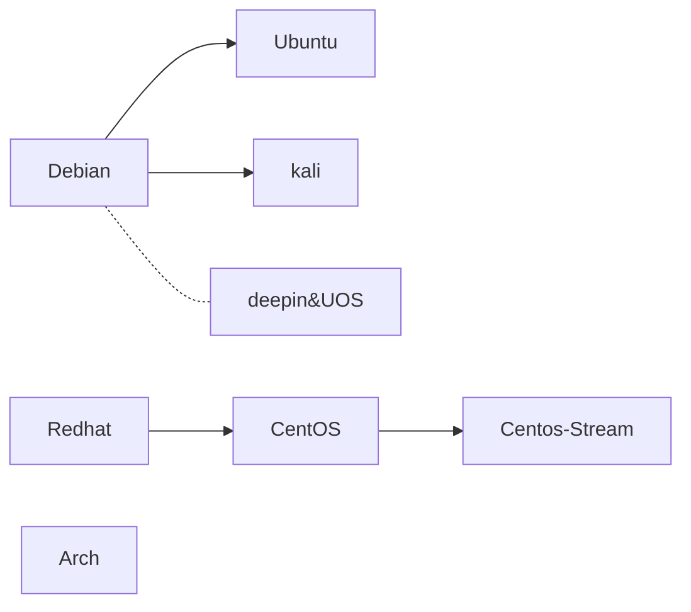

# 第1节 Linux 的简单介绍（1）-Linux 的选择

## 1.linux 的优点

Linux是一种广泛使用的操作系统。在编程中的好处有：

- 便于搭建环境（比如apt install），在windows上搭建环境比较困难
- 便于移植环境（配置文件简单，可以使用docker等便于移植的工具。这个特性使得一台 linux 机器上的的代码很容易在另一台机器上运行）
- 操作系统服务稳定且规范（类 UNIX 操作系统，很多函数通用，在windows上则不是这样，参照[上一个小节讲的 POSIX 内容](../3.computer_simple/3.arch_and_os.md
)；计时器稳定，你们的助教做算法实验统计程序运行时间的时候，windows上有时候计时会出问题，在linux上很稳定）
- 工具丰富（交叉编译器等，在windows上几乎找不到），开源软件较多（很多开源软件只能在 linux 上运行。当然 linux 本身也是开源的）

再说一下 linux 的缺点，当然大多数问题其实在熟悉之后都能解决：

- 对新手比较复杂，可能会发现啥啥都搞不明白。
- 与 windows 操作系统使用习惯相差太大。
- 很多专业软件没法使用。（这个和工具丰富并不矛盾，编程相关的工具 linux 丰富，很多其他应用软件则主要在 windows 上提供支持。）

### 1.1 举一个例子

《C程序设计》（谭浩强 著）（20级及以前的计算机程序设计A课程教材）里大概说了这么一句话：

> C语言输入输出的有缓冲的，当缓冲区满或遇到回车的时候才会刷新缓冲区。

不知道你们的课本上这句话，现在我们复盘一下。

```C
#include<stdio.h>
#include<windows.h> // 在 linux 上改为 unistd.h

int main(){
  for(int i = 0; i < 5; i++){
    printf("hello ");
    Sleep(1000); // 在 linux 上改为 sleep(1)
  }
  printf("\n");
  return 0;
}
```

假设没有缓冲，那么理论上来讲应该是每一秒输出一个`hello`，输出5个；如果按照谭浩强书上讲的，那么前5秒不会有任何输出，因为没有回车刷新缓冲区。事实上，如果你在windows电脑上运行，那么则会每秒输出1个；在linux电脑上运行，则前5秒没反应，之后一次性输出5个hello；这是因为输出缓冲那句话是对linux等操作系统说的。缓冲输入和输出的好处之一是提高输入输出的速度。

## 2. 选择是用什么 linux

这里从发行版和使用形式两个维度介绍，这两个维度基本上可以排列组合（有几个特例是不能组合的）。

### 2.0 常见的 Linux 发行版

Linux 本身是一个内核，很多不同的团队（盈利或非盈利的）把 linux 内核经过二次开发后形成了不同的发行版。直接使用 linux 内核是挺难使用的。

Linux 的发行版比较多，至于它们之间复杂的关系我就不再讲述了，因为没（我）什（不）么（知）用（道），只列出一些我见过的常用的发行版（应该说是发行版系列）的重要信息。

- Debian
  - 是从0开始建立的 linux 发行版。
  - 身边没听说过有人用这个的，风险大，不做评价。
- Ubuntu
  - 助教本人用过 Ubuntu 的 VMware 虚拟机、wsl、双系统、Vlab 平台。
  - 是在 Debian 基础上再进行开发的系统。
  - 网上资料最多。差不多可以完成本科生所有对 linux 的需求。
  - 看起来新手基本上都装 Ubuntu，用过一段时间的 linux 之后的人很少再选择安装 Ubuntu 了。
  - 听说不太稳定，我确实用出过不少问题，个人体验比较差。
- kali
  - 助教本人用过 kali 的双系统（现在就在用），双系统操作比 Ubuntu 简单。
  - 是在 Debian 基础上再进行开发的系统。
  - 安装完毕后自带很多常用工具，尤其是网络工具，听说网安专业的人喜欢用 kali
  - 资料不如 Ubuntu 多，但是 Ubuntu 的资料基本上都对 kali 有效。
  - 就目前本人经历来看， kali 还算稳定。
- Deepin/UOS
  - 助教本人用过 UOS 的双系统。UOS 是 deepin 的商业版本，但是 UOS 家庭版本免费。
  - 国产操作系统，获得较多支持，可以比较方便地运行微信。
  - 最早基于 Debian，后来重新构建。
  - 该系统并不是为编程设计，和其他 linux 操作逻辑相差比较大（比如一些原来要 sudo 的命令下放给了普通用户，其他的 sudo 要开发者模式），但是对新手相当友好。
  - UOS 可以一键安装双系统（安装包有双系统选项），可以说是十分的贴心了。
  - 对龙芯等国产硬件平台支持较好。
- Redhat
  - 商业发行版，要钱。
  - 没见有人用过，可能企业用的多。不推荐使用。
- Centos
  - 助教本人用过 centos 的 VMware 的虚拟机、wsl、双系统（一次成功，一次失败）。
  - 基于 Redhat 的社区版本
  - 目前已停止维护
- Centos-Stream
  - 助教本人用过 Centos-Stream 的 wsl（现在在用）、双系统（安装失败）。
  - 还在维护，Centos 能用的它基本上都能用。
- Arch Linux
  - 助教本人没用过，看别人用的还挺折腾的。
  - 不推荐新手使用。

整理一下：



### 2.1 常见的 linux 使用形式

#### 2.1.1 VMWare 虚拟机

网上可以看到很多人都在用 VMWare 虚拟机。也有用 Virtual Box 的，但是助教没用过。

优势：可以设置系统还原点，也就是说折腾坏了可以回到过去。可以同时运行多个系统（除了其中的一个，剩下的都要在 VMware 里）。很多新手都会使用这个。是除了实体机器外和实体机器最像的。

缺点：占用资源太大，运行速度慢。

个人评价：一般推荐新手使用。网上的教程一般把内存、存储、CPU核设置的比较小，其实可以设置大一点。推荐安装 ubuntu 或 centos-stream 的虚拟机。如果想折腾 arch 也可以。

#### 2.1.2 WSL

WSL(Windows Subsystem for Linux)，我认为这是一个伟大的产品。它能在 Windows 下运行 linux 内核。

优势：资源占用较小（助教本人安装的 centos-stream wsl 的存储只有1G多一点，但是已经有 C++ Python go 的支持和cmake Makefile等工具），且内存占用小，能够方便地和 Windows 的文件互通。安装是除了 vlab 的最方便的。

缺点：很多操作系统层面的东西实现不了。图形化界面比较麻烦（但是可以用 vscode）。

个人评价：简单编程比较好用，对于操作系统层面的实验基本上都不支持。推荐安装 ubuntu 或 centos-stream 的 wsl（你可以找助教要 centos 的安装包然后升级成 centos-stream）；是和实体机器最不像的。是一个增强版的 Windows 终端。

#### 2.1.3 Vlab

Vlab是中科大Linux用户协会开发的一款在线虚拟机服务。

优势：便于配置，对自己电脑的资源占用几乎没有。对新手友好。有更多的软件配套和支持，专为中科大定制，能够完成中科大计算机系的几乎全部实验。运营团队专业，可以24h不间断运行（有少数时候会停机检修，会提前通知）。

缺点：需要网络连接，桌面环境稍有延迟（事实上，如果用vlab写代码可以用 ssh + vscode 解决这个问题）。对于操作系统层面有部分不支持（其实还不错），只有部分镜像（但是够用）


↑中区食堂门口的vlab广告

评价：十分推荐中科大学生使用。另外，不只是计算机专业的可以使用，全校的应该都可以。Vlab 貌似只有 ubuntu 和 centos 可选，这时候建议安装 ubuntu 系统。

#### 2.1.4 实体机器运行 linux

优点：如果熟悉 linux，则实体电脑还是比较好用的，运行速度快、资源占用小、文件系统方便、软件安装方便，最真实的 linux 环境便于进行各种操作系统层面的尝试。

缺点：很多软件不能用，比如微信、媒体处理软件等，所以一般都装双系统。不能同时运行双系统，Windows 很难读取 linux 的文件（反过来很容易）。对新手不友好，容易把机器搞崩。听说不方便打游戏。

助教本人平时就用 kali 双系统，一般不开 Windows，时不时检查一下 Windows 还活着没。我的电脑如果开 Windows，断电续航大概两个半小时；使用 linux 能用大约 6-8 个小时，白天上课不需要带充电器。

评价：不推荐新手安装双系统，除了 UOS；推荐有一定经验的人安装。如果新手很想体验，推荐安装 UOS ；如果有一定了解，推荐安装 kali 系统。
