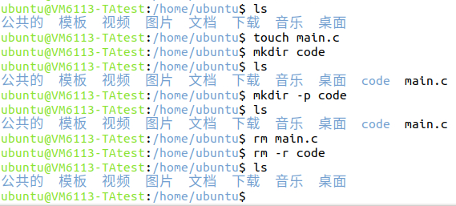
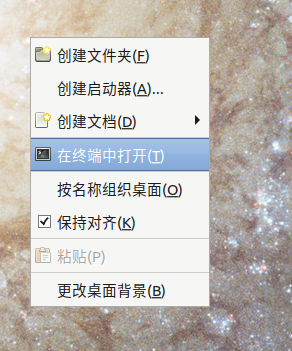

# 第2节 Linux 的简单介绍（2）-Linux 的使用

linux 入门的文档很多。事实上我也熟悉 linux 没多久，所以很多你们遇到的问题我大概也在不久之前遇到过。

我看《鸟哥的Linux私房菜.基础学习篇》的读书笔记：[链接](https://gitee.com/KZ25T/books_reading/tree/master/2%20Linux) ，当然别指望着光看我的笔记学会linux；如果希望能认真学习linux的推荐看这本书（更推荐看 LUG 的讲义），不过大多数人估计只是希望先从linux编程开始入手，那么并不必须看这本书。

> 这本书我的评价是，对新手还是不那么友好，但在我看过的书里可以说是比较友好的书了。里边很多内容不是新手必须要学的，比如各种装机啥的，换句话说就是主干不清晰；当然这不是说这书不好。我觉得这本书还是比较好地平衡了作为入门读本和字典的需求。

以下限于本人水平和介绍内容，部分细节不讲。有兴趣的可以查阅资料或者看上边那本书。

## 1. linux 的用户和系统简介

一个计算机可能有多个人经常轮流使用（虽然目前看来，你手中的电脑大概只有你一个人用），所以一般的操作系统是区分用户的。每个用户可以设置自己的文件权限使得别的人不可见。双卡双待，互不干扰。

### 1.1 Windows 文件与用户简介

先拿 Windows 举例子来熟悉一下。Win10 开机之后有提示输入 PIN 密码或者切换别的用户。打开C盘，打开User目录（也可能显示为中文“用户”），点击进去之后就会发现 `公用`、 `Default` 、 `defaultuser0` 、 `xxxxx`（你的用户名）等文件夹，对应的就是计算机的用户。使用 win+r 键打开“运行”，然后输入 cmd+回车打开 cmd 命令提示符，就可以发现默认目录最后一级是你当前的用户名：


而这个目录就是你的用户的**家目录**。家目录比较方便管理不同用户的文件；而系统的配置（一般在 `C:\Windows` 里）、安装的软件和软件的配置文件（一般在 `C:\Program Files` 或 `C:\Program Files (x86)` ）则不在家目录里，所有用户一般都可以使用。
  
桌面的目录是`C:\Users\xxxxx\Desktop`；从浏览器等软件下载的内容在 `C:\Users\xxxxx\Downloads` 里。一般你个人的文件请放在你的家目录。（当然，实际上 windows 下很多人都会做磁盘分区，放到 D 盘等位置也是可以的）

如果使用 powershell，则家目录在命令行中可以用符号 `~` 替代，比如在cd命令切换工作路径的时候就可以用 `~` 代指家目录、 `~/desktop` 代指桌面等：


终端前边的目录就是当前终端的工作目录。切换工作目录的方式就是 `cd path` 到path目录，不过只能在当前分区（指C盘、D盘等）内切换；如果需要切换到另一个分区，就输入 `D:` 即可。如果文件名中间有空格，请加上引号。


Windows的文件名**不区分**英文字母大小写。

### 1.2 Linux 用户简介

熟悉的windows介绍完了，现在介绍linux：

Linux 也是有用户的概念的。一般当安装一个系统的时候，会至少创建以下用户：

- root 用户，用户编号为0，具有极高的特权，可以管理计算机的各种硬件、系统配置、其他用户。使用 root 用户比较危险，使用时请确保你的操作是正确的。
- 至少一个普通用户（Centos 可能默认只有 root，你可以自行添加普通用户；ubuntu 好像默认产生一个普通用户叫 ubuntu），用户编号从1000开始.平时编程、办公等请使用普通用户，请勿使用 root 用户。
- 一些为了管理计算机而设定的用户，用户编号为 1 到 999 和 65534，有几十个，一般请不要动这些东西。一般我们可以当它不存在。

如果想要查看你的 linux 计算机有哪些用户，可以使用：

```bash
cat /etc/passwd
```

看起来堆在一起，如果想美观一些，请使用：

```bash
cat /etc/passwd | column --table --separator=':' | sort -k 3 -n 
```

以下我们当上边所属的第三种用户不存在，也就是所谓“用户”仅代表 root 和普通用户。

只有当需要管理计算机的一些重要资源的时候才可能使用 root ，比如安装软件、监听计算机网络端口、进行硬件管理、修复受损的系统等。

安装的软件一般对所有用户可用。很多时候你可能需要使用 sudo 执行命令，这个 `sudo` 就是代表以 root 权限执行命令（此话不是很准确）。很多时候，即便是安装软件、监听计算机网络端口、进行硬件管理的时候，也只是用普通用户 +sudo 实现。

> 当你执行某命令提示权限不足的时候，可以尝试在命令前面加 sudo 来执行。不过这时候需要小心，因为可能误删了不该删的东西、修改了不该改的配置，而且 linux 用命令行的删除是直接删掉，**没有回收站这个后悔药**，很可能这个文件就彻底没了。

### 1.3 Linux 文件简介

和 windows 分 C 盘 D 盘不一样，linux 不分区。其目录差不多是一个树形。树根的目录（不严谨的说，文件夹）为 `/`，其他文件或目录都在其子树上。

在安装系统完毕之后，`/` 下就已经做好了一些目录，比如 `/home` 、 `/usr` 、 `/root` 等。就像windows装完之后一般有 `C:\Windows\system32` 和 `C:\Program Files` 等。不同的目录有不同的作用，一般不要把文件塞错地方。

首先，和windows不同，首先linux的文件名**区分**大小写。

其次，linux也有家目录的概念。普通用户的家目录的位置是 `/home/xxxxx` ，xxxxx是用户名；各位同学的 vlab 应该只有 ubuntu 一个普通用户，**此时 ubuntu 是用户名，不代表操作系统，同学们可以随意换到自己喜欢的名字。** 如果新建了一个用户叫 LiHua，那么就会新增一个目录 `/home/LiHua` ，如果你的当前用户为ubuntu，那么 LiHua 的内容大概率是不可见，或是可见但不可写的。

Linux 家目录也用符号 `~` 表示，用法和 windows 类似。在登录不同用户的时候，`~` 代表的目录也不同。Linux 不分区，如果是个人的文件，请一般放在家目录下。

root 的家目录不在 `/home` 里，而是有一个单独的路径 `/root` 作为家目录。

除了 `/home` 和 `/root` ，linux其他的目录有另外特殊的用途。这里简单介绍几个，想看详细的可以看我的读书笔记。

- `/usr`：不是 user 的简写，是 `unix software resource` 的简写。打开这个目录，你可以看到诸如 `stdio.h` 等老朋友。
- `/opt`：是软件安装的默认位置，就像 `C:\Program Files` 一样。Vlab 预装的软件安装在 `/opt/vlab` 里。
- `/bin`：安装的工具一般在这里，很多软件也会在这里放一个启动用的可执行文件。
  > 这里我说一下所谓“工具”和“软件”的区别。如 gcc、cmake 这样的是工具，而 edge 浏览器这样的是软件。工具一般是开源、免费的，只有少部分有图形界面；软件一般是闭源的，基本上都有图形界面。
- `/etc`：是操作系统的重要设置和配置文件。
  > 各位同学以后需要熟悉一个东西，就是很多时候，设置、配置是由一个特定名字的文本文件决定的，而不是像在 windows 等操作系统中，软件设置一般是点击界面中的“设置”选项。像vscode里的`settings.json`就是对vscode进行设置的文件。

另外，linux 的文件的隐藏属性和 windows 不一样。对任意文件，Windows 可以设置其是否隐藏，linux中文件名开头带点的是隐藏文件或目录；这就是为啥你的git仓库有一个文件夹是 `.git` 、vscode里有 `.vscode` 等。

所有这些点开头的文件和目录，一般用来进行配置、设置（如.vscode和.git）或者记录（如.git），一般不应该修改内容（除了修改配置）、挪动位置或改变名称。

linux的家目录下有很多这些带点的文件，这些文件是一般对你本人用户的设置。比如 `~/.bashrc` ，就是对你的终端的设置文件。

还有一个值得注意的事情，linux的很多文件没有后缀。实际上操作系统靠文件头（就是文件开头的一些字节）识别二进制文件的类型，比如可执行文件等。linux中可执行文件一般是elf格式（对应windows的exe），有时候后缀带elf，但是很多时候不带。

### 1.4 环境变量

环境变量的意义：你在终端输入 gcc，那么终端就会在环境变量指示的路径里去找哪里有 gcc 这个程序，然后运行找到的程序。

Windows 的环境变量相信很多人都设置过，而且基本上都有一大堆条目，不会很干净。Linux 的环境变量在一个叫 PATH 的变量里，一般比较干净。可以使用命令 `echo $PATH` 查看当前环境变量。

## 2. linux终端与桌面简介

windows操作系统中，常见的是在桌面环境下，通过鼠标键盘进行操作。Linux则不然，应该有不少人听说过linux主要靠终端运行。也许很多同学都看过“黑客”（这里不探讨黑客的具体定义）们噼里啪啦敲着键盘，命令行一串一串的输出的样子。这时候可能根本没有图形界面。事实上，linux只靠终端就能解决很多事情。比如运行程序、编辑文本（包括写代码）等。

使用终端有很多好处，比如说编程上很容易写相关代码（printf总比设置各种图形界面好写得多），对用户来说也可以批量执行操作等。而且，使用桌面图形需要更多的计算辅助来渲染图像，终端则不需要，可以节省资源，省下来计算能力干重要的事。

当然，一些软件是无法使用终端的，还是需要桌面操作解决，比如浏览器、matlab、vivado等，该用桌面就用。

接下来介绍桌面。如果按照网上的教程，安装 vmware ubuntu 之后，打开的桌面大概率和 vlab 相差很大。这是因为，两者使用的桌面类型不同。三种常见的桌面环境有gnome、xfce和kde；Ubuntu 安装下来一般是 gnome，vlab的是 xfce；如果对 gnome 或者 xfce 不满意，可以安装 kde 桌面。kde 提供良好的操作体验，但是相应的占用资源较大。

助教本人的 kali 正在使用 xfce，可以调节成类似 Windows 10 的样子。


当然，图形环境需要占用存储空间大，运行的时候占用资源多，所以建议没事别用图形环境（除了 vmware 和实体机系统）。当然，新手入门linux从桌面开始还是比较好的。

桌面也是一个文件夹，一般桌面的路径是 `~/desktop` 或 `~/桌面` 。

## 3.linux常见工具简介

vim，大多数 linux 自带的文本编辑器，基于命令行、没有图形界面。可以用来改配置或者写代码用。这玩意对新手特别不友好，在很多搜索引擎中输入 vim 第一条都是“如何退出vim”；但是很多时候不得不用。

gcc，C语言编译器。windows上也有。

Makefile（其实叫make，只是文件叫Makefile），用来简化程序的编译。

<details>
<summary>为什么要用 makefile</summary>

对于平时主要写单文件编译的同学可能中间并没有看到各种.o文件，事实上这是编译器找一个地方临时存起来了。

> 这里还需要介绍一下C语言的编译。其实大一都讲过了，不过应该很多人那时候不理解，或者忘了。首先，对每一个.c，编译器从.c文件生成.s文件，这个.s是汇编代码，打开可以看到类似于咱的LC3汇编的内容（虽然实际上相差很大，但是其实核心思想是一样的，而且相比于C语言，这里的汇编代码还是更贴近LC3汇编）；然后由汇编器从.s生成.o，这个功能就像咱的LabA，不过这时候的.o是二进制文件。
>
> 这时候，每一个.c都生成了一个.o文件。如果只有一个文件，那么接下来链接器就可以直接生成可执行文件（exe，elf等）。但是如果有多个文件呢？这时候链接器就需要把多个.o合并起来，做一些处理生成可执行文件。
> 举个例子：两个文件
>
> main.c
>
> ```c
> extern void hello();
> int main() {
>     hello();
>     return 0;
> }
> ```
>
> hello.c
>
> ```c
> #include <stdio.h>
>
> void hello(){
>     printf("Hello World!\n");
>    return;
> }
> ```
>
> 依次执行指令：
>
> ```bash
> gcc -S main.c -o main.s
> gcc -S hello.c -o hello.s
> ```
>
> 就能看到生成的汇编。可以看看汇编里有什么。
>
> 继续执行
>
> ```bash
> gcc -c main.s -o main.o
> gcc -c hello.s -o hello.o
> ```
>
> 就能看到生成的.o
>
> 继续执行
>
> ```bash
> gcc hello.o main.o -o main.elf
> ./main.elf
> ```
>
> 就能看到输出。
>
> 多文件编译如果只改动一个文件，那么其他文件的.o不需要重新生成。只需要对这个文件重新生成.o并重新链接即可。
</details>

Makefile 用来管理多文件编译的一系列编译命令和依赖关系，可以方便地进行编译。可以看[这个](https://www.bilibili.com/video/BV1bg411p7oS)视频简单学习 Makefile 怎么用。

Cmake 的主要作用是生成 Makefile，因为 Makefile 的一些选项可能只适用于特定的环境，对于其他的环境没有很好的兼容性。使用 cmake 可以针对不同环境量身定制 Makefile 文件。可以看[这个](https://www.bilibili.com/video/BV1bg411p7oS)视频简单学习 cmake 怎么用。

## 4. 几个简单的linux命令

- `cd path` 切换目录到 path 下，用法和 windows 类似。比如：切换到家目录 `cd ~` ；path可以是绝对目录或相对目录。

- `ls` 列出当前目录下的可见文件和文件夹（此话不准确），后边加上目录即列出对应目录的可见文件和文件夹。
  - `ls -a` 列出目录下所有文件和文件夹，包括不可见文件。

    

  - `ls -l` 列出文件（不包含不可见文件）详细信息。
  - `ls -a -l` 列出所有文件的详细信息，包括不可见文件。这种情况一般可以缩写为 `ls -al`

  

  其中 `ls -l` 情况下，每列分别代表：权限、硬链接数、用户、用户组、文件大小、创建时间（3列）、文件名。

- `touch filename` ：创建一个空文件。
- `mkdir foldername` ：创建一个空文件夹（目录）。
  - `mkdir -p foldername` ：当目录不存在时创建空目录。
- `rm filename` ：删除一个文件。
  - `rm -r foldername` ：递归删除一个目录（也就是删除目录和目录下所有内容）
  
  

- `sudo apt install software_name` ：安装一个软件。
  - 如果运行某个命令，提示没有找到命令，可以用这个方法安装。
  
  

- `whoami` ，查看现在是处于哪个用户。
- `su username` ，切换到另一个用户。
  - 如果需要切换到 `root` ，也就是 `su root` ，可以使用简写 `su`
  - 切换到root需要输入密码，大家的vlab刚注册的时候没有密码，需要在这里设置root密码之后才能切换到root用户：
  
  

> Linux 的命令，很多使用的时候需要加上一个横杠和字母。这些东西是设定使用选项。
>
> 使用选项的设定一般有两种：
>
> 一种就是设定开启或关闭某个选项，比如上边的 `ls -a` 就是设定“开启”显示隐藏文件， `ls -l` 就是设定 “开启” 显示文件详细信息。这种时候一般可以组合起来，比如 `ls -al` 同时开启两项。
>
> 另一种是设定某个参数数值，比如 `git commit -m "提交消息"` ，其中 `-m` 就是设定提交消息的值。这种时候一般不能和其他的横杠合并。

## 5. 安装和配置zsh

### 5.1 为什么要安装zsh

这确实是一个问题。我之前线下课的时候没人问我。我本来准备写的，不过当时因为时间不够，所以我没讲。

linux的终端有很多种，一般默认是 `bash` ，你如果没有做配置，那么登录之后从桌面打开终端就是bash；

桌面打开终端的方式：



当然，你也许会发现，很多人的终端看起来还是挺漂亮的，不同的命令部分有对应的颜色高亮，一个命令输入前几个字就会有提示；而你的终端是光秃秃的，啥都没有，一不小心输错了一个字母就会提示各种错误。这很让人恼火。

如果能在输入的时候就检测到错误，或者是对一些较长的输入能自动补全，那就是很好的事情。很多人的终端就可以做到。这是怎么做到的？很大程度上是因为他们的终端不是 bash ；一种可行的终端称为 zsh ，下面就用人话简单介绍一下zsh：

zsh 是能够应用于 linux 的终端（好像也能应用于macOS），其能够执行的命令和 bash 差不多，只有极少数命令 bash 能执行的 zsh 执行不了。（也有zsh 能执行的 bash 执行不了。遇到以上两种情况，可以在终端输入zsh或bash进入另一种终端，执行之后输入 exit 退出）；但是其命令提示等功能比 bash 强大。目前 kali linux 的默认终端就是 zsh 终端。

zsh 也不是安装好就有那么强的功能的。实际上，zsh 安装好会和 bash 差不多都光秃秃的。这时候需要用插件使得 zsh 有提示能力（就像 vscode 一样），插件基本上都需要从 github 下载；受网络环境影响，我下面的下载地址用 gitee ，其内容和 github 上的一致。

网上的教程很少有人提到这一点。

### 5.2 安装 zsh 并配置插件的步骤

zsh 的插件有很多，我以下讲的都是常见的插件（和网上大多数人推荐的插件一样），我本人就用这样的配置，安装之后就能实现命令补全的功能。

右键打开终端，依次输入以下命令。注意，每次只输入一行。另外，输入第二个命令之后会有提示你是否需要继续进行，这时候按 `Y` 和回车继续。

有的命令输入执行之后没有输出，这是正常的。

记得在自己的用户（vlab上的 ubuntu 而非 root ，查看用户的方式是终端输入 `whoami` ，输出 ubuntu 是正常的）

```bash
sudo apt update
sudo apt install zsh
chsh -s /bin/zsh
cd ~
wget https://gitee.com/mirrors/oh-my-zsh/raw/master/tools/install.sh -O - | sh
```

有的命令很长，如果使用 Vlab 请看[vlab官方文档](https://vlab.ustc.edu.cn/docs/login/browser/#clipboard)使用剪切板来复制。

以上步骤耗时大约1分钟。

> 如果最后一步报错，提示未能连接github，可以把最后一步替代为：
>
> ```bash
> cd ~
> wget https://gitee.com/mirrors/oh-my-zsh/raw/master/tools/install.sh
> sed -i 's/REPO=${REPO:-ohmyzsh\/ohmyzsh}/REPO=${REPO:-mirrors\/oh-my-zsh}/' install.sh
> sed -i 's/REMOTE=${REMOTE:-https:\/\/github.com\/${REPO}.git}/REMOTE=${REMOTE:-https:\/\/gitee.com\/${REPO}.git}/' install.sh
> chmod +x install.sh
> sh install.sh
> ```

完成之后你的终端应该长这样：


这时候我们安装好了 zsh 和 `oh my zsh` ，后者是zsh插件的管理者。现在还没有任何插件，接下来我们安装插件。

```bash
git clone https://gitee.com/phpxxo/zsh-autosuggestions.git ${ZSH_CUSTOM:-~/.oh-my-zsh/custom}/plugins/zsh-autosuggestions
git clone https://gitee.com/Annihilater/zsh-syntax-highlighting.git ${ZSH_CUSTOM:-~/.oh-my-zsh/custom}/plugins/zsh-syntax-highlighting
mkdir -p ~/.oh-my-zsh/plugins/incr/
cd ~/.oh-my-zsh/plugins/incr/
wget http://mimosa-pudica.net/src/incr-0.2.zsh  
```

以上步骤耗时大约1分钟。注意，此时我们把插件下载好了，但是没有启动生效。接下来我们让其生效。

在终端中输入 `vim ~/.zshrc` ，按回车，等两三秒之后会发现终端变化很大，而且按几乎任何按键都没反应，不要惊慌：


这可能是你人生第一次使用vim编辑文件，也可能是第一次用这种终端而非图形界面编辑文件；这东西不是很好操作。第一次按照我说的来。

在小写情况下按下字母i，此时左下角出现插入：


这时候光标在左上角（那个颜色反色的字符），使用上下左右、PgUp、PgDn、Home、End 键可以改变光标位置或翻页。

移动光标找到这一行：

```text
plugins=(git)
```

按其他键（字母、数字、符号、回车等）输入，改成：

```text
plugins=(git
    zsh-autosuggestions
    zsh-syntax-highlighting)
```

（空格多少不要紧）

翻到最后一行，行尾按回车，删掉前边的井号，加上：

```text
source ~/.oh-my-zsh/plugins/incr/incr*.zsh
```

现在应该长这样：


接下来要退出vim；退出方式是先按下Esc，左下角的“插入”消失；接下来 **按冒号** 之后输入`wq`：


按回车即可退出。

> vim的一些常见用法可以看我的笔记

然后关掉终端并重启终端后输入 zsh 按回车，这时候就是 zsh 了。这时候就已经有命令提示功能，你可以尝试输入这几个命令体验一下。

需要注意的是，这时候当你输入错误命令时会出现红色，输入正确的命令之后按下空格是绿色；输入目录也有补全。在出现补全提示之后按下Tab键可以补全。


注意，有时候可能需要重启后，默认终端才会改为zsh。


如果输入 `echo $SHELL` 输出 `/bin/zsh` 说明此时你的默认终端是zsh，配置成功。
