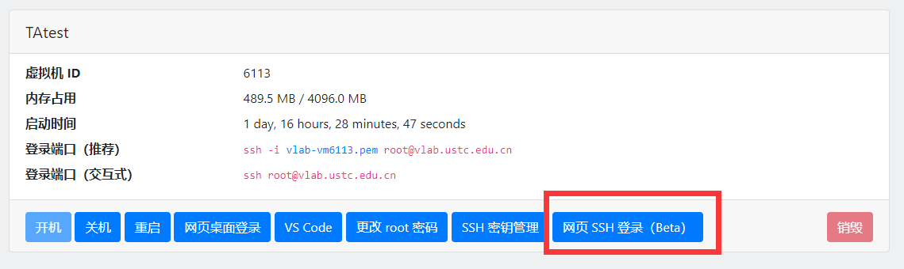
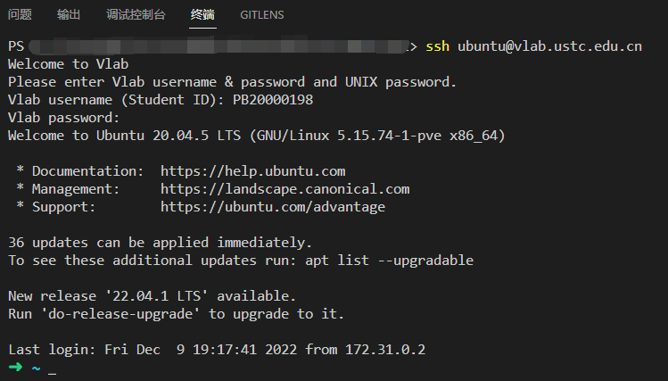
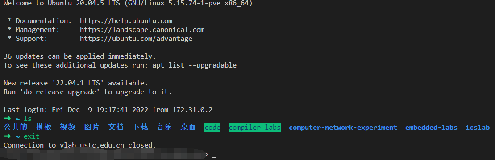
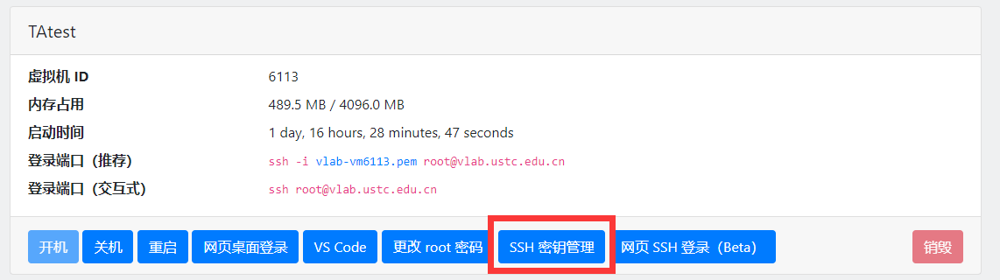
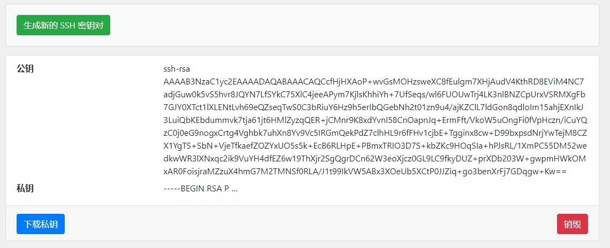
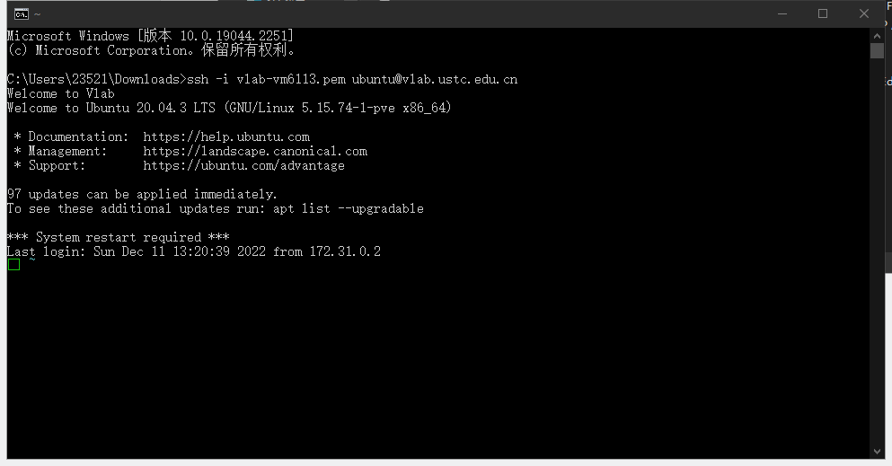
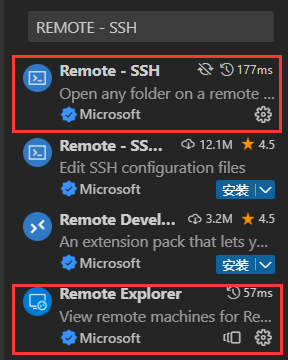
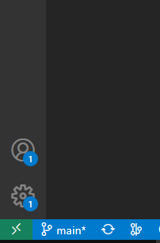
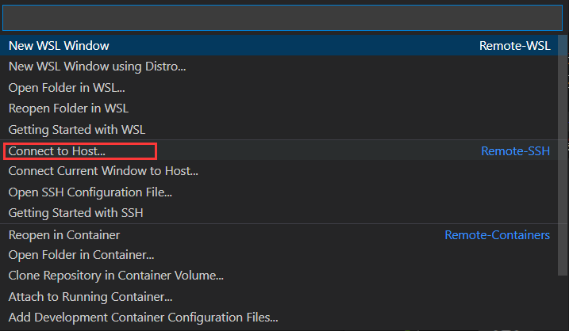
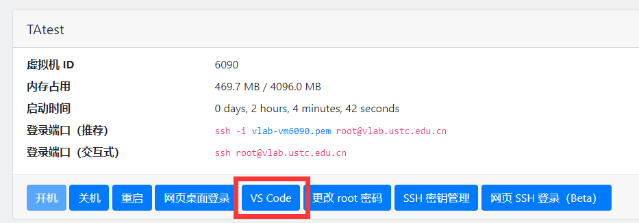

# 第3节 Vlab 的简单使用

## 1. 创建 Vlab linux虚拟机

进入[vlab](https://vlab.ustc.edu.cn/)，点击虚拟机管理，新虚拟机，自行取名，创建。

创建后，点击开机，过一会（一般几秒钟）之后刷新网页，点击网页桌面登录。登录后即可在浏览器中看到桌面。

需要注意的是linux的剪切板。上次我线下小灶发现很多同学不会用剪切板。使用剪切板请看[vlab官方文档](https://vlab.ustc.edu.cn/docs/login/browser/#clipboard)。

开机的时候会有提示一个群二维码，建议同学加群以关注vlab的通知（一般是服务器维护导致vlab停机等），有关vlab使用和linux使用的问题也可以在里面询问。加群之后可以在[这里](https://vlab.ustc.edu.cn/vm/notif)把那个通知关了，这样每次打开就不会弹出二维码了。

## 2. ssh登录

2022秋的《计算系统概论A》课程，建议大作业使用 ssh 方式登录并完成。当时该方式主要由隔壁班助教讲解，很多人没跟上，所以这里我再讲一遍。当时我是线下开的课，因为文档不全，有很多人没有最终完成。现在收拾好了，希望读者都能完成。

### 2.1 什么是ssh？为什么要用ssh？

ssh，我个人理解是一种加密的传输协议。你可以在一台电脑通过ssh登录并操作另一台电脑。ssh的原理我不讲，因为这不是我们需要关注的 ~~（其实是因为我不知道）~~

ssh 可以让我们操作另一台电脑，那么为什么不在另一台电脑上直接操作呢？这可能是因为另一台电脑太远，比如说你是大型公司的服务器管理人员，但是你可能离服务器比较远；也可能是因为电脑同时给多人使用，但是只有一块屏幕。通过 ssh 可以比较方便地解决以上问题。ssh 可以传输文件，或者用 vscode 写代码。

那相比于其他连接方式（比如 vlab 的网页桌面登录）呢？vlab的网页桌面需要实时传输图形，受网络传输速度等的限制较大，容易卡顿 ~~（尤其是中科大宿舍校园网）~~ ；因此在不需要图形界面而只需要终端和文件编辑的情况下（比如只使用终端操作机器，或者大多数写代码编程的情形），使用ssh登录效率较高。

> 你们的助教之前就不知道ssh，在一段时间内，在vlab桌面使用vscode，打字延迟特别高，因为打一个字需要把按键传输到vlab服务器，服务器处理之后的图像传输回来；这样使用体验很差。换ssh就好得多，因为在使用vscode+ssh写代码的情况下，代码的编辑是在本地，不需要图像和按键的传输，因此几乎没有延迟。只是保存文件和运行终端的时候有少量传输，在比较差的网络环境下也能满足要求。

### 2.2 如何使用ssh登录

听说许助教的习题课有不少人没跟上，一个是比较跳跃，另一个是他用的 macOS 操作系统和很多人的 windows 方法不一样。这里我循序渐进介绍几种办法。这里以 windows 登录 vlab 的 linux 为例。

#### 2.2.0 第零种：浏览器登录

Vlab虚拟机管理页面点击这个



进入一个新的标签页，这就是一个 ssh 终端，可以通过命令行控制虚拟机。

这一点应该都能做到，如果做不到就别做下一步了。

#### 2.2.1 第一种：本地最直接的办法

打开终端，输入 `ssh ubuntu@vlab.ustc.edu.cn` ，回车，输出第一行应该是 `Welcome to Vlab` ，后边要求输入 username 和 password，这俩的一种组合分别是**学号**和**统一身份认证密码**。登陆成功之后，你就可以把这个终端当linux终端使用从而操控你的vlab计算机。



有人说输入密码的时候没反应。 **显然不应该有反应，要不然你的密码不就被别人看见了吗？** 接着往下输入就行了。如果觉得输错了就按Backspace删掉重新输入。 **很多人这一步没有成功，其实是因为密码输得不对** 。

> 注意，配置 zsh 之后，linux 终端提示符前边是一个绿色（或红色）箭头。如果你只看到了绿色方框，那也是正常的，因为windows终端有些字符无法正常显示。

退出的方法是在 ssh 终端里输入 exit 或 logout，从而这个终端退出 ssh，恢复到 windows 终端。



这时候你登录时是以 ubuntu 用户身份登录的，如果需要用其他用户（比如root），那么请把 ubuntu 改成其他用户名。

这一点应该都能做到，如果做不到就别做下一步了。

#### 2.2.2 第二种：免密码登录

上一种方式里，每次登录都需要密码。现在我介绍一种免密码登录方式。

首先需要确认你的 windows 用户名。一种方法是按下 win+R 键打开终端，提示符是 `C:\Users\****`，这个 \*\*\*\* 就是你的用户名。后边的一些命令需要记得把对应的 \*\*\*\* 改为用户名。

Vlab网页点击ssh密钥管理。



如果底下没有公钥，就点击生成新的密钥对。



> 有没有发现公钥有点像第一次作业里的base64编码？

点击下载私钥，不管放在啥地方（比如说，浏览器下载一般在 `C:\Users\****\Downloads` ），打开主机终端切换到下载的 `vlab-vmxxxx.pem` 所在的目录，输入 `ssh -i vlab-vmxxxx.pem ubuntu@vlab.ustc.edu.cn` ，正常情况下可以免密登录。

> 记得把xxxx改成文件名对应的数字。



这一点应该大多数人能做到，如果做不到就别做下一步了。

#### 2.2.3 第三种：快速登录

上边的那种方式，输入的命令太长。我们现在需要进行快速登录。

打开 `C:\Users\****\.ssh` 文件夹。Mac 用户请打开 `~/.ssh` 文件夹。如果没有就新建这个文件夹。注意，这个文件夹可能是隐藏的，因此在确定其不存在之前，请先打开“显示隐藏文件”选项。

把刚刚下载的 `vlab-vmxxxx.pem` 移动到这个文件夹下。

在这里用记事本（也可以用 vscode）打开文件 `config`，（如果没有就新建，记得**这个文件没有后缀，请把文件扩展名选项打开！！！** 不会打开文件扩展名的看这个[链接](https://jingyan.baidu.com/article/73c3ce280c09f3a40243d942.html)），在上面写上这几行：

```text
Host vlab
    HostName vlab.ustc.edu.cn
    Port 22
    User ubuntu
    IdentityFile C:\Users\***\.ssh\vlab-vmxxxx.pem
```

第一行的名字可以换成自己喜欢的，不要有中文和空格。最后一行也把路径改成自己的，Windows用户记得改用户名，Mac 和 linux 用户需要全都改掉。

保存，关闭。

修改 .pem 文件的权限。这一步对 Windows 用户比较困难，对 linux 和 mac 用户比较容易。Windows 用户请参考[这个](https://blog.csdn.net/qq_31375855/article/details/125845446)，还解决不了就看[这个](https://blog.csdn.net/joshua2011/article/details/90208741)。linux 和 mac 用户请在终端输入：

```bash
chmod 600 ~/.ssh/vlab-vmxxxx.pem
```

打开终端， **注意是自己主机的终端，** 输入 `ssh vlab` ，注意输出。

- 如果没有输入账号密码而直接登录，那么恭喜你成功。
- 如果提示一个让输入yes或no，输入yes，如果没有输入账号密码而直接登录，那么恭喜你成功，否则失败。
- 如果提示 `no such identity` 然后叫你输入账号密码，说明你的config文件中的 `IdentityFile` 路径填错了。需要填成那个pem的路径。
- 如果提示一个什么权限too open，那么就是 `vlab-vmxxxx.pem` 的权限不对，回去接着改。
- 如果提示 `ssh: Could not resolve hostname xxxxxx: \262\273\326\252\265\300\325\342\321\371\265\304\326\367\273\372\241\243` ，大概率是因为你命令行的ssh后边的名字输错了，**要输入你的config文件里的第一行Host后边的内容（本例中为vlab）**；也可能是因为你把第二行的`vlab.ustc.edu.cn`输错了。
- 助教只试出来了这么多种错误。其他的请尝试自行搜索解决。

> Windows登录后，会出现的绿色的框而不是箭头（如果你按我的说法配置了zsh），这是因为windows不方便显示那个utf-8字符。（不过vscode的终端可以正常显示）一种解决办法是直接换掉那个字符：
> `vim ~/.oh-my-zsh/themes/robbyrussell.zsh-theme` ，把那个框（箭头）换成ascii码能表示的字符（比如说一个字符 `>` ），保存退出，输入`source ~/.zshrc` 即可。

#### 2.2.4 第四种：vscode+ssh登录

以上几种办法都很难编辑代码，除非你经常使用 vim 编辑代码。使用vscode可以通过 ssh 在 vlab 上写代码。前提是必须完成上一种登录方式。

听说许助教直接用这个方式登录，这样的话直接跨过了上边几种方法，容易失败且不知道失败在哪。

打开vscode安装这俩插件。（好像有的人只装第一个就能成功）



点击左下角绿色的打开远程窗口。如果没有，那重启vscode试试。



点击`connect to host`，选择你的ssh的Host名。没有我这么多选项是正常的，只要有`connect to host`就行。



打开之后第一次好像要选择操作系统，选择 `Linux` ；然后会下载 VS Code 服务器，可能需要几分钟到十几分钟，而且还没进度条，需要耐心等待。

第一次打开特别慢，后边就会比较快了。这时候你的vscode已经身在主机心在vlab了，就可以用它给linux写代码。

### 2.3 使用在线vscode

如果未能实现自己的 vscode+ssh 登录虚拟机，那么提供一种在线vscode的方式。

网页 vscode 的[使用文档](https://vlab.ustc.edu.cn/docs/apps/vscode/)，如果按我的方法不成功，可以去看文档。

首先，登录后打开终端，输入 `bash` 回车之后，输入 `vscode start`；这个命令貌似就是zsh不能执行但是bash能执行的。

回到vlab的虚拟机管理，点击这个：



就可以启动网页端的vscode了。

vscode 连接 linux，（包括以上讲的网页端 vscode 或者是主机 vscode 的 ssh 连接）可以用 vscode 写代码，这其实很有用，因为 linux 的一个很常用的场景就是写代码。当然网页 vscode 有诸多不便，能用 ssh 的 vscode就不要用网页 vscode；实在搞不定 ssh 的可以这么用。
