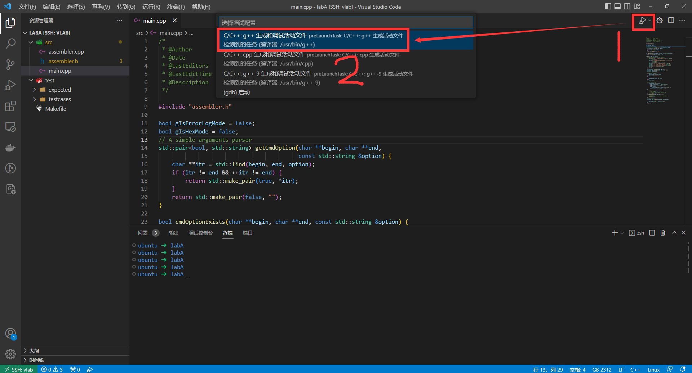
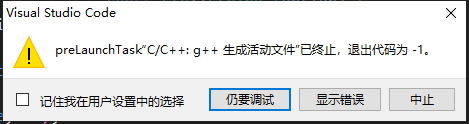
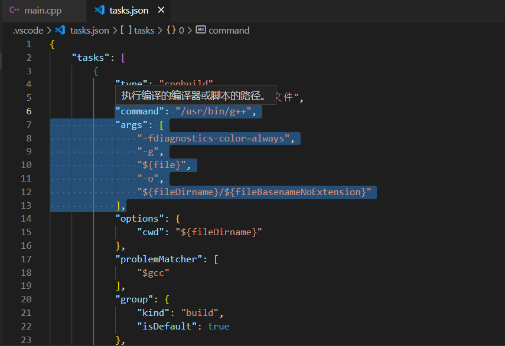
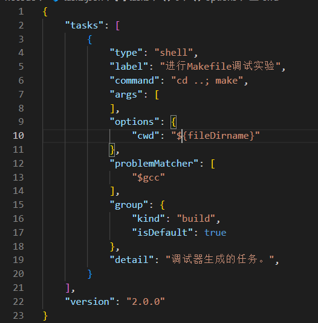
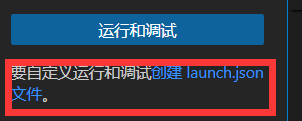
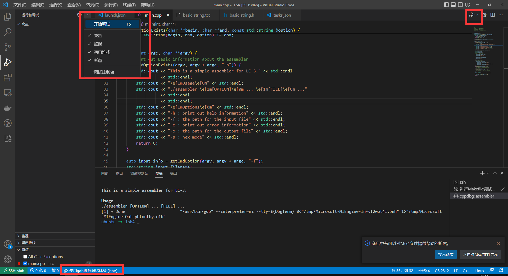
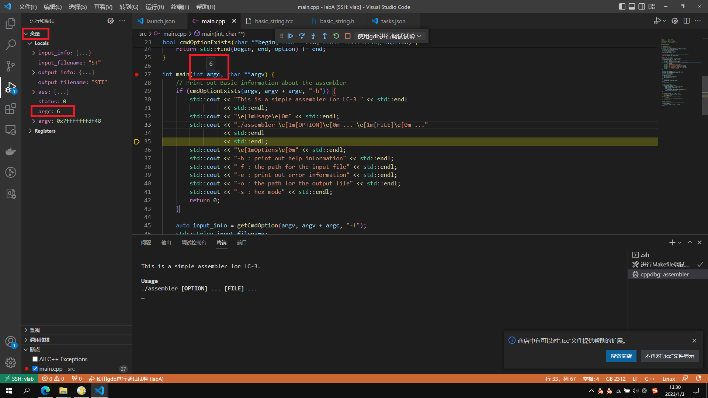

# 程序调试方法（以LabA为例）

> 环境：vlab+ssh的vscode登录

前言：据我观察很多人没用过程序调试工具，用过的人也大多数只是根据已有的教程，用图形化工具，实际上对其没有什么了解。现在我讲一下简单的程序调试原理。

首先，程序编译（从代码到可执行文件）是编译器完成的，一般我们用C语言编译器是 `gcc` ，C++编译器是 `g++` ；调试用的是调试器，一般是 `gdb` ；图形化操作界面一般是帮助我们生成对应的命令行调用gcc、gdb等工具。

然而，使用网上的教程对本次实验一般失效，为了解决对应的问题，我们需要从命令行学习。接下来我讲一下labA的调试方法，结合命令行给出调试思路。

VSCode当前工作目录为labA文件夹，目录下的文件是这样的：

```text
.
├── Makefile
├── src
│   ├── assembler.cpp
│   ├── assembler.h
│   └── main.cpp
└── test
    ├── expected
    │   ├── test1.bin
    │   ├── test2.bin
    │   └── test3.bin
    └── testcases
        ├── test1.asm
        ├── test2.asm
        └── test3.asm
```

注意，我们需要的 `.vscode` 是在 `labA` 底下的。

实际上我们暂时并不需要关注test那个东西。

首先如果按照以往的方式，在打开main.cpp的时候依次点击这两个按钮：



则会生成失败：



点击中止，查看失败的原因：打开.vscode/tasks.json，需要关注的是这两个地方：



这几行是vscode帮我们自动生成编译命令的设置。command是命令，args是参数。实际上由于我们的方式是直接用 `make` 生成，因此我们需要修改对应的命令行。

> 如果是没有makefile的多文件，那么一般吧第10行的`${file}`改成`*.cpp`即可。但是我们是有makefile的多文件。

因为编译命令make时所在的工作目录为 `labA` ，而main.cpp所在的目录是 `labA/src` ，因此在make前需要先把目录切换回去，编译命令也就是 `cd ..; make` ；执行以上命令是shell没有命令参数；而这个label可以任意命名。现在我只改了type、command、args、label四个选项：



对应需要添加launch.json文件。tasks.json帮我们编译，launch.json帮我们调试。点击创建：



在.vscode下发现launch.json，修改内容为：

```json
{
    // 使用 IntelliSense 了解相关属性。 
    // 悬停以查看现有属性的描述。
    // 欲了解更多信息，请访问: https://go.microsoft.com/fwlink/?linkid=830387
    "version": "0.2.0",
    "configurations": [
        {
            "name": "使用gdb进行调试试验",                //可以随便起名字
            "type": "cppdbg",                            //必须用这个
            "request": "launch",                         //必须用这个
            "program": "${fileDirname}/../assembler",    //指定程序文件，因为编译出来的程序文件是这个位置所以填这个
            "args": [
                "-h",
                "-f",
                "./test/testcases/test1.asm",
                "-o",
                "./test/actual/test1.bin",
            ],    //  运行程序的参数，相当于调试的时候的程序的启动命令行为：
                  //  ./assembler -h -f ./test/testcases/test1.asm -o ./test/actual/test1.bin
            "stopAtEntry": false,                        //程序入口停止（也就是main）
            "cwd": "${fileDirname}/..",                  //调试的时候的工作目录
            "environment": [],                           //环境变量，这里是没有
            "externalConsole": false,                    //如果使用控制台则需要打开这个，这里建议关了
            "MIMode": "gdb",                             //调试器名字是什么
            "miDebuggerPath": "/usr/bin/gdb",            //改成gdb的路径，linux下一般就是这个
                                                         //不知道的可以终端输入which gdb得到
            "setupCommands": [
                {
                    "description": "Enable pretty-printing for gdb",
                    "text": "-enable-pretty-printing",
                    "ignoreFailures": true
                }
            ],                                    //给调试器的参数，一般用这个就行
            "preLaunchTask": "进行Makefile调试实验"//在调试前需要干什么，当然是需要进行编译，这个需要和编译的名字一样
                                                  //也就是tasks.json的label
        }
    ]
}
```

每一行是干啥用的我都写注释里了。接下来准备调试，可以在main上设置断点。点击以下三个框的任意一个开始调试（可能会缺少某一个，但是只要有任意一个就行）：



如果接下来要选择某个任务，就选 `launch.json` 里的name对应那一项。然后就可以进入调试界面，可以看到各种调试信息，鼠标放到变量名字上就能看到变量的值，底下的终端有输出：



## 写代码写的更舒服

有的时候vscode可能会出各种bug，或者说你一不小心就漏了点配置。一种减少bug的方式是在 `.vscode` 下指定一些设置。键盘按下 `Ctrl+Shift+P` ，选择 `C/C++:编辑配置` ，在.vscode下生成 `c_cpp_propertie.json` ，可以修改里面的一些内容：

```json
{
    "configurations": [
        {
            "name": "Linux",            //没啥用但是不建议改
            "includePath": [            //定义includepath
                "${workspaceFolder}/**" //本次实验不需要这个，实际上可以删掉
            ],
            "defines": [],              //没在各种文件里写的预定义宏，本次实验没有
            "compilerPath": "/usr/bin/g++",         //编译器路径
            "intelliSenseMode": "linux-gcc-x64",    //根据 平台-编译器-体系结构选择
            "cppStandard": "c++20"                  //C++标准，建议选比较新的
        }
    ],
    "version": 4
}
```

这只是方便写代码，与编译和调试无关。

## 扩展应用到labS

labS中需要注意的两点：

1. CMake是用来生成Makefile的，Makefile和上边一样是用于编译的。所以第一次编译的命令是在build里执行 `cmake ..; make` ，后续如果不修改CMakeLists相关文件（此处仅有CMakeLists.txt）则不需要使用 `cmake ..` 命令，只需要make即可。
2. 默认给出的CMake是不支持gdb调试的。
3. CMake生成的Makefile比较复杂，x助教也看不懂，你可以问别的助教（不过个人感觉没几个能看得懂的）

所以我们首先需要先修改CMakeLists.txt使得其支持gdb，修改方法是我从网上现场查到的：在该文件中添加

```makefile
SET(CMAKE_BUILD_TYPE "Debug") 
# 添加对gdb的支持
SET(CMAKE_CXX_FLAGS_DEBUG "$ENV{CXXFLAGS} -O0 -Wall -g2 -ggdb")
SET(CMAKE_CXX_FLAGS_RELEASE "$ENV{CXXFLAGS} -O3 -Wall")
```

我本人加到了3-6行。

然后进入build执行 `cmake ..` ，参照上文类似的方式，不过和上面不同的是，需要修改tasks.json的5-6行：

```json
            "label": "labS：使用cmake的makefile调试",
            "command": "cd ../build; make",
```

其中command是必须修改的，label可以不改。

launch.json需要修改`program`为新的文件位置：

```json
"program": "${fileDirname}/../build/lc3simulator",
```

还需要修改args为运行程序的参数（比如说，为了初次体验可以改为只有`-h`），还有prelaunchtask改成tasks.json的label即可。
